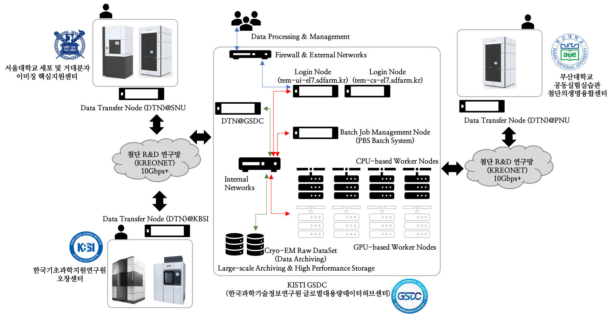

*************************************************
GSDC TEM Computing Cluster based on AlmaLinux 9.x
*************************************************

1. Service overview
===================

GSDC (Global Science experimental Data hub Center) provides data computing services, i.e., large-scale Cryo-EM data transfer, archiving and/or processing to Cryo-EM operators/users.
Cryo-EM facilities which are operated by government-funded research institutes or academies, can be directly connected to GSDC via KREONET with 10+ Gbps dedicated/shared network links. 
GSDC also supports petabyes scale of high performance (and/or archiving) storages and CPU/GPU computing servers to help Cryo-EM users' scientific discoveries. 
Here is GSDC's computing and storage infrastructres for Cryo-EM operators/users.

Overall architecture between KBSI, SNU (Seoul National University), PNU (Pusan National University)'s Cryo-EM facilities and GSDC TEM computing cluster.

2. Computing and storage resources
==================================

.. list-table:: Computational and stroage resources of GSDC TEM cluster
    :widths: auto
    :header-rows: 1

    * - Category
      - ServerName
      - Specification
      - Resources
    * - Login
      - tem-ui-al9.sdfarm.kr
      - Intel Xeon 2.7GHz 18Core * 2CPUs, 384GB main memory
      - 72 cores (with hypertheads)
    * - Login
      - tem-cs-al9.sdfarm.kr
      - Intel Xeon 2.7GHz 18Core * 2CPUs, 384GB main memory
      - 72 cores (with hypertheads)
    * - Batch master
      - tem-ce-al9.sdfarm.kr
      - Intel Xeon 2.7GHz 18Core * 2CPUs, 384GB main memory
      - 36 cores (without hypertheads)
    * - Workers
      - tem-cpu[01-13]-al9.sdfarm.kr
      - Intel Xeon 2.6GHz 14Core * 2CPUs, 192GB main memory
      - 380 cores (cpuQ)
    * - Workers
      - tem-gpu[01-10]-al9.sdfarm.kr
      - 256~384GB main meory, Nvidia P40-24GB, P100-16GB, V100-32GB, A100-40GB, A100-80GB
      - 300 cores and 26 GPUs total (gpuQ)
    * - Storage
      - Users home directory 
      - 100GB per each user account
      - /tem/home
    * - Storage
      - Data analysis  
      - 80TB per each research group
      - /tem/scratch
    * - Storage
      - Archiving 
      - 500TB per each Cryo-EM operation site
      - /tem/archive