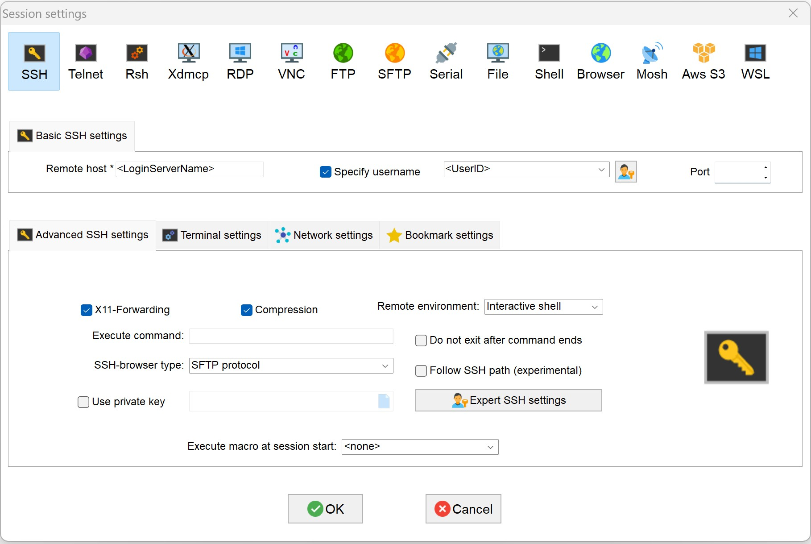
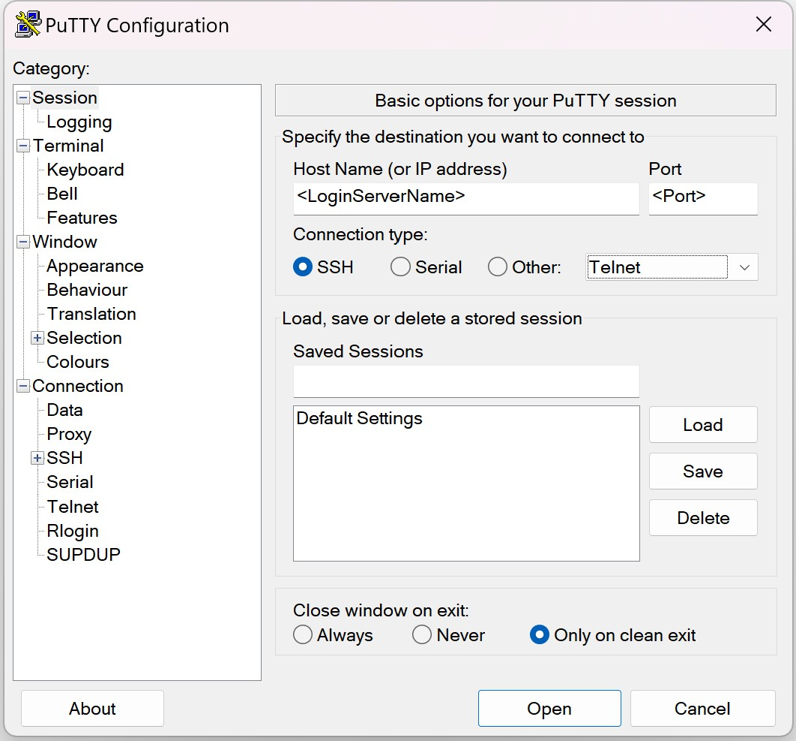
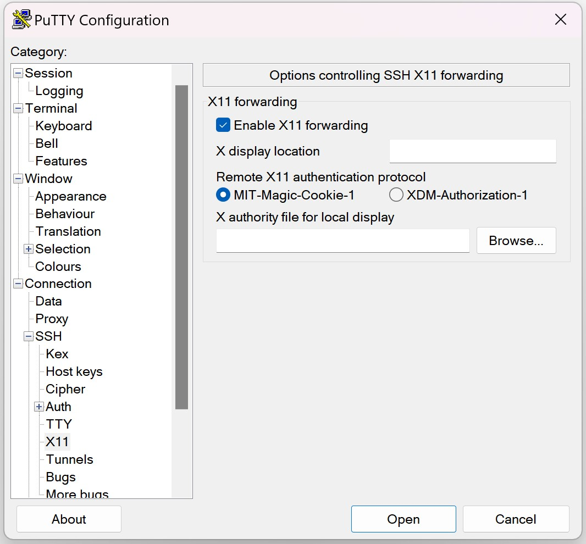

# SSH Login

!!! note "Enabling OTP"

    When first connecting to the login servers, you can log in using only your password (or initial password), but you MUST set up OTP (One-Time-Password) for two-factor authentication right after. Once logged in, follow the [GSDC OTP GUIDE](./otp.md) in your SSH terminal to enable it. 

## Linux/Mac Users

On Linux/Mac, use the built-in `ssh` command to connect to GSDC TEM login servers.

=== "tem-ui-al9.sdfarm.kr"
    ``` yaml linenums="1"
    $> ssh -Y -o Port=<port> <userID>@tem-ui-al9.sdfarm.kr
    First Factor:
    Second Factor:
    ```

=== "tem-cs-al9.sdfarm.kr"
    ``` yaml linenums="1"
    $> ssh -Y -o Port=<port> <userID>@tem-cs-al9.sdfarm.kr
    First Factor:
    Second Factor:
    ```

!!! note

    * line 1: `-Y (-X)` enables trusted (or untrusted) X11 forwarding. `port` is the port number your administrator gave you.
    * line 2: `First Factor` is your own password.
    * line 3: `Second Factor` is the six-digit OTP code. Just press `enter` if you haven't enabled OTP yet.

## Windows Users

### MobaXterm

* Download and install [MobaXterm](https://mobaxterm.mobatek.net)
* MobaXterm is an enhanced terminal for Windows with a **self-contained X11 server**, SSH client, network tools, and more.
* After launching MobaXterm, click `Sessions`
* In the `Session settings` dialog, select `SSH`



* Enter __`tem-ui-al9.sdfarm.kr`__ or __`tem-cs-al9.sdfarm.kr`__ as the `Remote host`.
* Check `Specify username`, then enter your account and the designated `Port` number.
* In the `Advanced SSH settings` tab, check `X11-Forwarding` and `Compression`, and set `Remote environment` to interactive shell.
* Click OK and proceed with login (authentication using the first and second factors).


### Putty

* Download and install [Putty](https://www.putty.org)

!!! info

    To use X11 forwarding (controlling an X11 GUI application running server-side, over the SSH channel), Putty requires a third-party X Window manager (e.g., Xming, Xmanager) pre-installed on the client workstation.

* After launching Putty, in the `Putty Configuration` dialog, click `Session`.
* In the right panel, enter __`tem-ui-al9.sdfarm.kr`__ or __`tem-cs-al9.sdfarm.kr`__ as the `Host Name`.
* Also enter the designated `Port` number.
* Go to `Connection`->`SSH`->`Auth`->`X11` and check `Enable X11 forwarding`.
* Go back to `Session`, optionally save the profile under a session name, and click `Open` to connect to the login servers.



