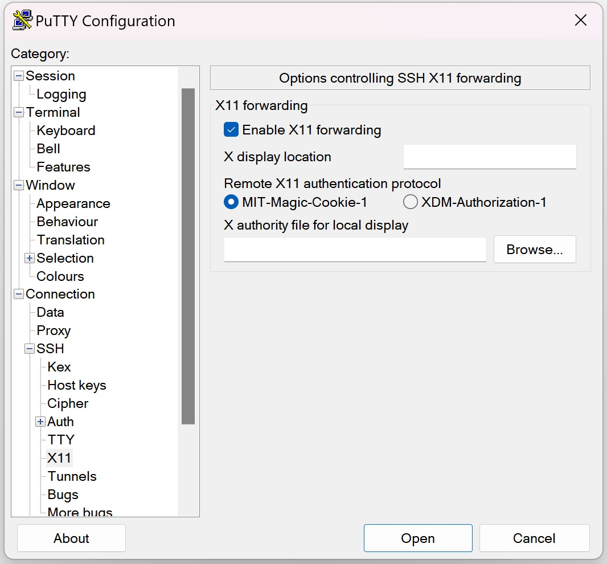

# SSH Login

!!! note "Enabling OTP"

    When connecting first to the login servers, you can log-in using only your password (or initial password), but you MUST immediately receive OTP (One-Time-Password)s for two-factor authentication. After the sucessful login, at ssh terminal, please follow the [GSDC OTP GUIDE](./otp.md) to enable it. 

## Linux/Mac Users

On the Linux/Mac environment, users can execute the built-in `ssh` command in order to connect and access GSDC TEM login servers.

=== "tem-ui-al9.sdfarm.kr"
    ``` yaml linenums="1"
    $> ssh -Y -o Port=<port> <userID>@tem-ui-al9.sdfarm.kr
    First Factor:
    Second Factor(optional):
    ```

=== "tem-cs-al9.sdfarm.kr"
    ``` yaml linenums="1"
    $> ssh -Y -o Port=<port> <userID>@tem-cs-al9.sdfarm.kr
    First Factor:
    Second Factor(optional):
    ```

!!! note

    * line 1: `-Y (-X)` means enabling trused (or untrusted) X11 forwarding. `port` is designated port number informed by administrator.
    * line 2: `First Factor` means your own password string.
    * line 3: `Second Factor` means six digits OTP code. You can input just `enter` if you have not enabled OTP yet.

## Windows Users

### MobaXterm

* Download and install [MobaXterm](https://mobaxterm.mobatek.net)
* MobaXterm is an enhanced terminal for Windows with **self-contained X11 server**, SSH client, network tools and much more.
* After executing MobaXterm, click `Sessions`
* On `Session settings` dialog, select `SSH`


* Enter __`tem-ui-al9.sdfarm.kr`__ or __`tem-cs-al9.sdfarm.kr`__ as `Remote host`.
* Check `Specify username`, enter your account and a designated `Port` number.
* On the dialog, select `Advanced SSH settings` tab: check `X11-Forwarding` and `Compression`, and also interactive shell as `Remote environment`.
* Click OK button and proceed the login procedure, i.e., authentication using the first and second factors)


### Putty

* Download and install [Putty](https://www.putty.org)

!!! info

    To use X11-forwarding (controlling X11 GUI application running on the server-side over the SSH network channel), Putty requires a 3rd-party XWindows manager (e.g., Xming, Xmanager, etc.) installed in advance on the client workstation.

* After executing Putty, on the `Putty Configuration` dialog, click `Session`
* On the right panel, enter __`tem-ui-al9.sdfarm.kr`__ or __`tem-cs-al9.sdfarm.kr`__ as `Host Name`.
* Also, enter a designated `Port` number.
* Move to `Connection`->`SSH`->`Auth`->`X11` and confirm to check `Enable X11 forwarding`
* Move to `Session`, optionally save the profile with the given session name and click `Open` to connect the login servers.





``` yaml
theme:
  features:
    - content.code.annotate # (1)
```

1. :man_raising_hand: I'm a code annotation! I can contain `code`, __formatted
    text__, images, ... basically anything that can be written in Markdown.