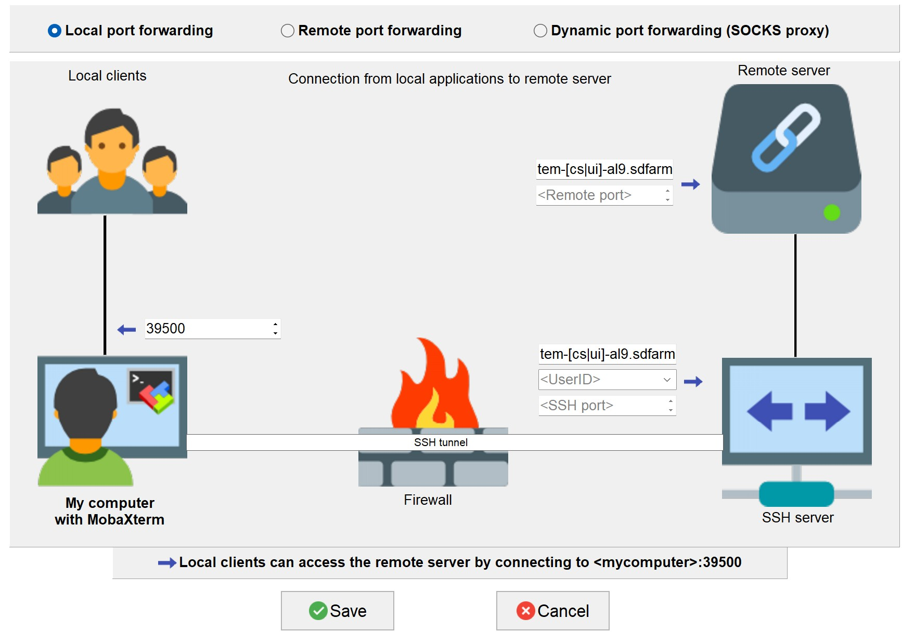

# CryoSPARC

CryoSPARC is the state-of-the-art platform used globally for obtaining 3D structural information from single-particle cryo-EM data. It enables automated, high-quality, high-throughput structure discovery of proteins, viruses, and molecular complexes for research and drug discovery.

!!! note

    At the time of writing (Jan. 2021), CryoSPARC unfortunately doesn't support installing **a single CryoSPARC instance**
    (web application, command core, and database) **for multiple users with full isolation and security of their project data**.
    
    A later CryoSPARC version may resolve this once the product is redesigned around the "Hub" concept (as mentioned in the CryoSPARC forum: 
    [https://discuss.cryosparc.com/t/use-linux-user-accounts/3480](https://discuss.cryosparc.com/t/use-linux-user-accounts/3480)). 
    
    In the meantime, each group must set up a completely isolated CryoSPARC instance independently within its own directory (/tem/scratch/<GroupDir>). This method relies on the UNIX system for security; it's more tedious to manage but gives stronger access restrictions for each user's dataset. 
    For your convenience, we're ready to install and set up a CryoSPARC instance using **administrative automation code on your behalf**.

## Prerequisites

CryoSPARC is free for academic use. 

For a completely isolated CryoSPARC instance, you need your own non-commercial CryoSPARC license key.

**Visit the CryoSPARC official site to request a license key, then e-mail the valid key to the GSDC TEM service administrator.**  

???+ info

    CryoSPARC offical site : [https://cryosparc.com](https://cryosparc.com)


## Getting a CryoSPARC instance 

CryoSPARC is a backend and frontend software system providing data processing and image analysis for single-particle cryo-EM, 
along with a browser-based user interface and command-line tools. It's composed of three major components: cryosparc_master, cryosparc_database, and cryosparc_worker.

* **cryosparc_master**
> Master processes (webapps, command_core, databases, etc.) run together on one node (in our case, the tem-cs-al9.sdfarm.kr or tem-ui-al9.sdfarm.kr login node). These processes host HTML5-based web applications and spawn or submit jobs to a cluster scheduler (e.g., our PBS-based batch system).

* **cryosparc_worker**
> Worker processes can be spawned on any available worker node to perform the data processing and image analysis tasks pre-defined within CryoSPARC.

* **cryosparc_database**
> The CryoSPARC database is built on MongoDB, managing metadata for users' workflows, projects, jobs, backend clusters/workers, and users. 

### 1. (Admin) Install and setup a CryoSPARC instance

On your behalf, the GSDC administrator can run Ansible configuration automation scripts to install and set up a CryoSPARC instance, using a given valid license key.
The master, worker, and database sub-packages are installed during this automation and end up in __/tem/scratch/GroupDir/.cryosparc__ once setup finishes.
Setup includes registering both the cluster (lane/worker nodes) instance and the webapp's admin/normal user accounts. The whole process takes about 10 minutes. 

After installation, __/tem/scratch/GroupDir/.cryosparc__ has the following directory/file structure (on the node—tem-cs-al9.sdfarm.kr or tem-ui-al9.sdfarm.kr—where the CryoSPARC instance runs):
    
``` bash
$> cd /tem/scratch/<GroupDir>/.cryosparc
$> tree -L 1 ./
.
├─ cluster_info.json              ## cluster(lane) information to register    
├─ cluster_script.sh              ## PBS script template to submit jobs to worker cluster(lane)
├─ cryosparc_master               ## cryosparc_master package install path
├─ cryosparc_master.tar.gz
├─ cryosparc_worker               ## cryosparc_worker package install path
├─ cryosparc_worker.tar.gz
└─ cryosparc_database             ## cryosparc_database package install path
```

???+ warning 
  
    **DO NOT** delete or modify the CryoSPARC instance base directory, **/tem/scratch/GroupDir/.cryosparc**. 
    
    This directory contains the database. Deleting it will corrupt or lose all project, job, and workflow metadata.

The configuration scripts also implicitly add the CryoSPARC instance's binary path to the PATH environment variable.

```bash
tem-[cs|ui]-al9.sdfarm.kr $> cat /tem/home/<UserID>/.bashrc
...
# User specific aliases and functions
export PATH='/tem/scratch/<GroupDir>/.cryosparc/cryosparc_master/bin':$PATH
```

### 2. (User) Verifying installation

Master processes (webapp, command_core, database, etc.) start automatically during configuration automation. Users should verify that these master processes are working correctly on **tem-cs-al9.sdfarm.kr** or **tem-ui-al9.sdfarm.kr** as guided below.

#### **2.1. Checking environment variables for CryoSPARC instance**

Log in to **tem-cs-al9.sdfarm.kr** or **tem-ui-al9.sdfarm.kr** via SSH to check the status of the deployed CryoSPARC instance.
Run the `cryosparcm env` command on the node (tem-cs-al9.sdfarm.kr or tem-ui-al9.sdfarm.kr) where the CryoSPARC instance runs.

```bash
$> cryosparcm env
export "CRYOSPARC_HTTP_PORT=39xxx"
export "CRYOSPARC_MASTER_HOSTNAME=tem-xx-al9.sdfarm.kr"
export "CRYOSPARC_CLICK_WRAP=true"
export "CRYOSPARC_COMMAND_VIS_PORT=39xxx"
export "CRYOSPARC_CONDA_ENV=cryosparc_master_env"
export "CRYOSPARC_FORCE_USER=false"
export "CRYOSPARC_INSECURE=true"
export "CRYOSPARC_DEVELOP=false"
export "CRYOSPARC_DB_PATH=/tem/scratch/<GroupDir>/.cryosparc/cryosparc_database"
export "CRYOSPARC_HTTP_RTP_PORT=39xxx"
export "CRYOSPARC_LICENSE_ID=<license_key>"
export "CRYOSPARC_HOSTNAME_CHECK=tem-cs-al9.sdfarm.kr"
export "CRYOSPARC_MONGO_PORT=39xxx"
export "CRYOSPARC_MONGO_CACHE_GB=4"
export "CRYOSPARC_HEARTBEAT_SECONDS=60"
export "CRYOSPARC_ROOT_DIR=/tem/scratch/<GroupDir>/.cryosparc/cryosparc_master"
export "CRYOSPARC_HTTP_RTP_LEGACY_PORT=39xxx"
export "CRYOSPARC_COMMAND_CORE_PORT=39xxx"
export "CRYOSPARC_BASE_PORT=39000"
export "CRYOSPARC_PATH=/tem/scratch/<GroupDir>/.cryosparc/cryosparc_master/deps/external/mongodb/bin:/tem/scratch/<GroupDir>/.cryosparc/cryosparc_master/bin"
export "CRYOSPARC_LIVE_ENABLED=true"
export "CRYOSPARC_COMMAND_RTP_PORT=39xxx"
export "CRYOSPARC_SUPERVISOR_SOCK_FILE=/tmp/cryosparc-supervisor-627a9991e2f2f069094732dfd78d1696.sock"
export "CRYOSPARC_LD_LIBRARY_PATH=/tem/scratch/<GroupDir>/.cryosparc/cryosparc_master/cryosparc_compute/blobio"
export "CRYOSPARC_FORCE_HOSTNAME=false"
export "PATH=/tem/scratch/<GroupDir>/.cryosparc/cryosparc_master/deps/external/mongodb/bin:/tem/scratch/<GroupDir>/.cryosparc/cryosparc_master/bin:/tem/scratch/<GroupDir>/.cryosparc/cryosparc_master/deps/anaconda/envs/cryosparc_master_env/bin:/tem/scratch/<GroupDir>/.cryosparc/cryosparc_master/deps/anaconda/condabin:/tem/scratch/<GroupDir>/.cryosparc/cryosparc_master/bin:/tem/home/<userid>/bin"
export "LD_LIBRARY_PATH=/tem/scratch/<GroupDir>/.cryosparc/cryosparc_master/cryosparc_compute/blobio:"
export "LD_PRELOAD="
export "PYTHONPATH=/tem/scratch/<GroupDir>/.cryosparc/cryosparc_master"
export "PYTHONNOUSERSITE=true"
export "CONDA_SHLVL=1"
export "CONDA_PROMPT_MODIFIER=(cryosparc_master_env)"
export "CONDA_EXE=/tem/scratch/<GroupDir>/.cryosparc/cryosparc_master/deps/anaconda/bin/conda"
export "CONDA_PREFIX=/tem/scratch/<GroupDir>/.cryosparc/cryosparc_master/deps/anaconda/envs/cryosparc_master_env"
export "CONDA_PYTHON_EXE=/tem/scratch/<GroupDir>/.cryosparc/cryosparc_master/deps/anaconda/bin/python"
export "CONDA_DEFAULT_ENV=cryosparc_master_env"
```

This shows the environment variables set for the CryoSPARC instance. 

!!! note
    
    In particular, remember **CRYOSPARC_BASE_PORT** (39000 in this example), **the CryoSPARC web application's listening port**.

    You'll use this port number later to set up an SSH tunnel between your client and the cryosparc hosting node (**tem-cs-al9.sdfarm.kr** or **tem-ui-al9.sdfarm.kr**). 
    **Through this tunneled SSH connection, you can access the CryoSPARC instance's web UI.**    


#### **2.2. Checking the status of CryoSPARC instance**

On the node (tem-cs-al9.sdfarm.kr or tem-ui-al9.sdfarm.kr) where the CryoSPARC instance runs, the `cryosparcm status` command produces output like this:

``` bash
$> cryosparcm status
----------------------------------------------------------------------------
CryoSPARC System master node installed at
/tem/scratch/<GroudID>/.cryosparc/cryosparc_master
Current cryoSPARC version: v4.5.3
----------------------------------------------------------------------------

CryoSPARC process status:

app                              RUNNING   pid 14307, uptime 0:00:09
app_api                          RUNNING   pid 14317, uptime 0:00:08
app_api_dev                      STOPPED   Not started
app_legacy                       STOPPED   Not started
app_legacy_dev                   STOPPED   Not started
command_core                     RUNNING   pid 14153, uptime 0:00:40
command_rtp                      RUNNING   pid 14247, uptime 0:00:26
command_vis                      RUNNING   pid 14240, uptime 0:00:27
database                         RUNNING   pid 14035, uptime 0:00:44

----------------------------------------------------------------------------
License is valid
----------------------------------------------------------------------------

global config variables:
export CRYOSPARC_LICENSE_ID="<license_key>"
export CRYOSPARC_MASTER_HOSTNAME="tem-xx-al9.sdfarm.kr"
export CRYOSPARC_DB_PATH="/tem/scratch/<GroupDir>/.cryosparc/cryosparc_database"
export CRYOSPARC_BASE_PORT=39xxx
export CRYOSPARC_DB_CONNECTION_TIMEOUT_MS=20000
export CRYOSPARC_INSECURE=true
export CRYOSPARC_DB_ENABLE_AUTH=true
export CRYOSPARC_CLUSTER_JOB_MONITOR_INTERVAL=10
export CRYOSPARC_CLUSTER_JOB_MONITOR_MAX_RETRIES=1000000
export CRYOSPARC_PROJECT_DIR_PREFIX='CS-'
export CRYOSPARC_DEVELOP=false
export CRYOSPARC_CLICK_WRAP=true
```

## Launching CryoSPARC instance

We assume your network setup looks like this (the most common scenario):

``` bash
                internet
[ localhost ]==============[ firewall | tem-[cs|ui]-al9.sdfarm.kr ]
```

### For Linux/Mac users 

Use the following command to start an SSH tunnel exporting **CRYOSPARC_BASE_PORT** from **tem-cs-al9.sdfarm.kr** or **tem-ui-al9.sdfarm.kr** to your local client computer.

If your CryoSPARC instance is deployed/running on the **tem-cs-al9.sdfarm.kr** node:

```bash
localhost $> ssh -N -f -L localhost:39500:tem-cs-al9.sdfarm.kr:<CRYOSPARC_BASE_PORT> -o Port=<ssh_port> <userid>@tem-cs-al9.sdfarm.kr
(<userID>@tem-cs-al9.sdfarm.kr) First Factor:
(<userID>@tem-cs-al9.sdfarm.kr) Second Factor:
```

???+ tip
    
    * 39500 port on localhost: assumes port 39500 is available on your localhost. Otherwise, use another available port.
    * -N: don't run a remote command. Useful for just forwarding ports.
    * -f: requests ssh to move to the background just before running the command.
    * -L [bind_address:]port:host:hostport


Otherwise, if the CryoSPARC instance is running on **tem-ui-al9.sdfarm.kr**:

```bash
localhost $> ssh -N -f -L localhost:39500:tem-ui-al9.sdfarm.kr:<CRYOSPARC_BASE_PORT> -o Port=<ssh_port> <userid>@tem-ui-al9.sdfarm.kr
(<userID>@tem-ui-al9.sdfarm.kr) First Factor:
(<userID>@tem-ui-al9.sdfarm.kr) Second Factor:
```

???+ tip

    * 39500 port on localhost: assumes port 39500 is available on your localhost. Otherwise, use another available port.
    * -N: don't run a remote command. Useful for just forwarding ports.
    * -f: requests ssh to move to the background just before running the command.
    * -L [bind_address:]port:host:hostport


!!! note

    Run this 'ssh' command on **YOUR LOCAL PC/WORKSTATION** to create a secure tunnel between your local machine and the GSDC server (tem-cs-al9.sdfarm.kr or tem-ui-al9.sdfarm.kr): localhost:39500 <--> tem-[cs|ui]-al9.sdfarm.kr:<CRYOSPARC_BASE_PORT>.

!!! note

    You can close the terminal window after running the above command, since 'ssh' runs in the background. The tunnel stays open.   

Now open your browser (Chrome/Firefox/Safari recommended) and go to [http://localhost:39500](http://localhost:39500). You should see the CryoSPARC login page.


### For Windows users 

#### Using MobaXterm

- Open `MobaXterm` application.
- `MobaXterm` -> `Tools` -> `MobaSSHTunnel (port forwarding)` : Open MobaSSHTunnel dialog box.
- `New SSH tunnel` : Set a forwarded port binding option and save the setting.
- Give the name to the saved port forwarding settings, and start the tunnel connection.

!!! note

    Use **CRYOSPARC_BASE_PORT** for the 'Remote server' port field.   



Now open your browser (Chrome/Firefox/Safari recommended) and go to [http://localhost:39500](http://localhost:39500). You should see the CryoSPARC login page.

#### Using Putty

- Open `PuTTy Configuration` dialog box.
- `PuTTy Configuration` -> `Session` : Load a SSH session to connect tem-[cs|ui]-al9.sdfarm.kr login node with the known <ssh_port>.
- `PuTTy Configuration` -> `Connection` -> `SSH` -> `Tunnels` : Set a forwarded port binding option and add the entry.

!!! note

    Use **tem-[cs|ui]-al9.sdfarm.kr:CRYOSPARC_BASE_PORT** for the 'Destination' field. 


Now open your browser (Chrome/Firefox/Safari recommended) and go to [http://localhost:39500](http://localhost:39500). 
You should see the CryoSPARC login page.

## Exploring CryoSPARC web apps

### CryoSPARC login

The group's representative user is notified of the CryoSPARC admin ID (e-mail) and password once installation and setup finish.
With this e-mail and password, users can log in to the CryoSPARC web interface. 


### CryoSPARC dashboard


### CryoSPARC project


### CryoSPARC lane information


???+ note

    For details on the CryoSPARC interface and usage, see CryoSPARC's official documentation: [https://guide.cryosparc.com/application-guide-v4.0+/a-tour-of-the-cryosparc-interface](https://guide.cryosparc.com/application-guide-v4.0+/a-tour-of-the-cryosparc-interface) 

## Adjusting memory requirements of CryoSPARC jobs

To increase or decrease memory requirements by adjusting the `ram_gb_multiplier` variable defined in the cluster submission script, see [https://guide.cryosparc.com/setup-configuration-and-management/software-system-guides/guide-configuring-custom-variables-for-cluster-job-submission-scripts](https://guide.cryosparc.com/setup-configuration-and-management/software-system-guides/guide-configuring-custom-variables-for-cluster-job-submission-scripts).


This custom variable can generally be configured at the CryoSPARC instance level, the target-lane level, or the job level.

## Tutorial on processing T20S

See CryoSPARC's webpage for the T20S processing tutorial: [https://guide.cryosparc.com/processing-data/get-started-with-cryosparc-introductory-tutorial](https://guide.cryosparc.com/processing-data/get-started-with-cryosparc-introductory-tutorial)


  