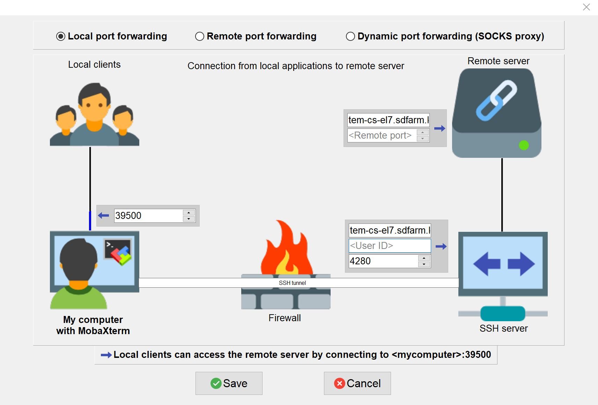
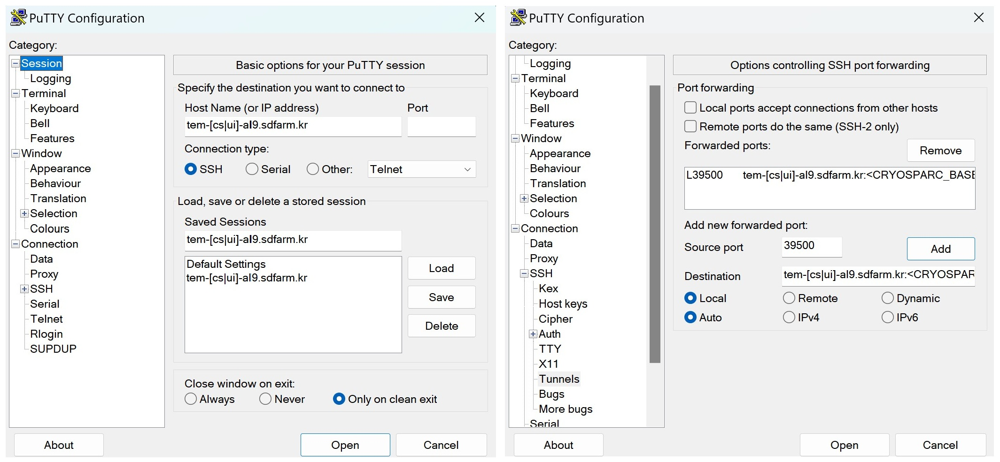
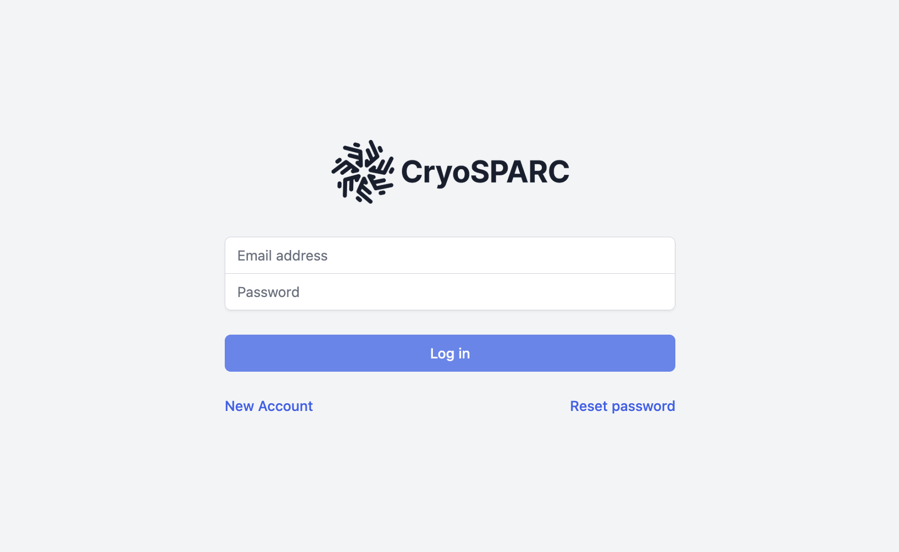
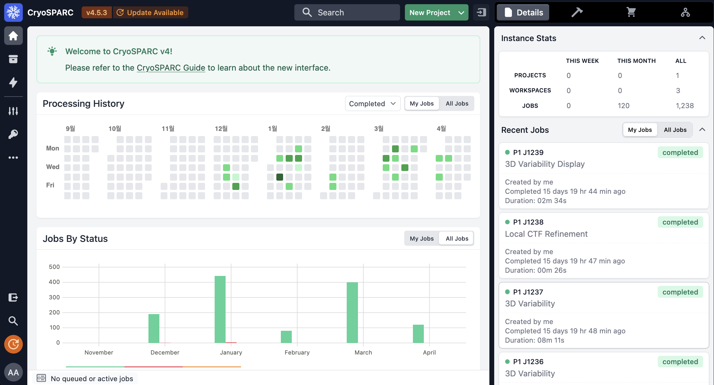
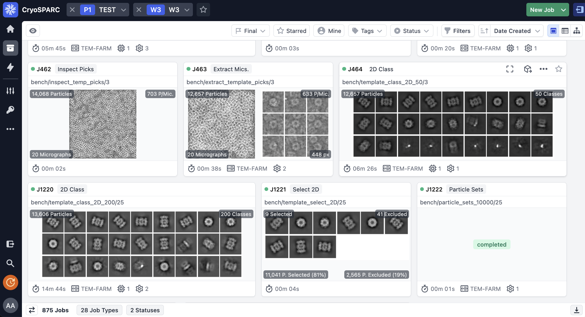
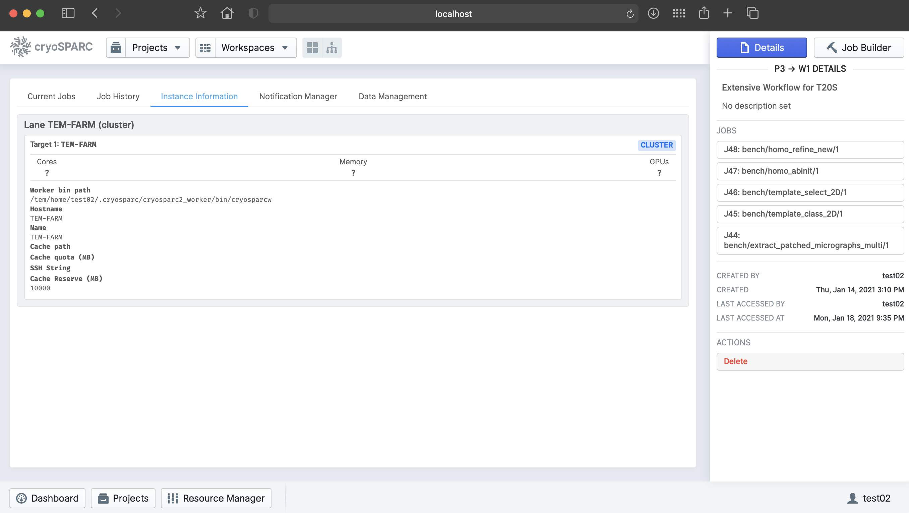

# CryoSPARC

CryoSPARC is the state-of-the-art platform used globally for obtaining 3D structural information from single particle cryo-EM data. The CryoSPARC platform enables automated, high quality and high-throughput structure discovery of proteins, viruses and molecular complexes for research and drug discovery.

!!! note

    At the time of writing this document (Jan. 2021), unforturnatelly, CryoSPARC does not provide the method of installing **a single CryoSPARC instance**
    (consisting of web applcation, command core, and database) **for use by a number of users with the complete isolation and security of their project data**.
    
    This problem might be resolved with later versions of CryoSPARC after CryoSPARC re-designs the product with the concept of "Hub" ( as mentioned in cryoSPARC forum 
    [https://discuss.cryosparc.com/t/use-linux-user-accounts/3480](https://discuss.cryosparc.com/t/use-linux-user-accounts/3480) ). 
    
    In the meanwhile, thus, we had to decide that each group must setup a completely isolated CryoSPARC instance independently within thier own home directories (/tem/scratch/<GroupDir>). This method relies on the UNIX system for security and is more tedious to manage but provides stronger access restrictions for users own dataset. 
    For users convenience, we are ready to install and setup a CryoSPARC instance with **administrative automation codes on behalf of user**.

## Prerequisites

CryoSPARC is available free of charge for academic use. 

For a completely isolated CryoSPARC instance, user must have their own non-commercial license key for CryoSPARC.

**Please visit the CryoSPARC official site, request a license key and inform the valid key to GSDC TEM service administrator by e-mail.**  

???+ info

    CryoSPARC offical site : [https://cryosparc.com](https://cryosparc.com)


## Getting a CryoSPARC instance 

CryoSPARC is a backend and frontend software system that provides data processing and image analysis capabilities for single particle cryo-EM, 
along with a browser based user interface and command line tools. CryoSPARC is composed of three major components : cryosparc_master, cryospace_database and cryosparc_worker.

* **cryosparc_master**
> Master processes (webapps, command_core, databases, etc.) run together on one node (for our case, tem-cs-al9.sdfarm.kr or tem-ui-al9.sdfarm.kr login node). These processes host HTML5 based web applications, spawn or submit jobs to a cluster scheduler (for example, to PBS-based batch system)

* **cryosparc_worker**
> Worker process can be spawned on any available worker nodes, and do data processing and image analysis tasks which are pre-defined within CryoSPARC software packages.

* **cryosparc_database**
> CryoSPARC database is built on top of mongoDB, managing the metadata of users workflows, projects, jobs, backend clusters or workers as well as users. 

### 1. (Admin) Install and setup a CryoSPARC instance

On behalf of users, GSDC administrator can execute ansible configuration automation code-snippets to install and setup a CryoSPARC instance, using a given valid license key.
Master, worker and database sub-packages will be installed during configuration automation, which are located in __/tem/scratch/GroupDir/.cryosparc__ after finishing setup.
A setup procedure includes registering both cluster(lane or worker nodes) instance and webapp's admin/normal users account. The whole setup will take about 10 minutes. 

After finishing installation, __/tem/scratch/GroupDir/.cryosparc__ has following directories/files structure: (On the node tem-cs-al9.sdfarm.kr or tem-ui-al9.sdfarm.kr where the CryoSPARC instance's running)
    
``` bash
$> cd /tem/scratch/<GroupDir>/.cryosparc
$> tree -L 1 ./
.
├─ cluster_info.json              ## cluster(lane) information to register    
├─ cluster_script.sh              ## PBS script template to submit jobs to worker cluster(lane)
├─ cryosparc_master               ## cryosparc_master package install path
├─ cryosparc_master.tar.gz
├─ cryosparc_worker               ## cryosparc_worker package install path
├─ cryosparc_worker.tar.gz
└─ cryosparc_database             ## cryosparc_database package install path
```

???+ warning 
  
    **!! CAUTION !!** **DO NOT** delete or modify CryoSPARC instance base directory, __/tem/scratch/<GroupDir>/.cryosparc__. The CryoSPARC base directory contains database. If this directory is deleted, all the project, job and workflow information will be corrupted and lost.

Also, the configuration code-snippets implicitly add CryoSPARC instance's binary path to PATH environment variable.

```bash
tem-[cs|ui]-al9.sdfarm.kr $> cat /tem/home/<UserID>/.bashrc
...
# User specific aliases and functions
export PATH='/tem/scratch/<GroupDir>/.cryosparc/cryosparc_master/bin':$PATH
```

### 2. (User) Verifying installation

By default, master processes (webapp, command_core, database, etc.) are automatilly started during configuration automation. Users should check and verify whether the master processes are working correctly on **tem-cs-al9.sdfarm.kr** or **tem-ui-al9.sdfarm.kr** as guided 

#### **2.1. Checking environment variables for CryoSPARC instance**

You need to login the **tem-cs-al9.sdfarm.kr** or **tem-ui-al9.sdfarm.kr** via SSH to check the status of the deployed CryoSPARC intance.
You should execute `cryosparcm env` command on the node tem-cs-al9.sdfarm.kr or tem-ui-al9.sdfarm.kr where the CryoSPARC instance's running.

```bash
$> cryosparcm env
export "CRYOSPARC_HTTP_PORT=39xxx"
export "CRYOSPARC_MASTER_HOSTNAME=tem-xx-al9.sdfarm.kr"
export "CRYOSPARC_CLICK_WRAP=true"
export "CRYOSPARC_COMMAND_VIS_PORT=39xxx"
export "CRYOSPARC_CONDA_ENV=cryosparc_master_env"
export "CRYOSPARC_FORCE_USER=false"
export "CRYOSPARC_INSECURE=true"
export "CRYOSPARC_DEVELOP=false"
export "CRYOSPARC_DB_PATH=/tem/scratch/<GroupDir>/.cryosparc/cryosparc_database"
export "CRYOSPARC_HTTP_RTP_PORT=39xxx"
export "CRYOSPARC_LICENSE_ID=<license_key>"
export "CRYOSPARC_HOSTNAME_CHECK=tem-cs-al9.sdfarm.kr"
export "CRYOSPARC_MONGO_PORT=39xxx"
export "CRYOSPARC_MONGO_CACHE_GB=4"
export "CRYOSPARC_HEARTBEAT_SECONDS=60"
export "CRYOSPARC_ROOT_DIR=/tem/scratch/<GroupDir>/.cryosparc/cryosparc_master"
export "CRYOSPARC_HTTP_RTP_LEGACY_PORT=39xxx"
export "CRYOSPARC_COMMAND_CORE_PORT=39xxx"
export "CRYOSPARC_BASE_PORT=39000"
export "CRYOSPARC_PATH=/tem/scratch/<GroupDir>/.cryosparc/cryosparc_master/deps/external/mongodb/bin:/tem/scratch/<GroupDir>/.cryosparc/cryosparc_master/bin"
export "CRYOSPARC_LIVE_ENABLED=true"
export "CRYOSPARC_COMMAND_RTP_PORT=39xxx"
export "CRYOSPARC_SUPERVISOR_SOCK_FILE=/tmp/cryosparc-supervisor-627a9991e2f2f069094732dfd78d1696.sock"
export "CRYOSPARC_LD_LIBRARY_PATH=/tem/scratch/<GroupDir>/.cryosparc/cryosparc_master/cryosparc_compute/blobio"
export "CRYOSPARC_FORCE_HOSTNAME=false"
export "PATH=/tem/scratch/<GroupDir>/.cryosparc/cryosparc_master/deps/external/mongodb/bin:/tem/scratch/<GroupDir>/.cryosparc/cryosparc_master/bin:/tem/scratch/<GroupDir>/.cryosparc/cryosparc_master/deps/anaconda/envs/cryosparc_master_env/bin:/tem/scratch/<GroupDir>/.cryosparc/cryosparc_master/deps/anaconda/condabin:/tem/scratch/<GroupDir>/.cryosparc/cryosparc_master/bin:/tem/home/<userid>/bin"
export "LD_LIBRARY_PATH=/tem/scratch/<GroupDir>/.cryosparc/cryosparc_master/cryosparc_compute/blobio:"
export "LD_PRELOAD="
export "PYTHONPATH=/tem/scratch/<GroupDir>/.cryosparc/cryosparc_master"
export "PYTHONNOUSERSITE=true"
export "CONDA_SHLVL=1"
export "CONDA_PROMPT_MODIFIER=(cryosparc_master_env)"
export "CONDA_EXE=/tem/scratch/<GroupDir>/.cryosparc/cryosparc_master/deps/anaconda/bin/conda"
export "CONDA_PREFIX=/tem/scratch/<GroupDir>/.cryosparc/cryosparc_master/deps/anaconda/envs/cryosparc_master_env"
export "CONDA_PYTHON_EXE=/tem/scratch/<GroupDir>/.cryosparc/cryosparc_master/deps/anaconda/bin/python"
export "CONDA_DEFAULT_ENV=cryosparc_master_env"
```

You can find what kinds of environment variables have been set for the cryoSPARC instance. 

!!! note
    
    Especially, user should check **CRYOSPARC_BASE_PORT** (above, for example, 39000), which is **the listening port of CryoSPARC web application**. 
    Later, this port number is used to make SSH tunneling between client and **tem-cs-al9.sdfarm.kr** or **tem-ui-al9.sdfarm.kr** login node. 
    **Via the tunneled connection over SSH, users can access the web UI of CryoSPARC instance.**    


#### **2.2. Checking the status of CryoSPARC instance**

On the node tem-cs-al9.sdfarm.kr or tem-ui-al9.sdfarm.kr where the CryoSPARC instance's running, the result of `cryosparcm status` command is as follows:

``` bash
$> cryosparcm status
----------------------------------------------------------------------------
CryoSPARC System master node installed at
/tem/scratch/<GroudID>/.cryosparc/cryosparc_master
Current cryoSPARC version: v4.5.3
----------------------------------------------------------------------------

CryoSPARC process status:

app                              RUNNING   pid 14307, uptime 0:00:09
app_api                          RUNNING   pid 14317, uptime 0:00:08
app_api_dev                      STOPPED   Not started
app_legacy                       STOPPED   Not started
app_legacy_dev                   STOPPED   Not started
command_core                     RUNNING   pid 14153, uptime 0:00:40
command_rtp                      RUNNING   pid 14247, uptime 0:00:26
command_vis                      RUNNING   pid 14240, uptime 0:00:27
database                         RUNNING   pid 14035, uptime 0:00:44

----------------------------------------------------------------------------
License is valid
----------------------------------------------------------------------------

global config variables:
export CRYOSPARC_LICENSE_ID="<license_key>"
export CRYOSPARC_MASTER_HOSTNAME="tem-xx-al9.sdfarm.kr"
export CRYOSPARC_DB_PATH="/tem/scratch/<GroupDir>/.cryosparc/cryosparc_database"
export CRYOSPARC_BASE_PORT=39xxx
export CRYOSPARC_DB_CONNECTION_TIMEOUT_MS=20000
export CRYOSPARC_INSECURE=true
export CRYOSPARC_DB_ENABLE_AUTH=true
export CRYOSPARC_CLUSTER_JOB_MONITOR_INTERVAL=10
export CRYOSPARC_CLUSTER_JOB_MONITOR_MAX_RETRIES=1000000
export CRYOSPARC_PROJECT_DIR_PREFIX='CS-'
export CRYOSPARC_DEVELOP=false
export CRYOSPARC_CLICK_WRAP=true
```

## Launching CryoSPARC instance

We assume that user's network setup looks like (most commonly used scenario):

``` bash
                internet
[ localhost ]==============[ firewall | tem-[cs|ui]-al9.sdfarm.kr ]
```

### For Linux/Mac users 

With the following command, you can start an SSH tunnel to export **CRYOSPARC_BASE_PORT** from **tem-cs-al9.sdfarm.kr** or **tem-ui-al9.sdfarm.kr** to your local client computer.

If the provided CryoSPARC instance has been deployed/executed on the **tem-cs-al9.sdfarm.kr** node,

```bash
localhost $> ssh -N -f -L localhost:39500:tem-cs-al9.sdfarm.kr:<CRYOSPARC_BASE_PORT> -o Port=<ssh_port> <userid>@tem-cs-al9.sdfarm.kr
(<userID>@tem-cs-al9.sdfarm.kr) First Factor:
(<userID>@tem-cs-al9.sdfarm.kr) Second Factor:
```

???+ tip
    
    * 39500 port on localhost : assume that the port number 39500 is available on your localhost. Otherwise, you can use another port available.
    * -N : Do not execute a remote command. This is useful option for just forwarding ports.
    * -f : Requests ssh to go to background just before command execution.
    * -L [bind_address:]port:host:hostport


Otherwise, the CryoSPARC instance is running on the **tem-ui-al9.sdfarm.kr**,

```bash
localhost $> ssh -N -f -L localhost:39500:tem-ui-al9.sdfarm.kr:<CRYOSPARC_BASE_PORT> -o Port=<ssh_port> <userid>@tem-ui-al9.sdfarm.kr
(<userID>@tem-ui-al9.sdfarm.kr) First Factor:
(<userID>@tem-ui-al9.sdfarm.kr) Second Factor:
```

???+ tip

    * 39500 port on localhost : assume that the port number 39500 is available on your localhost. Otherwise, you can use another port available.
    * -N : Do not execute a remote command. This is useful option for just forwarding ports.
    * -f : Requests ssh to go to background just before command execution.
    * -L [bind_address:]port:host:hostport


!!! note

    You should execute this 'ssh' command on **YOUR LOCAL PC/WORKSTATION** to make a tunnel between your local machine and GSDC server (tem-cs-al9.sdfarm.kr or tem-ui-al9.sdfarm.kr) (localhost:39500 <--> tem-[cs|ui]-al9.sdfarm.kr:<CRYOSPARC_BASE_PORT>) over secure channel.

!!! note

    You can close the terminal window (because 'ssh' will be run in the background) after running the above command. The tunnel will stay open.   

Now, open your browser (Chrome/Firefox/Safari recommended) and navigate to [http://localhost:39500](http://localhost:39500). You should be presented with the CryoSPARC login page.


### For Windows users 

#### Using MobaXterm

- Open `MobaXterm` application.
- `MobaXterm` -> `Tools` -> `MobaSSHTunnel (port forwarding)` : Open MobaSSHTunnel dialog box.
- `New SSH tunnel` : Set a forwarded port binding option and save the setting.
- Give the name to the saved port forwarding settings, and start the tunnel connection.

!!! note

    You must use **CRYOSPARC_BASE_PORT** for the 'Remote server' port section.   



Now, open your browser (Chrome/Firefox/Safari recommended) and navigate to [http://localhost:39500](http://localhost:39500). You should be presented with the cryoSPARC login page.

#### Using Putty

- Open `PuTTy Configuration` dialog box.
- `PuTTy Configuration` -> `Session` : Load a SSH session to connect tem-[cs|ui]-al9.sdfarm.kr login node with the known <ssh_port>.
- `PuTTy Configuration` -> `Connection` -> `SSH` -> `Tunnels` : Set a forwarded port binding option and add the entry.

!!! note

    You must use **tem-[cs|ui]-al9.sdfarm.kr:CRYOSPARC_BASE_PORT** for the 'Destination' field. 




Now, open your browser (Chrome/Firefox/Safari recommended) and navigate to [http://localhost:39500](http://localhost:39500). 
You should be presented with the CryoSPARC login page.

## Exploring CryoSPARC web apps

### CryoSPARC login

CryoSPARC admin. ID(e-mail) and password information will be notified to group representative user when the installation and setup is finished.
Given e-mail and password, users can login to CryoSPARC web interfaces. 




### CryoSPARC dashboard




### CryoSPARC project




### CryoSPARC cluster (lane)



???+ note

    For details about user interface and usage of CryoSPARC, refer to CryoSPARC's official document. [https://guide.cryosparc.com/application-guide-v4.0+/a-tour-of-the-cryosparc-interface](https://guide.cryosparc.com/application-guide-v4.0+/a-tour-of-the-cryosparc-interface) 


## Tutorial on processing T20S

Please refer to CryoSPARC's webpage for the tutorial on processing T20S : [https://guide.cryosparc.com/processing-data/get-started-with-cryosparc-introductory-tutorial](https://guide.cryosparc.com/processing-data/get-started-with-cryosparc-introductory-tutorial)


  