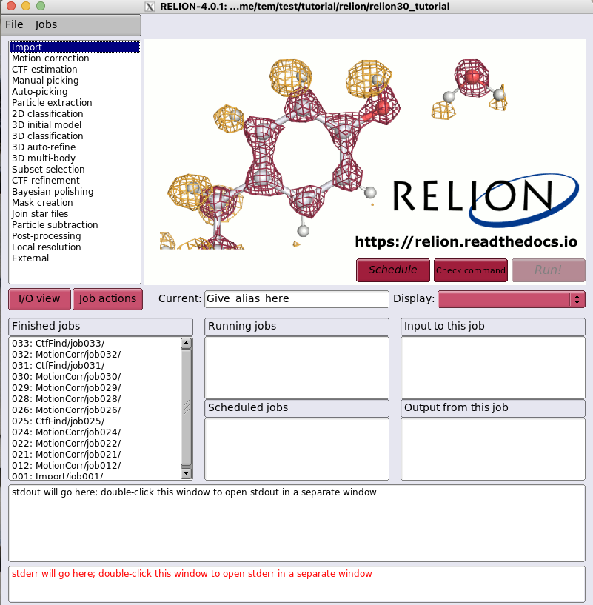
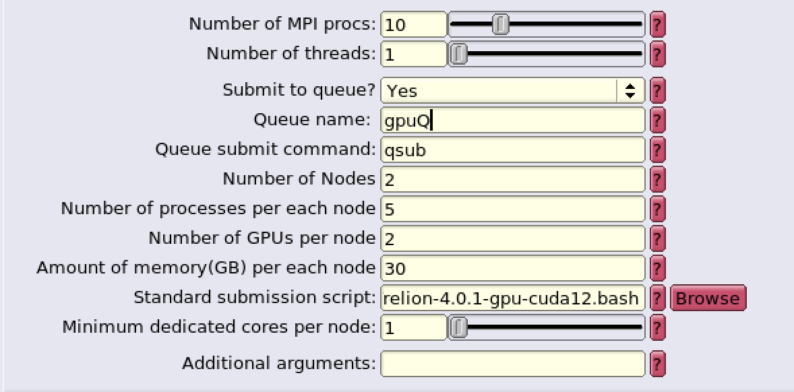
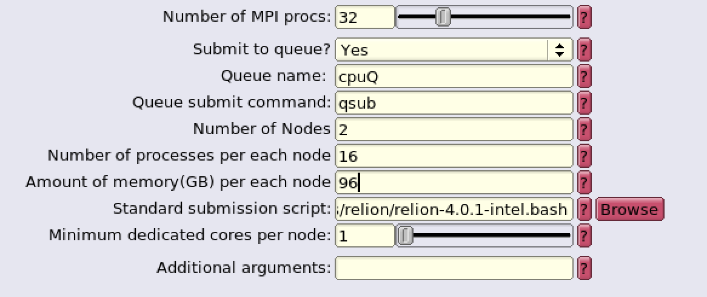

# Relion

RELION (for REgularised LIkelihood OptimisatioN, pronounce rely-on) is a stand-alone computer program that employs an empirical Bayesian approach to refinement of (multiple) 3D reconstructions or 2D class averages in electron cryo-microscopy (cryo-EM).

## Executing relion

1. Find out relion applications module path by `module keyword` command

    ``` bash
    $> module keyword relion
    ------------------------------------------------------------------------------------------------------------
    The following modules match your search criteria: "relion"
    ------------------------------------------------------------------------------------------------------------

    apps/relion/4.0.1/cpu: apps/relion/4.0.1/cpu/gcc-11.5.0, apps/relion/4.0.1/cpu/intel-compiler-2024.0.2
        RELION (for REgularised LIkelihood OptimisatioN, pronounce rely-on)

    apps/relion/4.0.1/gpu: apps/relion/4.0.1/gpu/cuda-11.8, apps/relion/4.0.1/gpu/cuda-12.6
        RELION (for REgularised LIkelihood OptimisatioN, pronounce rely-on)

    apps/relion/5.0.0/cpu: apps/relion/5.0.0/cpu/gcc-11.5.0, apps/relion/5.0.0/cpu/intel-compiler-2024.0.2
        RELION (for REgularised LIkelihood OptimisatioN, pronounce rely-on)

    apps/relion/5.0.0/gpu: apps/relion/5.0.0/gpu/cuda-11.8, apps/relion/5.0.0/gpu/cuda-12.6
        RELION (for REgularised LIkelihood OptimisatioN, pronounce rely-on)

    ------------------------------------------------------------------------------------------------------------
    To learn more about a package execute:
    $ module spider Foo
    where "Foo" is the name of a module.
    To find detailed information about a particular package you
    must specify the version if there is more than one version:
    $ module spider Foo/11.1
    ------------------------------------------------------------------------------------------------------------
    ```

    Here, relion-related module paths (e.g., apps/relion/5.0.0/cpu/intel-compiler-2024.0.2, where the module is for the relion version 5.0.0 application built upon using intel compiler) are shown,
    as each module with different version of relion with the variants of depending on the underlying architectures (x86 or CUDA).

2. Load the environment module of relion which you want to use.

    ``` bash
    $> module load apps/relion/4.0.1/gpu/cuda-12.6
    $> module list

    Currently Loaded Modules:
        1) gcc/11.5.0   2) cuda/12.6   3) openmpi/5.0.3/gcc-11.5.0   4) apps/relion/4.0.1/gpu/cuda-12.6

    ```

     As the module specified is loaded, all other dependent modules are also automatically loaded (you can check these modules with `module list` command)
    
3. Check the binary path of the relion application

    ``` bash
    $> which relion
    /tem/al9/applications/relion-4.0.1-gpu-cuda-12.6/bin/relion
    ```

4. Execute the relion (we assume that X11 forwarding is enabled)

    ``` bash
    $> relion
    ```

    


## Relion job templates (Standard submission scripts)

All the relion job templates (also known as standard submission scripts) for PBSPro is located at the following : **/tem/al9/templates/relion**

``` bash
$> cd /tem/al9/templates/relion
$> tree .
.
├── relion-4.0.1-cpu.bash
├── relion-4.0.1-gpu-cuda11.bash
├── relion-4.0.1-gpu-cuda12.bash
├── relion-4.0.1-intel.bash
├── relion-5.0.0-cpu.bash
├── relion-5.0.0-gpu-cuda11.bash
├── relion-5.0.0-gpu-cuda12.bash
└── relion-5.0.0-intel.bash

$> cat relion-4.0.1-gpu-cuda12.bash
#!/bin/bash

### Inherit all current environment variables
#PBS -V

### Queue name
#PBS -q XXXqueueXXX

### GPU cluster use : Specify the number of nodes (XXXextra1XXX)
### the number of processes per each node (XXXextra2XXX)
### the number of GPUs per each node (XXXextra3XXX)
### and the size of required memory per each node (GB, XXXextra4XXX)

#PBS -l select=XXXextra1XXX:ncpus=XXXextra2XXX:ngpus=XXXextra3XXX:mem=XXXextra4XXXGB:mpiprocs=XXXextra2XXX
#PBS -o XXXoutfileXXX
#PBS -e XXXerrfileXXX

#PBS -k eod

###########################################################
### Print Environment Variables
###########################################################
echo ------------------------------------------------------
echo -n 'Job is running on node '; cat $PBS_NODEFILE
echo ------------------------------------------------------
echo PBS: qsub is running on $PBS_O_HOST
echo PBS: originating queue is $PBS_O_QUEUE
echo PBS: executing queue is $PBS_QUEUE
echo PBS: working directory is $PBS_O_WORKDIR
echo PBS: execution mode is $PBS_ENVIRONMENT
echo PBS: job identifier is $PBS_JOBID
echo PBS: job name is $PBS_JOBNAME
echo PBS: node file is $PBS_NODEFILE
echo PBS: current home directory is $PBS_O_HOME
echo PBS: PATH = $PBS_O_PATH
echo ------------------------------------------------------

###########################################################
# Switch to the working directory;
cd $PBS_O_WORKDIR/XXXnameXXX
touch run.out
touch run.err
cd $PBS_O_WORKDIR
###########################################################

### Run:
module load apps/relion/4.0.1/gpu/cuda-12.6
mpirun --mca btl tcp,self -n XXXmpinodesXXX -N XXXextra2XXX --machinefile $PBS_NODEFILE XXXcommandXXX

echo "Done!"
```

The job templates file contains **some pre-defined strings (XXX...XXX)**. Each string is replaced with some values provided by users (or automatically by the program) in the relion GUI tool when a relion job is submitted using the template.

* GPU scripts strings

| String                 | Meaning                                                                          | Remarks                    |
| ---------------------- | -------------------------------------------------------------------------------- | -------------------------- |
| XXXnameXXX             | Job name                                                                         |                            |
| XXXcommandXXX          | Relion command to be executed                                                    |                            |
| XXXqueueXXX            | Queue Name (`Queue name:` in GUI)                                                | cpuQ or gpuQ               |
| XXXextra1XXX           | Number of Nodes (`Number of Nodes:` in GUI)                                      | 1-2 (recommended)          |
| XXXextra2XXX           | Number of proccesses per each node (`Number of processes per each node:` in GUI) |                            |
| XXXextra3XXX           | Number of GPUs per each node (`Number of GPUs per node:` in GUI)                 | 1-2 (recommended)          |
| XXXextra4XXX           | Amount of memory per each node (`Amount of memory(GB) per each node:` in GUI)    | Number of processes per each node * 6GB (recommended) |
| XXXmpinodesXXX         | Number of Nodes x (Number of processes per each node)                            |                            |




* CPU scripts strings

| String                 | Meaning                                                                          | Remarks                    |
| ---------------------- | -------------------------------------------------------------------------------- | -------------------------- |
| XXXnameXXX             | Job name                                                                         |                            |
| XXXcommandXXX          | Relion command to be executed                                                    |                            |
| XXXqueueXXX            | Queue Name (`Queue name:` in GUI)                                                | cpuQ or gpuQ               |
| XXXextra1XXX           | Number of Nodes (`Number of Nodes:` in GUI)                                      | 1-2 (recommended)          |
| XXXextra2XXX           | Number of proccesses per each node (`Number of processes per each node:` in GUI) |                            |
| XXXextra3XXX           | Amount of memory per each node (`Amount of memory(GB) per each node:` in GUI)    | Number of processes per each node * 6GB (recommended) |
| XXXmpinodesXXX         | (Number of Nodes) x (Number of processes per each node)                          |                            |

