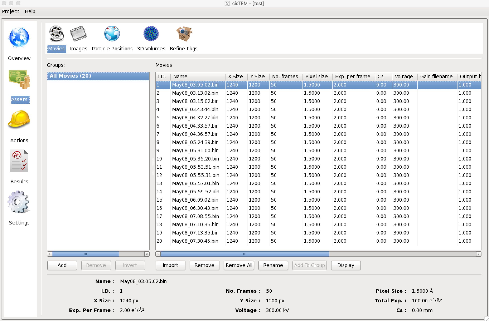
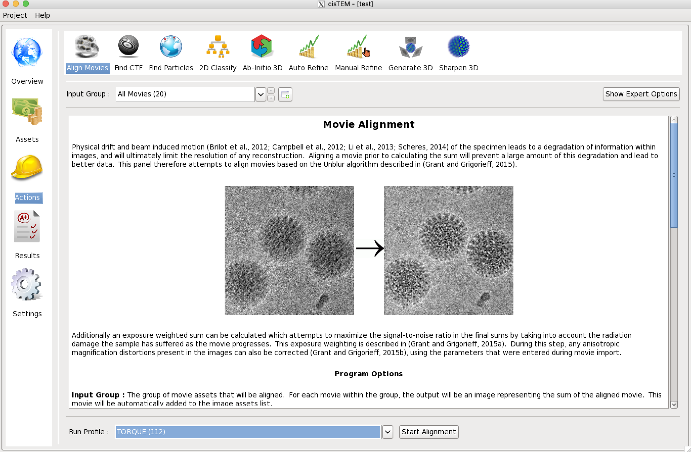
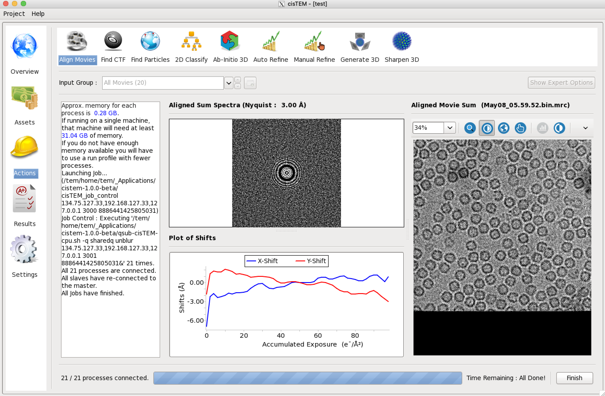

******
cisTEM
******
cisTEM is user-friendly software to process cryo-EM images of macromolecular complexes and obtain high-resolution 3D reconstructions from them. It comprises a number of tools to process image data including movies, micrographs and stacks of single-particle images, implementing a complete “pipeline” of processing steps to obtain high-resolution single-particle reconstructions. (from cisTEM official site https://cistem.org)

Executing cisTEM
================

How to start cisTEM data analysis tool
--------------------------------------

1. You can find out cisTEM applications' environment module path by listing all the module available on TEM service farm.

.. code-block:: bash

  $> module avail

  ----------------- /tem/home/tem/Modules/Modules/versions -----------------
  3.2.10

  ----------- /tem/home/tem/Modules/Modules/default/modulefiles ------------
  apps/gcc/4.4.7/cistem/1.0.0     cuda/9.1
  apps/gcc/4.4.7/relion/cpu/3.0.7 modules
  apps/gcc/4.4.7/relion/gpu/3.0.7 mpi/gcc/openmpi/1.8.8

2. Check the module details for cisTEM application

.. code-block:: bash

  $> module show apps/gcc/4.4.7/cistem/1.0.0 

  -------------------------------------------------------------------
  /tem/home/tem/Modules/Modules/default/modulefiles/apps/gcc/4.4.7/cistem/1.0.0:

  module-whatis    Setups `cistem-1.0.0' environment variables 
  module           load mpi/gcc/openmpi/1.8.8 
  prepend-path     PATH /tem/home/tem/_Applications/cistem-1.0.0-beta 
  conflict         apps/gcc/4.4.7/cistem 
  -------------------------------------------------------------------

3. Load the environment module for cisTEM  application which you want to execute. As the module specified is loaded, all the modules with dependency are also loaded (you can check these modules with “module list” command)

.. code-block:: bash

  $> module load apps/gcc/4.4.7/cistem/1.0.0 
  $> module list
  Currently Loaded Modulefiles:
    1) mpi/gcc/openmpi/1.8.8         2) apps/gcc/4.4.7/cistem/1.0.0

4. Check the cisTEM application binary path

.. code-block:: bash

  $> which cisTEM
  /tem/home/tem/_Applications/cistem-1.0.0-beta/cisTEM

5. Execute the cisTEM application (we assume that X11 forwarding is enabled)

.. code-block:: bash

  $> cisTEM

.. image:: images/cistem-screenshot-re.png
  :scale: 50 %
  :align: center

On startup, the GUI presents a list of previously opened projects, as well as options to create a new project or open an existing project. 
To continue a previous project, click on the provided link.

Run profiles for job submission
===============================

Profile templates
-----------------

If you need cisTEM to work on multiple computing servers in a cluster which is managed with Torque, you should check out (or create) a "Run Profile" in cisTEM's settings tab.
You can find a shell script available in following file paths.

.. code-block:: bash

  (cisTEM with job outputs and errors) /tem/home/tem/_Applications/cistem-1.0.0-beta/qsub-cisTEM-cpu.sh
  (cisTEM without outputs and errors)  /tem/home/tem/_Applications/cistem-1.0.0-beta/qsub-cisTEM-cpu-noout.sh

For qsub-cisTEM-cpu.sh,

.. code-block:: bash

  #!/bin/bash
  queue=
  while getopts ":q:" OPTION
  do
    case "${OPTION}" in
      q) queue="${OPTARG}";;
    esac
  done
  shift $((OPTIND-1))

  cat - <<EOF | qsub
  #!/bin/bash
  #PBS -N cisTEM.${1}
  ${queue:+#PBS -l nodes=1:ppn=1:${queue}}
  ${queue:+#PBS -q ${queue}}

  module load apps/gcc/4.4.7/cistem/1.0.0
  ${@}
  EOF

For qsub-cisTEM-cpu-noout.sh,

.. code-block:: bash

  #!/bin/bash
  queue=
  while getopts ":q:" OPTION
  do
    case "${OPTION}" in
      q) queue="${OPTARG}";;
    esac
  done
  shift $((OPTIND-1))

  cat - <<EOF | qsub
  #!/bin/bash
  #PBS -N cisTEM.${1}
  #PBS -e /dev/null
  #PBS -o /dev/null
  ${queue:+#PBS -l nodes=1:ppn=1:${queue}}
  ${queue:+#PBS -q ${queue}}

  module load apps/gcc/4.4.7/cistem/1.0.0
  ${@}
  EOF

Adding a new Run Profile
------------------------

In cisTEM settings, add a new "Run Profile" (called TORQUE here) with the following parameters :

* Manager Command: /tem/home/tem/_Applications/cistem-1.0.0-beta/$command 
* Gui Address: Automatic
* Controller Address: Automatic
* Command -> Edit:

  * Command: /tem/home/tem/_Applications/cistem-1.0.0-beta/qsub-cisTEM-cpu.sh **-q cpuQ** $command
  * No. Copies: 84
  * Delay (ms): 10

.. image:: images/cistem-run-profile-re.png
  :scale: 60 %
  :align: center

Examples of running cisTEM jobs
===============================

With the above cisTEM setting, here, we provide some examples of running cisTEM jobs with cisTEM GUI tools.

Importing Movies and images
---------------------------

Once a project is open or has been newly created, Assets can be imported. These will usually be Movies or Images but can also be Particle Positions, 3D Volumes and Refinement Packages.
Click on Assets, then Movies and Import. In the dialog, select "Add Directory" and navigate to the directory containing your own movies.
The movies are all part of a group called "All Movies". Additional groups can be created using "Add" to select subsets of a dataset for further processing. 
You should continue with all the data for now. If images are available instead of movies,
these can be imported as Image Assets in the same way as Movies, by clicking "Images".

Movie Alignment
---------------

Movie data collection and frame alignment have been part of the single-particle image processing pipeline since it was first introduced by Brilot et al. in 2012. The original software **Unblur** was developed further by Grant & Grigorieff (2015) when exposure weighting was added to take into account the radiation-dependent signal loss when adding movie frames, yielding signal-optimized frame sums. cisTEM implements the Unblur algorithm in the Align Movies panel, which also provides some background to the method. Click “Actions” and select “Align Movies” to call up the panel.

Actions panels display parameters that you can change. Some of these are shown on the main panel while others are only accessible when "Show Expert Options" is selected. 
Movie alignment usually works with the default parameters and you should simply click "Start Alignment" near the bottom of the panel.
You will notice that next to the start button a menu is shown that allows you to select different run profiles.
The Local profile should **NOT** be selected because it will launch alignment jobs onto the login node but you should change to other profiles (for example, TORQUE profile) 
if these were previously set up under Settings.

The alignment of all the  movies takes less than a minute. While the job is running, X,Y traces are displayed for some of the movies and a progress bar indicates the time left until completion of the job. 
After termination (you must click on “Finish” at the end of all jobs), you can inspect the results by clicking "Results"

