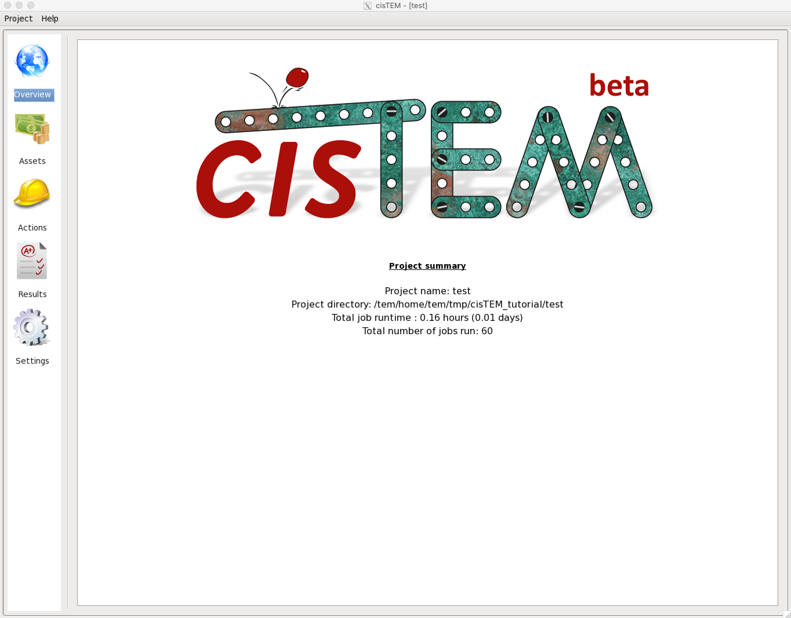
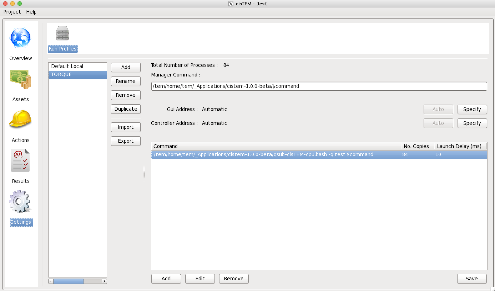

******
cisTEM
******
cisTEM is user-friendly software to process cryo-EM images of macromolecular complexes and obtain high-resolution 3D reconstructions from them. It comprises a number of tools to process image data including movies, micrographs and stacks of single-particle images, implementing a complete “pipeline” of processing steps to obtain high-resolution single-particle reconstructions. (from cisTEM official site https://cistem.org)

Executing cisTEM
================

How to start cisTEM data analysis tool
--------------------------------------

1. You can find out cisTEM applications' environment module path by listing all the module available on TEM service farm

.. code-block:: bash

  $> module avail

  ----------------- /tem/home/tem/Modules/Modules/versions -----------------
  3.2.10

  ----------- /tem/home/tem/Modules/Modules/default/modulefiles ------------
  apps/gcc/4.4.7/cistem/1.0.0     cuda/9.1
  apps/gcc/4.4.7/relion/cpu/3.0.7 modules
  apps/gcc/4.4.7/relion/gpu/3.0.7 mpi/gcc/openmpi/1.8.8

2. Check the module details for cisTEM application

.. code-block:: bash

  $> module show apps/gcc/4.4.7/cistem/1.0.0 

  -------------------------------------------------------------------
  /tem/home/tem/Modules/Modules/default/modulefiles/apps/gcc/4.4.7/cistem/1.0.0:

  module-whatis    Setups `cistem-1.0.0' environment variables 
  module           load mpi/gcc/openmpi/1.8.8 
  prepend-path     PATH /tem/home/tem/_Applications/cistem-1.0.0-beta 
  conflict         apps/gcc/4.4.7/cistem 
  -------------------------------------------------------------------

3. Load the environment module for cisTEM  application which you want to execute. As the module specified is loaded, all the modules with dependency are also loaded (you can check these modules with “module list” command)

.. code-block:: bash

  $> module load apps/gcc/4.4.7/cistem/1.0.0 
  $> module list
  Currently Loaded Modulefiles:
    1) mpi/gcc/openmpi/1.8.8         2) apps/gcc/4.4.7/cistem/1.0.0

4. Check the cisTEM application binary path

.. code-block:: bash

  $> which cisTEM
  /tem/home/tem/_Applications/cistem-1.0.0-beta/cisTEM

5. Execute the cisTEM application (we assume that X11 forwarding is enabled)

.. code-block:: bash

  $> cisTEM

Run profiles for job submission
===============================

Profile templates
-----------------

If you need cisTEM to work on multiple computing servers in a cluster which is managed with Torque, you should check out (or create) a "Run Profile" in cisTEM's settings tab.
You can find a shell script available in following file paths.

.. code-block:: bash

  (cisTEM with job outputs and errors) /tem/home/tem/_Applications/cistem-1.0.0-beta/qsub-cisTEM-cpu.sh
  (cisTEM without outputs and errors)  /tem/home/tem/_Applications/cistem-1.0.0-beta/qsub-cisTEM-cpu-noout.sh

For qsub-cisTEM-cpu.sh,

.. code-block:: bash

  #!/bin/bash
  queue=
  while getopts ":q:" OPTION
  do
    case "${OPTION}" in
      q) queue="${OPTARG}";;
    esac
  done
  shift $((OPTIND-1))

  cat - <<EOF | qsub
  #!/bin/bash
  #PBS -N cisTEM.${1}
  ${queue:+#PBS -l nodes=1:ppn=1:${queue}}
  ${queue:+#PBS -q ${queue}}

  module load apps/gcc/4.4.7/cistem/1.0.0
  ${@}
  EOF

For qsub-cisTEM-cpu-noout.sh,

.. code-block:: bash

  #!/bin/bash
  queue=
  while getopts ":q:" OPTION
  do
    case "${OPTION}" in
      q) queue="${OPTARG}";;
    esac
  done
  shift $((OPTIND-1))

  cat - <<EOF | qsub
  #!/bin/bash
  #PBS -N cisTEM.${1}
  #PBS -e /dev/null
  #PBS -o /dev/null
  ${queue:+#PBS -l nodes=1:ppn=1:${queue}}
  ${queue:+#PBS -q ${queue}}

  module load apps/gcc/4.4.7/cistem/1.0.0
  ${@}
  EOF

Adding a new Run Profile
------------------------

In cisTEM settings, add a new "Run Profile" with the following parameters :

* Manager Command: /tem/home/tem/_Applications/cistem-1.0.0-beta/$command 
* Gui Address: Automatic
* Controller Address: Automatic
* Command -> Edit:

  * Command: /tem/home/tem/_Applications/cistem-1.0.0-beta/qsub-cisTEM-cpu.sh -q <your_own_queue_name> $command
  * No. Copies: 84
  * Delay (ms): 10

