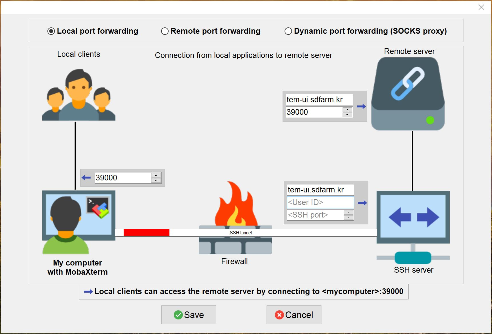
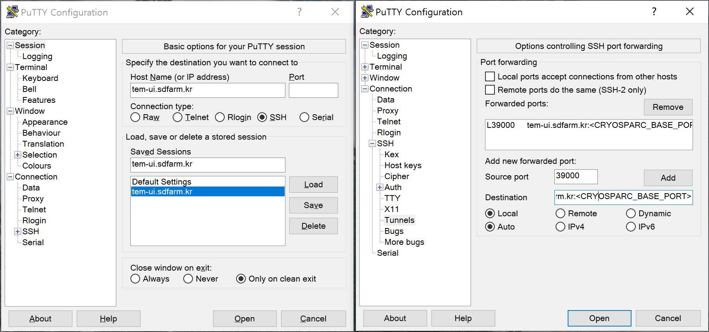
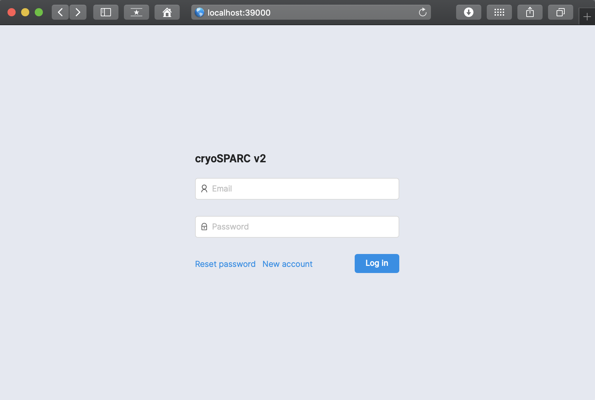
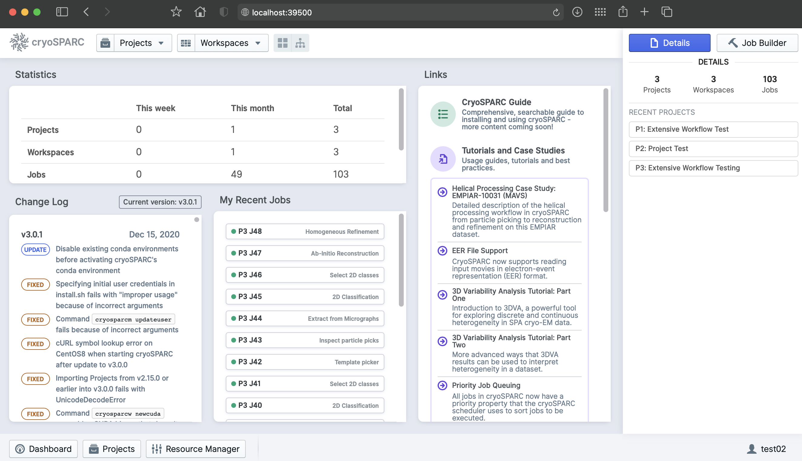
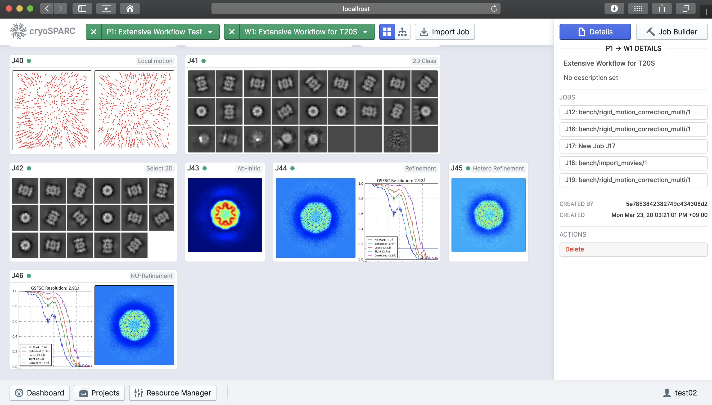
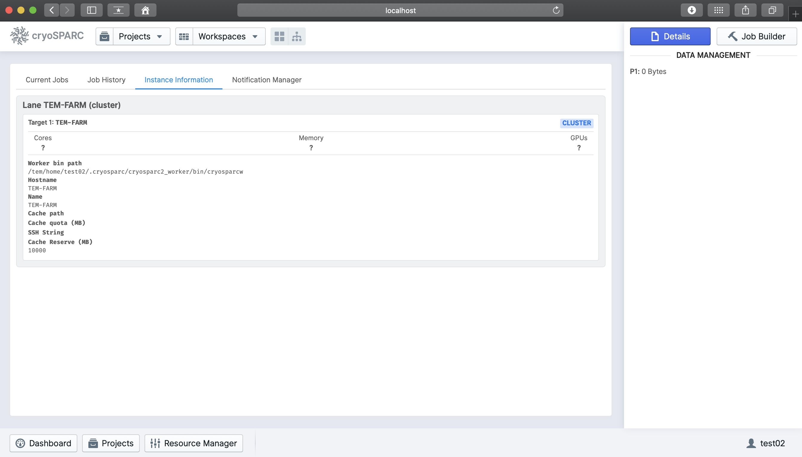

*********
cryoSPARC
*********
CryoSPARC is the state-of-the-art platform used globally for obtaining 3D structural information from single particle cryo-EM data. 
The cryoSPARC platform enables automated, high quality and high-throughput structure discovery of proteins, viruses and molecular complexes 
for research and drug discovery.

.. note::
  cryoSPARC offical site : https://cryosparc.com

.. note::
  At the time of writing this document (Mar. 2020), unforturnatelly, cryoSPARC v2.x does not provide the method of installing **a single cryoSPARC instance**
  (consisting of web applcation, command core, and database) **for use by a number of users with the complete isolation and security of their project data**.
  This problem might be resolved with later versions of cryoSPARC after CryoSPARC re-designs the product with the concept of "Hub" (as mentioned in cryoSPARC forum 
  https://discuss.cryosparc.com/t/use-linux-user-accounts/3480).
  In the meanwhile, thus, we had to decide that each user must setup **a completely isolated cryoSPARC instance independently within thier own home directories** 
  (/tem/home/<userhome>).
  This method relies on the UNIX system for security and is more tedious to manage but provides stronger access restrictions for users own dataset.
  For users convenience, we are ready to install and setup a cryoSPARC instance with **administrative automation codes on behalf of users**.  

Prerequisites
=============

Now, cryoSPARC is available free of charge for academic use. For a completely isolated cryoSPARC instance, user must have their own non-commercial license key for cryoSPARC v2.
**Please visit the CryoSPARC official site, request a license key and inform the valid key to GSDC TEM service administrator by e-mail.**  

Getting a cryoSPARC instance 
============================

CryoSPARC is a backend and frontend software system that provides data processing and image analysis capabilities for single particle cryo-EM, 
along with a browser based user interface and command line tools. CryoSPARC is composed of three major components : cryosparc_master, cryospace_database and cryosparc_worker.

* **cryosparc_master** : Master processes (webapps, command_core, databases, etc.) run together on one node (for our case, tem-ui.sdfarm.kr login node). These processes host HTML5 based web applications, spawn or submit jobs to a cluster scheduler (for example, to PBS-based batch system)

* **cryosparc_worker** : Worker process can be spawned on any available worker nodes, and do data processing and image analysis tasks which are pre-defined within cryoSPRAC software packages.

* **cryosparc_database** : CryoSPARC database is built on top of mongoDB, managing the metadata of users workflows, projects, jobs, backend clusters or workers as well as users. 

1. (Admin) Install and setup a cryoSPARC instance
-------------------------------------------------

On behalf of users, administrator can execute ansible configuration automation code-snippets to install and setup a cryoSPARC instance, using a given valid license key.
Master, worker and database sub-packages will be installed during configuration automation, which are located in **/tem/home/<user>/.cryosparc** after finishing setup.
A setup procedure includes registering both cluster(lane or worker nodes) instance and webapp's admin/normal users account. 
The whole setup will take about 10 minutes. 

After finishing installation, **/tem/home/<user>/.cryosparc** has following directories/files structure:

.. code-block:: bash

  $> cd ~/.cryosparc
  $> tree -L 1 ./
  .
  ├─ cluster_info.json              ## cluster(lane) information to register    
  ├─ cluster_script.sh              ## PBS script template to submit jobs to worker cluster(lane)    
  ├─ cryosparc2_master              ## cryosparc_master package install path
  ├─ cryosparc2_master.tar.gz
  ├─ cryosparc2_worker              ## cryosparc_worker package install path
  ├─ cryosparc2_worker.tar.gz
  └─ cryosparc_database             ## cryosparc_database package install path

.. warning::
  **!! CAUTION !!** **DO NOT** delete or modify cryoSPARC instance base directory, **/tem/home/<user>/.cryosparc**. The cryoSPARC base directory contains database. If this directory is deleted,
  all the project, job and workflow information will be corrupted and lost.

Also, the configuration code-snippets implicitly add cryoSPARC instance's binary path to PATH environment variable.

.. code-block:: bash

   $> cat /tem/home/<user>/.bashrc
   ...
   # User specific aliases and functions
   export PATH='/tem/home/<user>/.cryosparc/cryosparc2_master/bin':$PATH

2. (User) Verifying installation
--------------------------------

By default, master processes (webapp, command_core, database, etc.) are automatilly started during configuration automation.
Users should check and verify whether the master processes are working correctly on tem-ui.sdfarm.kr login node or not. 

* **Checking environment variables for cryoSPARC instance**

.. code-block:: bash

   $> cryosparcm env
   
   export "CRYOSPARC_HTTP_PORT=39000"
   export "CRYOSPARC_MASTER_HOSTNAME=tem-ui.sdfarm.kr"
   export "CRYOSPARC_CLICK_WRAP=true"
   export "CRYOSPARC_COMMAND_VIS_PORT=39003"
   export "CRYOSPARC_INSECURE=true"
   export "CRYOSPARC_DEVELOP=false"
   export "CRYOSPARC_DB_PATH=/tem/home/<user>/.cryosparc/cryosparc_database"
   export "CRYOSPARC_HTTP_RTP_PORT=39006"
   export "CRYOSPARC_LICENSE_ID=<license_key"
   export "CRYOSPARC_MONGO_PORT=39001"
   export "CRYOSPARC_MONGO_CACHE_GB=4"
   export "CRYOSPARC_HEARTBEAT_SECONDS=60"
   export "CRYOSPARC_COMMAND_PROXY_PORT=39004"
   export "CRYOSPARC_ROOT_DIR=/tem/home/<user>/.cryosparc/cryosparc2_master"
   export "CRYOSPARC_COMMAND_CORE_PORT=39002"
   export "CRYOSPARC_BASE_PORT=39000"
   export "CRYOSPARC_PATH=/tem/home/<user>/.cryosparc/cryosparc2_master/deps/anaconda/bin:/tem/home/<user>/.cryosparc/cryosparc2_master/deps/external/mongodb/bin:/tem/home/<user>/.cryosparc/cryosparc2_master/bin"
   export "CRYOSPARC_LIVE_ENABLED=false"
   export "CRYOSPARC_COMMAND_RTP_PORT=39005"
   export "CRYOSPARC_SUPERVISOR_SOCK_FILE=/tmp/cryosparc-supervisor-627a9991e2f2f069094732dfd78d1696.sock"
   export "CRYOSPARC_LD_LIBRARY_PATH="
   export "LD_LIBRARY_PATH=:"
   export "LD_PRELOAD=/tem/home/<user>/.cryosparc/cryosparc2_master/deps/anaconda/lib/libpython2.7.so.1.0"
   export "PYTHONPATH="
   export "PYTHONNOUSERSITE=true"

You can find what kinds of environment variables have been set for the cryoSPARC instance. 

.. note::
   Especially, user should check **CRYOSPARC_BASE_PORT** (above, for example, 39000), which is **the listening port of cryoSPARC web application**. 
   Later, this port number is used to make SSH tunneling between client and tem-ui.sdfarm.kr login node. 
   **Via the tunneled connection over SSH, users can access the web UI of cryoSPARC instance.**    

* **Checking the status of cryoSPARC instance**

.. code-block:: bash

   $> cryosparcm status
   ----------------------------------------------------------------------------
   CryoSPARC System master node installed at
   /tem/home/<user>/.cryosparc/cryosparc2_master
   Current cryoSPARC version: v2.14.2
   ----------------------------------------------------------------------------

   cryosparcm process status:
   app                              STOPPED   Not started
   app_dev                          STOPPED   Not started
   command_core                     RUNNING   pid 171073, uptime 1 day, 5:35:11
   command_proxy                    RUNNING   pid 171175, uptime 1 day, 5:35:02
   command_rtp                      STOPPED   Not started
   command_vis                      RUNNING   pid 171170, uptime 1 day, 5:35:03
   database                         RUNNING   pid 170997, uptime 1 day, 5:35:14
   watchdog_dev                     STOPPED   Not started
   webapp                           RUNNING   pid 171178, uptime 1 day, 5:35:00
   webapp_dev                       STOPPED   Not started

   ----------------------------------------------------------------------------

   global config variables:

   export CRYOSPARC_LICENSE_ID="<license_key>"
   export CRYOSPARC_MASTER_HOSTNAME="tem-ui.sdfarm.kr"
   export CRYOSPARC_DB_PATH="/tem/home/<user>/.cryosparc/cryosparc_database"
   export CRYOSPARC_BASE_PORT=39000
   export CRYOSPARC_DEVELOP=false
   export CRYOSPARC_INSECURE=true
   export CRYOSPARC_CLICK_WRAP=true

Launching CryoSPARC instance
============================

We assume that user's network setup looks like (most commonly used scenario):

.. code-block:: bash

                   internet
   [ localhost ]==============[ firewall | tem-ui.sdfarm.kr ]

For Linux/Mac users 
-------------------

With the following command, you can start an SSH tunnel to export **CRYOSPARC_BASE_PORT** from tem-ui.sdfarm.kr to your local client machine.

.. code-block:: bash

   localhost$> ssh -N -f -L localhost:39000:tem-ui.sdfarm.kr:<CRYOSPARC_BASE_PORT> -o Port=<ssh_port> <userid>@tem-ui.sdfarm.kr

   ## -N : Do not execute a remote command. This is useful option for just forwarding ports.
   ## -f : Requests ssh to go to background just before command execution.
   ## -L [bind_address:]port:host:hostport

.. note::
   You should execute this 'ssh' command on **YOUR LOCAL PC/WORKSTATION** to make a tunnel between 
   your local machine and tem-ui.sdfarm.kr (localhost:39000 <--> tem-ui.sdfarm.kr:<CRYOSPARC_BASE_PORT>) over secure channel.

.. note::
   You can close the terminal window (because 'ssh' will be run in the background) after running the above command. The tunnel will stay open.   

Now, open your browser (Chrome/Firefox/Safari recommended) and navigate to http://localhost:39000. You should be presented with the cryoSPARC login page.

For Windows users 
-----------------

* Using MobaXterm

  * Open 'MobaXterm' application.
  * 'MobaXterm' -> 'Tools' -> 'MobaSSHTunnel (port forwarding)' : Open MobaSSHTunnel dialog box.
  * 'New SSH tunnel' : Set a forwarded port binding option and save the setting.
  * Give the name to the saved port forwarding settings, and start the tunnel connection.

.. note::
   You must use **CRYOSPARC_BASE_PORT** for the 'Remote server' port section.   

Now, open your browser (Chrome/Firefox/Safari recommended) and navigate to http://localhost:39000. You should be presented with the cryoSPARC login page.

* Using Putty
  
  * Open 'PuTTy Configuration' dialog box.
  * 'PuTTy Configuration' -> 'Session' : Load a SSH session to connect tem-ui login node with the known <ssh_port>.
  * 'PuTTy Configuration' -> 'Connection' -> 'SSH' -> 'Tunnels' : Set a forwarded port binding option and add the entry.

.. note::
   You must use **tem-ui.sdfarm.kr:CRYOSPARC_BASE_PORT** for the 'Destination' field. 

Now, open your browser (Chrome/Firefox/Safari recommended) and navigate to http://localhost:39000. You should be presented with the cryoSPARC login page.

Exploring CryoSPARC web apps
============================

CryoSPARC login
---------------

E-mail and password information will be notified to users as the installation and setup is finished.
Given e-mail and password, users can login to cryoSPARC web interfaces. 

CryoSPARC dashboard
-------------------

CryoSPARC project
-----------------

CryoSPARC cluster(lane)
-----------------------

.. note::
   For details on user interface and usages of cryoSPARC, refer to cryoSPARC's official document.
   https://cryosparc.com/docs/reference/general 

Tutorial on processing T20S
===========================

* Please refer to CryoSPARC's webpage for the tutorial on processing T20S : https://cryosparc.com/docs/tutorials/t20s

Trouble shooting
================

1. How to stop or start the cryoSPARC instance?
-----------------------------------------------

* Stop the running cryoSPRAC instance

.. code-block:: bash

   $> cryosparcm stop

   CryoSPARC is running.
   Stopping cryosparc.
   command_proxy: stopped
   command_vis: stopped
   webapp: stopped
   command_core: stopped
   database: stopped
   Shut down

Stop the cryosparc instance if running. This will gracefully kill all the master processes, and will cause any running jobs (potentially on other nodes) to fail.

* Start the cryoSPARC instance

.. code-block:: bash

   $> cryosparcm start

   Starting cryoSPARC System master process..
   CryoSPARC is not already running.
   database: started
   command_core: started
   cryosparc command core startup complete.
   command_vis: started
   command_proxy: started
   webapp: started
   -----------------------------------------------------
   CryoSPARC master started. 
   From this machine, access cryoSPARC at
   http://localhost:39030

   From other machines on the network, access cryoSPARC at
   http://tem-ui.sdfarm.kr:39030

   Startup can take several minutes. Point your browser to the address
   and refresh until you see the cryoSPARC web interface.

Start the cryosparc instance if stopped. This will cause the database, command, webapp etc processes to start up. 
Once these processes are started, they are run in the background, so the current shell can be closed and the web UI will continue to run, as will jobs that are spawned.

2. How to reset the password of non-admin user?
-----------------------------------------------

Users can reset the non-admin user's password to a new password with the following command-line execution:

.. code-block:: bash

   $> cryosparcm resetpassword --email <email address> --password <newpassword>

3. Job (or Workflow) failed caused by **SSD caching**
-----------------------------------------------------

Job failure log looks like:

.. code-block:: bash

   [CPU: 166.4 MB]  Traceback (most recent call last):
   File "cryosparc2_worker/cryosparc2_compute/run.py", line 82, in cryosparc2_compute.run.main
   File "cryosparc2_worker/cryosparc2_compute/jobs/class2D/run.py", line 64, in cryosparc2_compute.jobs.class2D.run.run_class_2D
   File "cryosparc2_compute/particles.py", line 61, in read_blobs
      u_blob_paths = cache.download_and_return_cache_paths(u_rel_paths)
   File "cryosparc2_compute/jobs/cache.py", line 129, in download_and_return_cache_paths
      other_instance_ids = get_other_instance_ids(instance_id, ssd_cache_path)
   File "cryosparc2_compute/jobs/cache.py", line 250, in get_other_instance_ids
      all_instance_ids = [p for p in os.listdir(ssd_cache_path) if os.path.isdir(os.path.join(ssd_cache_path, p)) and p.startswith('instance_')]
   OSError: [Errno 2] No such file or directory: ''

During cryoSPARC configuration, we did not provide an option to support any **SSD caching** due to the lack of SSD (or NVMe SSD) drives on the worker nodes.
However, by default, cryoSPARC seems to have 'SSD caching' enabled on its Web user interface. When you are running jobs that process particles (for example: Ab-Initio, Homogeneous Refinement, 2D Classification, 3D Variability), 
you will find a parameter at the bottom of the job builder under "Compute Settings" called **Cache particle images on SSD**. 
Turn this option off to load raw data from their original location instead.

Also, you can set a default parameter value of each project. By default, the Cache particle images on SSD parameter is always on for every job you build, 
but if you'd like to keep this option off across all jobs in a project, you can set a project-level default by running the following command in a shell on the UI node:

.. code-block:: bash

   $> cryosparcm cli "set_project_param_default('PX', 'compute_use_ssd', False)"

where 'PX' is the Project ID you want to set the default value for (e.g., 'P1', 'P2', etc.)

You can undo this setting by running:

.. code-block:: bash
   
   $> cryosparcm cli "unset_project_param_default('PX', 'compute_use_ssd')"

4. Failed to launch! 190
------------------------

As you submit a cryoSPARC job to TEM-FARM cluster, you can encounter an error such as **"Failed to launch! 190"**.
If you face with this error, you should check **Number of GPUs to parallelize** option under "Compute Setttings" of job builder first.
Unlike relion, it seems that all the cryoSPARC jobs can not distribute their worker processes onto multiple worker nodes 
(that is, all the cryoSPARC job is executed on a single CPU or GPU node).
So, the maximum number of GPUs which can be used to parallelize within a job is 2 (because there are 2 P100 or P40 GPUs on each GPU node in GSDC TEM FARM).

.. image:: images/cryosparc-maxgpus.png
    :scale: 45 %
    :align: center

5. Binary locations of Gctf, MotionCor2
---------------------------------------

The GPU environment of GSDC TEM farm is built on top of NVIDIA CUDA SDK (driver version 396.37 and CUDA library version 9.1).
Some 3rd-party applications with GPU acceleration, for example, Gctf, MotionCor2, which can be utilized within various number of Cryo-EM toolkit are provided, and
you can find those binaries in the following locations:

.. code-block:: bash

   ## Gctf
      /tem/home/tem/_Applications/Gctf_v1.18_b2/bin/Gctf_v1.18_b2_sm60_cu9.1

   ## MotionCor2
      /tem/home/tem/_Applications/MotionCor2/MotionCor2_Cuda9.1_v1.0.5 
