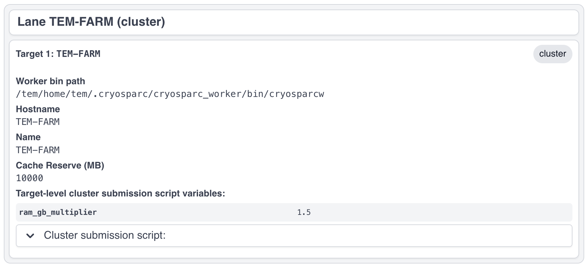
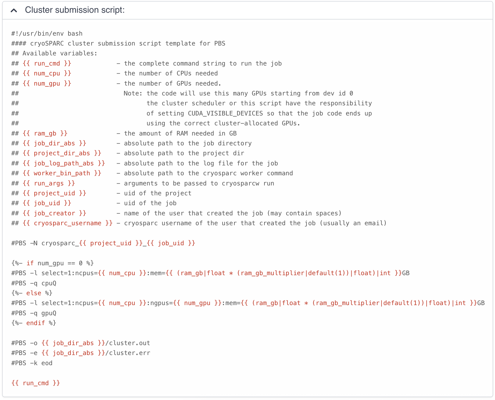
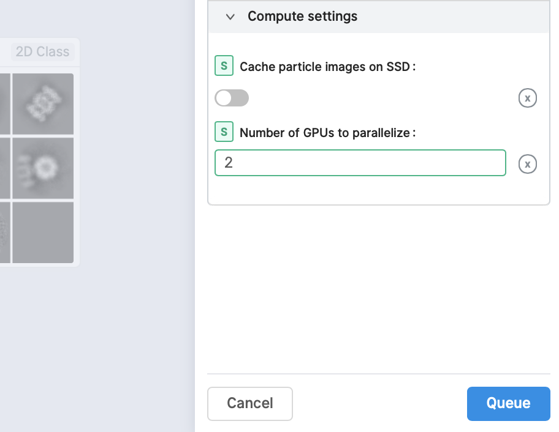

# FAQs

## **Accounts/Password/OTP**

#### **Resolving the IPA command error when getting OTP?**

??? note "(OTP) How to resolve the IPA command error when getting OTP?"

    This error occurs when the credentials issued by your authentication system, which are valid for one day, expire or become invalid. Here are the steps to resolve this problem. 
    
    Open your login terminal and execute the following command to obtain new credentials.
    
    ```bash
    $> kinit
    Password for [UserID]@SDFARM.KR: (Enter your password)
    ```

    Enter your password and press Enter to generate new credentials. Now, re-run the `ipa otptoken-add` command. It should execute without errors, using the newly generated credentials.

#### **Resolving "Unable to display QR code" error?**

??? note "(OTP) How to resolve `Unable to display QR code` error?"

    When connecting to the GSDC login server via a lab workstation/desktop using the GNOME Terminal in a Linux system (e.g., Ubuntu), executing the `ipa otptoken-add` command results in the message `ipa: WARNING: Unable to display QR code using the configured output encoding. Please use the token URI to configure your OTP device`.

    To resolve this issue, you can force the use of a locale supported by the internal Python QR code package within the ipa tool. Use the following command:
    
    ```bash
    $> LANG=en_US.UTF-8 LC_ALL=en_US.UTF-8 ipa otptoken-add --algo=sha512
    ```

#### **Releasing terminal's screen lock?**

??? note "(LOCK+OTP) How to release terminal's screen lock"

    When the screen lock is activated while using OTP, it prompts for a password with a message like :

    ```bash
    Screen used by [UserName] <[UserID]> on [LoginServerName].
    Password:
    ```

    ```bash
    This tty (pts/1) is not a virtual console.

    The pts/1 is now locked by [UserID].
    Password: 
    ```

    What password should I use to unlock it? To unlock the screen in this scenario, you should enter both the `First Factor` (usually your regular password string) and the `Second Factor` (the 6 digits OTP code generated by your OTP token). Combining these two factors (with consequtive password + otp) will allow you to unlock the screen and continue using your session.

#### **Changing password after the password expiration (or reset)**

??? note "(PASSWORD) How to change password after expiration (or reset)"

    Now your password has expired (or initialized). When you first log in using an original (or initialized) password, you will be asked to change it as below:

    ```bash
    $> ssh -o Port=<port> UserID@Login-Server

    -- WARNING -- 
    This system is for the use of authorized users only. Individuals using this computer system without authority or in excess of their authority 
    are subject to having all their activities on this system monitored and recorded by system personnel. Anyone using this system expressly consents to 
    such monitoring and is advised that if such monitoring reveals possible evidence of criminal activity, system personnel may provide the evidence of 
    such monitoring to law enforcement officials.

    First Factor: {original_password} or {initialized_password}
    Second Factor: {your_OTP}
    Password expired. Change your password now.
    
    First Factor (Current Password): {original_password} or {initialized_password}
    Second Factor: {your_OTP} **`Must wait for the OTP token refreshed`**
    
    New password: {your_new_password}
    Retype new password: {confirm_your_new_password}
    ```

    ??? note+ __Important__
    
        During the password change process, you'll need to enter your OTP (One-Time Password) twice. Each 6-digit OTP provided by Google Authenticator can only be used once, 
        indicated by the blue circular timer next to it showing its validity period. 
        Therefore, before entering your OTP for the second time, you must wait until the current OTP expires and a new OTP is generated.    


## **SSH Login/Terminal**

#### **Releasing the account lock?**

??? note "(LOCK) How to release the GSDC account lock?"

    When logging in to the login server using a GSDC UserID, entering the wrong password (including OTP) more than 5 times may cause the UserID to be locked. 
    When the UserID is locked, access to the server is restricted for a certain period of time. 
    
    To unlock the account, you must send **a ticket email** to the person in charge.
    
    E-mail address : __gsdc-support at kisti.re.kr__ (__[TEM]__ prefix required in the e-mail title)

## **X11 Forwarding**

## **SSH Tunnelling**

## **Data Transfer**

## **Module Environment (LMOD)**

#### **"module avail" can't find some modules. What do I do?**

??? note "`module avail` can't find some modules. What do I do?"

    You might have an out-of-date cache. Try running:

    ```bash
    $> module --ignore_cache avail
    ```

    If this command does find it, then you have an old personal lmod's spider cache. To remove it do:

    ```bash
    $> rm -rf ~/.cache/lmod
    $> module avail
    ```

## **CryoSPARC**

#### **Changing CryoSPARC's master host name?**

??? note "How to change CryoSPARC's master host name?"

    CryoSPARC master daemons have been executed on ScientificLinux7.x(SL7)-based login servers (__`tem-ui-el7.sdfarm.kr`__ and __`tem-cs-el7.sdfarm.kr`__) using `cryosparcm start` command for the representative account of each research group. 
    
    During OS upgrades to AlmaLinux 9.x, all these login servers hostname has been changed. 
    Thus, {==CryoSPARC master configuration must be changed in order to ensure correct execution on the new login servers
    (__`tem-ui-al9.sdfarm.kr`__ and __`tem-cs-al9.sdfarm.kr`__)==}. 
    
    Please follow below step-by-step guide to run your CryoSPARC onto the new login servers.

    === "Old SL7-based login servers (config.sh)"
        ``` yaml
        ...
        export CRYOSPARC_MASTER_HOSTNAME="tem-ui-el7.sdfarm.kr"
        ...
        ```
        or
        ``` yaml
        ...
        export CRYOSPARC_MASTER_HOSTNAME="tem-cs-el7.sdfarm.kr"
        ...
        ```
    === "New AL9-based login servers (config.sh)"
        ``` yaml
        ...
        export CRYOSPARC_MASTER_HOSTNAME="tem-ui-al9.sdfarm.kr"
        ...
        ```
        or
        ``` yaml
        ...
        export CRYOSPARC_MASTER_HOSTNAME="tem-cs-al9.sdfarm.kr"
        ...
        ```

    1. Log-in old cryosparc servers (__`tem-ui-el7`__ or __`tem-cs-el7`__) with each group's representative account, which your cryosparc master daemons have been running on. Stop all the cryosparc daemons.
        If your cryosparc daemons were already successfully terminated on the one of the old login servers, you can skip this step.
        ```bash
        $> cryosparcm stop 
        $> ps aux | grep <AccountName> | grep cryosparc
        $> ps aux | grep <AccountName> | grep -E "cryosparc|node" | awk '{print $2}' | xargs -I{} kill -9 {}
        ```
    2. Log-in new cryosparc servers (__`tem-ui-al9`__ or __`tem-cs-al9`__) using the same account, where your cryosparc master will be running. Locate `/tem/scratch/<GroupDir>/.cryosparc/cryosparc_master`, edit `config.sh` file and save (see above codeblock). 
    3. Start cryosparc.
        ```bash
        $> cat /tem/scratch/<GroupDir>/.cryosparc/cryosparc_master/config.sh
        $> cryosparcm start
        ```


#### **Migrating CryoSPARC's `TEM-FARM` lane from old SL7 to new AL9-based cluster?**

??? note "How to migrate CryoSPARC's `TEM-FARM` lane from old SL7 to new AL9-based cluster?"

    `TEM-FARM` lane information (stored in Cryosparc database) needs to be updated mainly due to the difference between Torque and PBSPro batch systems. Lane information is controlled by two files (__`cluster_info.json`__ and __`cluster_script.sh`__).
    
    The file that should be updated is located at : `/tem/scratch/<GroupDir>/.croysparc/cluster_script.sh`


    1. As pre-requisites, stop all the cryosparc daemons on the old SL7-based login servers, change your cryosparc master hostname to a new AL9-based login server (__`tem-ui-al9`__ or __`tem-cs-al9`__). 

    2. Start CryoSPARC (`cryosparcm start`) on the one of new login servers (__`tem-ui-al9`__ or __`tem-cs-al9`__)

    3. Locate `/tem/scratch/<GroupDir>/.cryosparc` directory. You will find the original `cluster_info.json` and `cluster_script.sh`.

    4. Replace the original `cluster_script.sh` file with the new one (__`/tem/al9/cluster_script.sh`__).
        ``` bash
        $> cd /tem/scratch/<GroupDir>/.cryosparc
        $> cp -i /tem/al9/cluster_script.sh .
        cp: overwrite './cluster_script.sh'? y

        $> cat cluster_script.sh
        $> cryosparcm cluster connect
        ...
        Successfully added cluster lane TEM-FARM
        ```

    `cryosparcm cluster connect` command reads `cluster_info.json` and `cluster_script.sh` from the current directory and update the lane configuration.

    === "SL7 : cluster_script.sh"
        ```bash
        #!/usr/bin/env bash
        #### cryoSPARC cluster submission script template for PBS
        ## Available variables:
        ## {{ run_cmd }}            - the complete command string to run the job
        ## {{ num_cpu }}            - the number of CPUs needed
        ## {{ num_gpu }}            - the number of GPUs needed.
        ##                            Note: the code will use this many GPUs starting from dev id 0
        ##                                  the cluster scheduler or this script have the responsibility
        ##                                  of setting CUDA_VISIBLE_DEVICES so that the job code ends up
        ##                                  using the correct cluster-allocated GPUs.
        ## {{ ram_gb }}             - the amount of RAM needed in GB
        ## {{ job_dir_abs }}        - absolute path to the job directory
        ## {{ project_dir_abs }}    - absolute path to the project dir
        ## {{ job_log_path_abs }}   - absolute path to the log file for the job
        ## {{ worker_bin_path }}    - absolute path to the cryosparc worker command
        ## {{ run_args }}           - arguments to be passed to cryosparcw run
        ## {{ project_uid }}        - uid of the project
        ## {{ job_uid }}            - uid of the job
        ## {{ job_creator }}        - name of the user that created the job (may contain spaces)
        ## {{ cryosparc_username }} - cryosparc username of the user that created the job (usually an email)
        
        #PBS -N cryosparc_{{ project_uid }}_{{ job_uid }}
        
        #PBS -l nodes=1:ppn={{ num_cpu }}:cpuQ
        #PBS -q cpuQ
        
        #PBS -l nodes=1:ppn={{ num_cpu }}:gpus={{ num_gpu }}:gpuQ
        #PBS -q gpuQ
        
        #PBS -o {{ job_dir_abs }}
        #PBS -e {{ job_dir_abs }}

        ################################
        ## Print Environment Variables #
        ################################
        echo ------------------------------------------------------
        echo -n 'Job is running on node '; cat $PBS_NODEFILE
        echo ------------------------------------------------------
        echo PBS: qsub is running on $PBS_O_HOST
        echo PBS: originating queue is $PBS_O_QUEUE
        echo PBS: executing queue is $PBS_QUEUE
        echo PBS: working directory is $PBS_O_WORKDIR
        echo PBS: execution mode is $PBS_ENVIRONMENT
        echo PBS: job identifier is $PBS_JOBID
        echo PBS: job name is $PBS_JOBNAME
        echo PBS: node file is $PBS_NODEFILE
        echo PBS: current home directory is $PBS_O_HOME
        echo PBS: PATH = $PBS_O_PATH
        echo PBS: PBS_GPUFILE=$PBS_GPUFILE
        echo PBS: CUDA_VISIBLE_DEVICES=$CUDA_VISIBLE_DEVICES
        echo ------------------------------------------------------

        {{ run_cmd }}
        ```
    === "AL9 : cluster_script.sh"
        ```bash
        #!/usr/bin/env bash
        #### cryoSPARC cluster submission script template for PBS
        ## Available variables:
        ## {{ run_cmd }}            - the complete command string to run the job
        ## {{ num_cpu }}            - the number of CPUs needed
        ## {{ num_gpu }}            - the number of GPUs needed.
        ##                            Note: the code will use this many GPUs starting from dev id 0
        ##                                  the cluster scheduler or this script have the responsibility
        ##                                  of setting CUDA_VISIBLE_DEVICES so that the job code ends up
        ##                                  using the correct cluster-allocated GPUs.
        ## {{ ram_gb }}             - the amount of RAM needed in GB
        ## {{ job_dir_abs }}        - absolute path to the job directory
        ## {{ project_dir_abs }}    - absolute path to the project dir
        ## {{ job_log_path_abs }}   - absolute path to the log file for the job
        ## {{ worker_bin_path }}    - absolute path to the cryosparc worker command
        ## {{ run_args }}           - arguments to be passed to cryosparcw run
        ## {{ project_uid }}        - uid of the project
        ## {{ job_uid }}            - uid of the job
        ## {{ job_creator }}        - name of the user that created the job (may contain spaces)
        ## {{ cryosparc_username }} - cryosparc username of the user that created the job (usually an email)
        
        #PBS -N cryosparc_{{ project_uid }}_{{ job_uid }}

        
        #PBS -l select=1:ncpus={{ num_cpu }}:mem={{ (ram_gb|float * (ram_gb_multiplier|default(1))|float)|int }}GB
        #PBS -q cpuQ
        
        #PBS -l select=1:ncpus={{ num_cpu }}:ngpus={{ num_gpu }}:mem={{ (ram_gb|float * (ram_gb_multiplier|default(1))|float)|int }}GB
        #PBS -q gpuQ
        

        #PBS -o {{ job_dir_abs }}/cluster.out
        #PBS -e {{ job_dir_abs }}/cluster.err
        #PBS -k eod

        {{ run_cmd }}
        ```

    You can do double-check the updated lane information in the CryoSPARC WebGUI, left menu `More`->`Instance Information`.

    
    /// caption
    Updated TEM-FARM lane information
    ///

    
    /// caption
    Updated TEM-FARM cluster submission script
    ///

#### **Resolving the problems on starting and/or restarting CryoSPARC daemons?**

??? note "How to resolve the problems on starting and/or restarting CryoSPARC daemons?"

    First, you must guarantee all the cryosparc related processes - supervisord, mongod, command_core, command_vis, command_rtp, webapp, app, liveapp - to be terminated successfully on the CryoSPARC master host. If necessary, you can kill the zombie processes.

    ``` bash
    $> cryosparcm stop
    CryoSPARC is running.
    Stopping cryoSPARC
    app: stopped
    app_api: stopped
    command_core: stopped
    command_rtp: stopped
    command_vis: stopped
    Shut down
    ```

    After stopping cryosparc, in order to check and kill the running zombie processes, use the following commands. Please repalce `<AccountName>` with the representative account. 

    ``` bash
    $> ps aux | grep <AccountName> | grep cryosparc
    $> ps aux | grep <AccountName> | grep -E "cryosparc|node" | awk '{print $2}' | xargs -I{} kill -9 {}
    ```

    Second, find your own cryosparc unix socket files on `/tmp` directory, and if exists, delete the files using `rm` command.

    ``` bash
    $> cd /tmp
    $> ls -al | grep <AccountName> | grep sock
    srwx------.  1 userid  userid  0 Jun 24 16:39 cryosparc-supervisor-6276.sock
    srwx------.  1 userid  userid  0 Jun 24 16:39 mongodb-39000.sock
    $> rm cryosparc-supervisor-6276.sock
    $> rm mongodb-39000.sock
    ```

    Then, start your cryosparc instance.

    ``` bash
    $> cryosparcm start
    Starting CryoSPARC System master process...
    CryoSPARC is not already running.
    configuring database...
        configuration complete
    database: started
    database OK
    command_core: started
        command_core connection succeeded
        command_core startup successful
    command_vis: started
    command_rtp: started
        command_rtp connection succeeded
        command_rtp startup successful
    app: started
    app_api: started
    -----------------------------------------------------
    ...
    Startup can take several minutes. Point your browser to the address
    and refresh until you see the CryoSPARC web interface.
    ```

#### **Upgrading (or Downgrading) to the specific version of cryosparc softwares?**

??? note "How to upgrade (or downgrade) to the specific version of cryosparc softwares?"

    The following update guides summarize the procedure for cryosparc’s master and worker software updates. For more details, please refer to [https://guide.cryosparc.com/setup-configuration-and-management/software-updates](https://guide.cryosparc.com/setup-configuration-and-management/software-updates).

    1. Check for updates

        Log into the __`tem-ui-al9.sdfarm.kr`__ or __`tem-cs-al9.sdfarm.kr`__ server where the cryosparc master is running using ssh. 
        Then, run the below command to check available updates.

        ``` bash
        userid@tem-[cs|ui]-al9 $> cryosparcm update --check
        CryoSPARC current version v4.5.3
            update starting on Wed Apr 23 05:35:33 PM KST 2025

        current version v4.5.3
            new version v4.7.0

        Update available!
        ```

        Also, you can use this command `cryosparcm update --list` to get a full list of available versions.

        ``` bash
        userid@tem-[cs|ui]-al9 $> cryosparcm update --list
        CryoSPARC current version v4.5.3
                update starting on Wed Apr 23 05:41:22 PM KST 2025

        Available versions:

        v2.15.0
        v3.0.0
        v3.0.1
        v3.1.0
        v3.2.0
        v3.3.0
        v3.3.1
        v3.3.2
        v3.4.0
        v4.0.0
        v4.0.1
        v4.0.2
        v4.0.3
        v4.0.4
        v4.1.0
        v4.1.1
        v4.1.2
        v4.2.0
        v4.2.1
        v4.3.0
        v4.3.1
        v4.4.0
        v4.4.1
        v4.5.0
        v4.5.1
        v4.5.2
        v4.5.3
        v4.6.0
        v4.6.1
        v4.6.2
        v4.7.0

        To install a specific version, use
            $ cryosparcm update --version=vXX.YY.ZZ[-branchname]
        ```


    2. Before you update: complete or kill running jobs

        Before you update the cryosparc softwares, you must wait for all the running cryosparc jobs completed (or kill your jobs). You also must check all the cryosparc related processes (i.e., supervisord, mongod, command_core, command_vis, command_rtp, webapp, app, liveapp) to be terminated successfully.

        ``` bash
        userid@tem-[cs|ui]-al9 $> cryosparcm stop

        CryoSPARC is running.
        Stopping cryoSPARC
        app: stopped
        command_core: stopped
        command_rtp: stopped
        command_vis: stopped
        liveapp: stopped
        webapp: stopped
        database: stopped
        Shut down

        userid@tem-[cs|ui]-al9 $>  ps aux | grep <userid> | grep cryosparc
        userid    2449  0.0  0.0 152792 17480 ?        Ss   Jun24   0:18 python /tem/scratch/<GroupDir>/.cryosparc/cryosparc_master/deps/anaconda/envs/cryosparc_master_env/bin/supervisord -c /tem/scratch/<GroupDir>/.cryosparc/cryosparc_master/supervisord.conf
        userid    2472  1.2  0.0 1429268 57412 ?       Sl   Jun24  13:19 mongod --dbpath /tem/scratch/<GroupDir>/.cryosparc/cryosparc_database --port 
        userid    2900  0.2  0.0 860572 83028 ?        Sl   Jun24   2:23 python -c import cryosparc_command.command_core as serv; serv.start
        userid    4332  0.1  0.1 854192 236396 ?       Sl   Jun24   1:53 python -c import cryosparc_command.command_vis as serv; serv.start
        userid    4378  0.4  0.0 1190536 196316 ?      Sl   Jun24   4:59 python -c import cryosparc_command.command_rtp as serv; serv.start
        userid    5586  0.1  0.0 1331136 116972 ?      Sl   Jun24   1:17 /tem/scratch/<GroupDir>/.cryosparc/cryosparc_master/cryosparc_webapp/nodejs/bin/node ./bundle/main.js
        userid    5625  0.1  0.0 1049868 97640 ?       Sl   Jun24   1:22 /tem/scratch/<GroupDir>/.cryosparc/cryosparc_master/cryosparc_app/nodejs/bin/node ./bundle/main.js
        userid    5690  0.2  0.0 1326136 81432 ?       Sl   Jun24   2:12 /tem/scratch/<GroupDir>/.cryosparc/cryosparc_master/cryosparc_liveapp/nodejs/bin/node ./bundle/main.js

        userid@tem-[cs|ui]-al9 $> ps aux | grep <userid> | grep -E "cryosparc|node" | awk '{print $2}' | xargs -I{} kill -9 {}
        ```

        Find your own cryosparc unix socket files on /tmp directory, and if exists, delete the files using rm command.

        ``` bash
        userid@tem-[cs|ui]-al9 $> cd /tmp
        userid@tem-[cs|ui]-al9 $> ls -al | grep <userid> | grep sock

        srwx------.  1 userid       userid          0 Jun 24 16:39 cryosparc-supervisor-627a9991e2f2f069094732dfd78d1696.sock
        srwx------.  1 userid       userid          0 Jun 24 16:39 mongodb-39031.sock

        userid@tem-[cs|ui]-al9 $> rm cryosparc-supervisor-627a9991e2f2f069094732dfd78d1696.sock
        userid@tem-[cs|ui]-al9 $> rm mongodb-39031.sock
        ```

    3. Back-up cryosparc databases
   
        We also highly recommend making a backup of your database as described below.

        ``` bash
        userid@tem-[cs|ui]-al9 $> cryosparcm backup

        Backing up to /tem/scratch/<GroupDir>/.cryosparc/cryosparc_database/backup/cryosparc_backup_2021_04_20_15h00.archive

        CryoSPARC is not already running.

        Starting the database in case it's not already running.
        database: started

        Executing mongodump.

        2021-04-20T15:00:42.606+0900    writing admin.system.version to archive '/tem/scratch/<GroupDir>/.cryosparc/cryosparc_database/backup/cryosparc_backup_2021_04_20_15h00.archive'
        2021-04-20T15:00:42.608+0900    done dumping admin.system.version (1 document)
        2021-04-20T15:00:42.609+0900    writing meteor.events to archive '/tem/scratch/<GroupDir>/.cryosparc/cryosparc_database/backup/cryosparc_backup_2021_04_20_15h00.archive'
        2021-04-20T15:00:42.617+0900    writing meteor.fs.files to archive '/tem/scratch/<GroupDir>/.cryosparc/cryosparc_database/backup/cryosparc_backup_2021_04_20_15h00.archive'
        2021-04-20T15:00:42.617+0900    writing meteor.notifications to archive '/tem/scratch/<GroupDir>/.cryosparc/cryosparc_database/backup/cryosparc_backup_2021_04_20_15h00.archive'
        2021-04-20T15:00:42.618+0900    writing meteor.fs.chunks to archive '/tem/scratch/<GroupDir>/.cryosparc/cryosparc_database/backup/cryosparc_backup_2021_04_20_15h00.archive'
        2021-04-20T15:00:42.661+0900    done dumping meteor.notifications (315 documents)

        ... (omit)

        2021-04-20T15:00:42.751+0900    done dumping meteor.file_index (0 documents)
        2021-04-20T15:00:42.755+0900    done dumping meteor.exposures (0 documents)
        2021-04-20T15:00:42.770+0900    done dumping meteor.events (25676 documents)
        2021-04-20T15:00:53.903+0900    [########################]  meteor.fs.chunks  8386/8386  (100.0%)
        2021-04-20T15:00:53.905+0900    done dumping meteor.fs.chunks (8386 documents)

        Complete!
        ```

        After backing up your cryosparc database, you should check the status of cryosparc daemons and stop them again.

        ``` bash
        userid@tem-[cs|ui]-al9 $> cryosparcm status
        userid@tem-[cs|ui]-al9 $> cryosparcm stop
        ```

    4. Cryosparc master updates

        To begin automatic master updates with the newest available version of cryosparc, just run

        ``` bash
        userid@tem-[cs|ui]-al9$> cryosparcm update

        CryoSPARC current version v4.3.0
                update starting on Tue Apr 20 15:36:12 KST 2025

        No version specified - updating to latest version.

        =============================
        Updating to version v4.5.3.
        =============================
        CryoSPARC is not already running.
        If you would like to restart, use cryosparcm restart
        Removing previous downloads...
        Downloading master update...
        % Total    % Received % Xferd  Average Speed   Time    Time     Time  Current
                                        Dload  Upload   Total   Spent    Left  Speed
        0     0    0     0    0     0      0      0 --:--:--  0:00:02 --:--:--     0
        100  785M  100  785M    0     0  2072k      0  0:06:27  0:06:27 --:--:-- 3897k
        Downloading worker update...
        % Total    % Received % Xferd  Average Speed   Time    Time     Time  Current
                                        Dload  Upload   Total   Spent    Left  Speed
        0     0    0     0    0     0      0      0 --:--:--  0:00:02 --:--:--     0
        100 1807M  100 1807M    0     0  2312k      0  0:13:20  0:13:20 --:--:-- 7988k
        Done.

        Update will now be applied to the master installation,
        followed by worker installations on other nodes.

        Deleting old files...
        Extracting...
        Done.

        ===================================================
        Installing latest master dependencies.
        ===================================================

        Checking dependencies...
        Dependencies for python have changed - reinstalling...
        ------------------------------------------------------------------------

        Installing anaconda python...
        ------------------------------------------------------------------------
        PREFIX=/tem/scratch/<GroupDir>/.cryosparc/cryosparc_master/deps/anaconda
        Unpacking payload ...

        Solving environment: done

        ## Package Plan ##

        environment location: /tem/scratch/<GroupDir>/.cryosparc/cryosparc_master/deps/anaconda

        added / updated specs:
            - _libgcc_mutex==0.1=main
            - ca-certificates==2020.1.1=0
            - certifi==2020.4.5.1=py37_0
            - cffi==1.14.0=py37he30daa8_1
            - chardet==3.0.4=py37_1003
            - conda-package-handling==1.6.1=py37h7b6447c_0
            - conda==4.8.3=py37_0
            - cryptography==2.9.2=py37h1ba5d50_0
            - idna==2.9=py_1
            - ld_impl_linux-64==2.33.1=h53a641e_7
            - libedit==3.1.20181209=hc058e9b_0
            - libffi==3.3=he6710b0_1
            - libgcc-ng==9.1.0=hdf63c60_0
            - libstdcxx-ng==9.1.0=hdf63c60_0
            - ncurses==6.2=he6710b0_1
            - openssl==1.1.1g=h7b6447c_0
            - pip==20.0.2=py37_3
            - pycosat==0.6.3=py37h7b6447c_0
            - pycparser==2.20=py_0
            - pyopenssl==19.1.0=py37_0
            - pysocks==1.7.1=py37_0
            - python==3.7.7=hcff3b4d_5
            - readline==8.0=h7b6447c_0
            - requests==2.23.0=py37_0
            - ruamel_yaml==0.15.87=py37h7b6447c_0
            - setuptools==46.4.0=py37_0
            - six==1.14.0=py37_0
            - sqlite==3.31.1=h62c20be_1
            - tk==8.6.8=hbc83047_0
            - tqdm==4.46.0=py_0
            - urllib3==1.25.8=py37_0
            - wheel==0.34.2=py37_0
            - xz==5.2.5=h7b6447c_0
            - yaml==0.1.7=had09818_2
            - zlib==1.2.11=h7b6447c_3


        The following NEW packages will be INSTALLED:

        _libgcc_mutex      pkgs/main/linux-64::_libgcc_mutex-0.1-main
        ca-certificates    pkgs/main/linux-64::ca-certificates-2020.1.1-0
        certifi            pkgs/main/linux-64::certifi-2020.4.5.1-py37_0
        cffi               pkgs/main/linux-64::cffi-1.14.0-py37he30daa8_1
        chardet            pkgs/main/linux-64::chardet-3.0.4-py37_1003
        conda              pkgs/main/linux-64::conda-4.8.3-py37_0
        conda-package-han~ pkgs/main/linux-64::conda-package-handling-1.6.1-py37h7b6447c_0
        cryptography       pkgs/main/linux-64::cryptography-2.9.2-py37h1ba5d50_0
        idna               pkgs/main/noarch::idna-2.9-py_1
        ld_impl_linux-64   pkgs/main/linux-64::ld_impl_linux-64-2.33.1-h53a641e_7
        libedit            pkgs/main/linux-64::libedit-3.1.20181209-hc058e9b_0
        libffi             pkgs/main/linux-64::libffi-3.3-he6710b0_1
        libgcc-ng          pkgs/main/linux-64::libgcc-ng-9.1.0-hdf63c60_0
        libstdcxx-ng       pkgs/main/linux-64::libstdcxx-ng-9.1.0-hdf63c60_0
        ncurses            pkgs/main/linux-64::ncurses-6.2-he6710b0_1
        openssl            pkgs/main/linux-64::openssl-1.1.1g-h7b6447c_0
        pip                pkgs/main/linux-64::pip-20.0.2-py37_3
        pycosat            pkgs/main/linux-64::pycosat-0.6.3-py37h7b6447c_0
        pycparser          pkgs/main/noarch::pycparser-2.20-py_0
        pyopenssl          pkgs/main/linux-64::pyopenssl-19.1.0-py37_0
        pysocks            pkgs/main/linux-64::pysocks-1.7.1-py37_0
        python             pkgs/main/linux-64::python-3.7.7-hcff3b4d_5
        readline           pkgs/main/linux-64::readline-8.0-h7b6447c_0
        requests           pkgs/main/linux-64::requests-2.23.0-py37_0
        ruamel_yaml        pkgs/main/linux-64::ruamel_yaml-0.15.87-py37h7b6447c_0
        setuptools         pkgs/main/linux-64::setuptools-46.4.0-py37_0
        six                pkgs/main/linux-64::six-1.14.0-py37_0
        sqlite             pkgs/main/linux-64::sqlite-3.31.1-h62c20be_1
        tk                 pkgs/main/linux-64::tk-8.6.8-hbc83047_0
        tqdm               pkgs/main/noarch::tqdm-4.46.0-py_0
        urllib3            pkgs/main/linux-64::urllib3-1.25.8-py37_0
        wheel              pkgs/main/linux-64::wheel-0.34.2-py37_0
        xz                 pkgs/main/linux-64::xz-5.2.5-h7b6447c_0
        yaml               pkgs/main/linux-64::yaml-0.1.7-had09818_2
        zlib               pkgs/main/linux-64::zlib-1.2.11-h7b6447c_3


        Preparing transaction: done
        Executing transaction: done
        installation finished.
        ------------------------------------------------------------------------
            Done.
            anaconda python installation successful.
        ------------------------------------------------------------------------
        Extracting all conda packages...
        ------------------------------------------------------------------------
        ............................................................................
        ------------------------------------------------------------------------
            Done.
            conda packages installation successful.
        ------------------------------------------------------------------------
        Main dependency installation completed. Continuing...
        ------------------------------------------------------------------------
        Completed.
        Currently checking hash for mongodb
        Dependencies for mongodb have not changed.
        Completed dependency check.

        ===================================================
        Successfully updated master to version v4.5.3.
        ---
        Starting cryoSPARC System master process..
        CryoSPARC is not already running.
        database: started
        command_core: started
            command_core connection succeeded
            command_core startup successful
        command_vis: started
        command_rtp: started
            command_rtp connection succeeded
            command_rtp startup successful
        webapp: started
        app: started
        liveapp: started
        -----------------------------------------------------

        CryoSPARC master started.
        ...
        Startup can take several minutes. Point your browser to the address
        and refresh until you see the cryoSPARC web interface.

        ===================================================
        Now updating worker nodes.
        ===================================================

        All workers:
        ---------------------------------------------------
        Done updating all worker nodes.
        If any nodes failed to update, you can manually update them.
        Cluster worker installations must be manually updated.

        To update manually, copy the cryosparc_worker.tar.gz file into the
        cryosparc worker installation directory, and then run
            $ bin/cryosparcw update
        from inside the worker installation directory.
        ```

        Or, you can update the master with a specific version.

        ``` bash
        userid@tem-[cs|ui]-al9 $> cryosparcm update --version=vXX.YY.ZZ
        ```

        After updating the master of your cryosparc instance, you should check the status of cryosparc daemons and stop them again in order to re-install the worker softwares.

        ``` bash
        userid@tem-[cs|ui]-al9 $> cryosparcm status
        userid@tem-[cs|ui]-al9 $> cryosparcm stop
        ```
        
    5. Cryosparc worker updates

        Since we adopt the clustered installation method for cryosparc instances, we shoud manually update the cryosparc worker. Now let's newly install all the cryosparc worker softwares.

        If you successully update the cryosparc master softwares above, you must find __`cryosparc_worker.tar.gz`__ tar ball in __`/tem/scratch/<GroupDir>/.cryosparc/cryosparc_master`__ directory.

        ``` bash
        userid@tem-[cs|ui]-al9 $> cd /tem/scratch/<GroupDir>/.cryosparc/cryosparc_master
        userid@tem-[cs|ui]-al9 $> ls -al *.tar.gz
        -rw-r-----. 1 userid userid  823226956 Apr 20 15:42 cryosparc_master.tar.gz
        -rw-r-----. 1 userid userid 1895278500 Apr 20 15:56 cryosparc_worker.tar.gz
        ```

        First, modify the name of the previous worker directory to that with .orig postfix and copy/uncompress the new worker tarball to .cryosparc directory.

        If your master installation directory is “cryosparc_master”, use these commands.

        ``` bash
        userid@tem-[cs|ui]-al9 $> cd /tem/scratch/<GroupDir>/.cryosparc
        userid@tem-[cs|ui]-al9 $> mv cryosparc_worker cryosparc_worker.orig
        userid@tem-[cs|ui]-al9 $> cp /tem/scratch/<GroupDir>/.cryosparc/cryosparc_master/cryosparc_worker.tar.gz /tem/scratch/<GroupDir>/.cryosparc
        userid@tem-[cs|ui]-al9 $> tar xvfz cryosparc_worker.tar.gz
        ```

        Then, re-install all the cryosparc worker softwares with the followings (note that cryosparc version 4.3.0+ has self-contained CUDA SDK, so you don’t have to select the host directory path of CUDA while installing the cryosparc worker):

        ``` bash
        userid@tem-[cs|ui]-al9 $> cd /tem/scratch/<GroupDir>/.cryosparc/cryosparc_worker
        userid@tem-[cs|ui]-al9 $> eval $(cryosparcm env)
        userid@tem-[cs|ui]-al9 $> ./install.sh --license $CRYOSPARC_LICENSE_ID
        ******* CRYOSPARC SYSTEM: WORKER INSTALLER ***********************

        Installation Settings:
        License ID              : xxxxxxxxxxxx
        Root Directory          : /tem/scratch/<GroupDir>/.cryosparc/cryosparc_worker
        Standalone Installation : false
        Version                 : v4.5.3

        ******************************************************************

        CUDA check..
        Found nvidia-smi at /bin/nvidia-smi

        CUDA Path was provided as /usr/local/cuda-11.8
        Checking CUDA installation...
        Found nvcc at /usr/local/cuda-11.8/bin/nvcc
        The above cuda installation will be used but can be changed later.

        ******************************************************************

        Setting up hard-coded config.sh environment variables

        ******************************************************************

        Installing all dependencies.

        Warning: conda environment not found; this indicates that a cryoSPARC installation is either incomplete or in progress
        Checking dependencies...
        Dependencies for python have changed - reinstalling...
        ------------------------------------------------------------------------
        Installing anaconda python...
        ------------------------------------------------------------------------
        PREFIX=/tem/scratch/<GroupDir>/.cryosparc/cryosparc_worker/deps/anaconda
        Unpacking payload ...

        Solving environment: done

        ## Package Plan ##

        environment location: /tem/scratch/<GroupDir>/.cryosparc/cryosparc_worker/deps/anaconda

        added / updated specs:
            - _libgcc_mutex==0.1=main
            - ca-certificates==2020.1.1=0
            - certifi==2020.4.5.1=py37_0
            - cffi==1.14.0=py37he30daa8_1
            - chardet==3.0.4=py37_1003
            - conda-package-handling==1.6.1=py37h7b6447c_0
            - conda==4.8.3=py37_0
            - cryptography==2.9.2=py37h1ba5d50_0
            - idna==2.9=py_1
            - ld_impl_linux-64==2.33.1=h53a641e_7
            - libedit==3.1.20181209=hc058e9b_0
            - libffi==3.3=he6710b0_1
            - libgcc-ng==9.1.0=hdf63c60_0
            - libstdcxx-ng==9.1.0=hdf63c60_0
            - ncurses==6.2=he6710b0_1
            - openssl==1.1.1g=h7b6447c_0
            - pip==20.0.2=py37_3
            - pycosat==0.6.3=py37h7b6447c_0
            - pycparser==2.20=py_0
            - pyopenssl==19.1.0=py37_0
            - pysocks==1.7.1=py37_0
            - python==3.7.7=hcff3b4d_5
            - readline==8.0=h7b6447c_0
            - requests==2.23.0=py37_0
            - ruamel_yaml==0.15.87=py37h7b6447c_0
            - setuptools==46.4.0=py37_0
            - six==1.14.0=py37_0
            - sqlite==3.31.1=h62c20be_1
            - tk==8.6.8=hbc83047_0
            - tqdm==4.46.0=py_0
            - urllib3==1.25.8=py37_0
            - wheel==0.34.2=py37_0
            - xz==5.2.5=h7b6447c_0
            - yaml==0.1.7=had09818_2
            - zlib==1.2.11=h7b6447c_3


        The following NEW packages will be INSTALLED:

        _libgcc_mutex      pkgs/main/linux-64::_libgcc_mutex-0.1-main
        ca-certificates    pkgs/main/linux-64::ca-certificates-2020.1.1-0
        certifi            pkgs/main/linux-64::certifi-2020.4.5.1-py37_0
        cffi               pkgs/main/linux-64::cffi-1.14.0-py37he30daa8_1
        chardet            pkgs/main/linux-64::chardet-3.0.4-py37_1003
        conda              pkgs/main/linux-64::conda-4.8.3-py37_0
        conda-package-han~ pkgs/main/linux-64::conda-package-handling-1.6.1-py37h7b6447c_0
        cryptography       pkgs/main/linux-64::cryptography-2.9.2-py37h1ba5d50_0
        idna               pkgs/main/noarch::idna-2.9-py_1
        ld_impl_linux-64   pkgs/main/linux-64::ld_impl_linux-64-2.33.1-h53a641e_7
        libedit            pkgs/main/linux-64::libedit-3.1.20181209-hc058e9b_0
        libffi             pkgs/main/linux-64::libffi-3.3-he6710b0_1
        libgcc-ng          pkgs/main/linux-64::libgcc-ng-9.1.0-hdf63c60_0
        libstdcxx-ng       pkgs/main/linux-64::libstdcxx-ng-9.1.0-hdf63c60_0
        ncurses            pkgs/main/linux-64::ncurses-6.2-he6710b0_1
        openssl            pkgs/main/linux-64::openssl-1.1.1g-h7b6447c_0
        pip                pkgs/main/linux-64::pip-20.0.2-py37_3
        pycosat            pkgs/main/linux-64::pycosat-0.6.3-py37h7b6447c_0
        pycparser          pkgs/main/noarch::pycparser-2.20-py_0
        pyopenssl          pkgs/main/linux-64::pyopenssl-19.1.0-py37_0
        pysocks            pkgs/main/linux-64::pysocks-1.7.1-py37_0
        python             pkgs/main/linux-64::python-3.7.7-hcff3b4d_5
        readline           pkgs/main/linux-64::readline-8.0-h7b6447c_0
        requests           pkgs/main/linux-64::requests-2.23.0-py37_0
        ruamel_yaml        pkgs/main/linux-64::ruamel_yaml-0.15.87-py37h7b6447c_0
        setuptools         pkgs/main/linux-64::setuptools-46.4.0-py37_0
        six                pkgs/main/linux-64::six-1.14.0-py37_0
        sqlite             pkgs/main/linux-64::sqlite-3.31.1-h62c20be_1
        tk                 pkgs/main/linux-64::tk-8.6.8-hbc83047_0
        tqdm               pkgs/main/noarch::tqdm-4.46.0-py_0
        urllib3            pkgs/main/linux-64::urllib3-1.25.8-py37_0
        wheel              pkgs/main/linux-64::wheel-0.34.2-py37_0
        xz                 pkgs/main/linux-64::xz-5.2.5-h7b6447c_0
        yaml               pkgs/main/linux-64::yaml-0.1.7-had09818_2
        zlib               pkgs/main/linux-64::zlib-1.2.11-h7b6447c_3


        Preparing transaction: done
        Executing transaction: done
        installation finished.
        ------------------------------------------------------------------------
            Done.
            anaconda python installation successful.
        ------------------------------------------------------------------------
        Extracting all conda packages...
        ------------------------------------------------------------------------

        ------------------------------------------------------------------------
            Done.
            conda packages installation successful.
        ------------------------------------------------------------------------
        Preparing to install all pip packages...
        ------------------------------------------------------------------------
        Processing ./deps_bundle/python/python_packages/pip_packages/pycuda-2020.1.tar.gz
        Skipping wheel build for pycuda, due to binaries being disabled for it.
        Installing collected packages: pycuda
            Running setup.py install for pycuda ... done
        Successfully installed pycuda-2020.1
        ------------------------------------------------------------------------
            Done.
            pip packages installation successful.
        ------------------------------------------------------------------------
        Main dependency installation completed. Continuing...
        ------------------------------------------------------------------------
        Completed.
        Currently checking hash for ctffind
        Dependencies for ctffind have changed - reinstalling...
        ------------------------------------------------------------------------
        ctffind 4.1.10 installation successful.
        ------------------------------------------------------------------------
        Completed.
        Currently checking hash for cudnn
        Dependencies for cudnn have changed - reinstalling...
        ------------------------------------------------------------------------
        cudnn 8.1.0.77 for CUDA 11 installation successful.
        ------------------------------------------------------------------------
        Completed.
        Currently checking hash for gctf
        Dependencies for gctf have changed - reinstalling...
        ------------------------------------------------------------------------
        Gctf v1.06 installation successful.
        ------------------------------------------------------------------------
        Completed.
        Completed dependency check.

        ******* CRYOSPARC WORKER INSTALLATION COMPLETE *******************

        In order to run processing jobs, you will need to connect this
        worker to a cryoSPARC master.

        ******************************************************************
        ```


    6. Running the new cryosparc instance

        All the cryosparc master and worker updates has completed. So, you need to re-execute cryosparc instance daemons (assume that userid’s CRYOSPARC_BASE_PORT is 39030).

        ``` bash
        userid@tem-[cs|ui]-al9 $> cd ~/
        userid@tem-[cs|ui]-al9 $> cryosparcm env
        userid@tem-[cs|ui]-al9 $> cryosparcm status
        userid@tem-[cs|ui]-al9 $> cryosparcm start

        Starting cryoSPARC System master process..
        CryoSPARC is not already running.
        database: started
        command_core: started
            command_core connection succeeded
            command_core startup successful
        command_vis: started
        command_rtp: started
            command_rtp connection succeeded
            command_rtp startup successful
        webapp: started
        app: started
        liveapp: started
        -----------------------------------------------------

        CryoSPARC master started.
        From this machine, access cryoSPARC at
            http://localhost:39030
        and access cryoSPARC Live at
            http://localhost:39036
        please note the legacy cryoSPARC Live application is running at
            http://localhost:39037

        From other machines on the network, access cryoSPARC at
            http://tem-[cs|ui]-al9.sdfarm.kr:39030
        and access cryoSPARC Live at
            http://tem-[cs|ui]-al9.sdfarm.kr:39036


        Startup can take several minutes. Point your browser to the address
        and refresh until you see the cryoSPARC web interface.
        ```

#### **Initializaing the password of non-administrator user?**

??? note "How to reset the password of non-administrator user?"

    Group representative user (i.e, PI) can reset the CryoSPARC non-admin user’s password to a new password with the following command-line execution:
    First, login the server (__`tem-ui-al9.sdfarm.kr`__ or __`tem-cs-al9.sdfarm.kr`__) where the cryosparc instance is running, using representative account. 

    ```bash
    $> cryosparcm resetpassword --email <email address> --password <newpassword>
    ```

#### **Job failure caused by SSD caching**

??? note "How to address job failure caused by SSD caching?"

    During cryosparc configuration, we did not provide an option to support any SSD caching due to the lack of SSD (or NVMe SSD) drives on the worker nodes. However, by default, CryoSPARC seems to have __SSD caching__ enabled on its Web user interface. When you are running jobs that process particles (for example: Ab-Initio, Homogeneous Refinement, 2D Classification, 3D Variability), you will find a parameter at the bottom of the job builder under `Compute Settings` called `Cache particle images on SSD`. Turn this option off to load raw data from their original location instead.

    Also, you can set a default parameter value of each project. By default, the Cache particle images on SSD parameter is always on for every job you build, but if you’d like to keep this option off across all jobs in a project, you can set a project-level default by running the following command:

    ``` bash
    $> cryosparcm cli "set_project_param_default('PX', 'compute_use_ssd', False)"
    ```

    where ‘PX’ is the Project ID you want to set the default value for (e.g., ‘P1’, ‘P2’, etc.)


#### **Job launching failure**

??? note "How to address job launch failure?"

    As you submit a CryoSPARC job to TEM-FARM lane, you can encounter an error such as __Failed to launch!__. If you face with this error, you should check __`Number of GPUs to parallelize`__ option under `Compute Setttings` of job builder first. Unlike relion, it seems that all the CryoSPARC jobs can not distribute their worker processes onto multiple worker nodes (that is, all the cryoSPARC job is executed on a single CPU or GPU node). So, please remain the maximum number of GPUs which can be used to parallelize within a job is less than 2.

    
