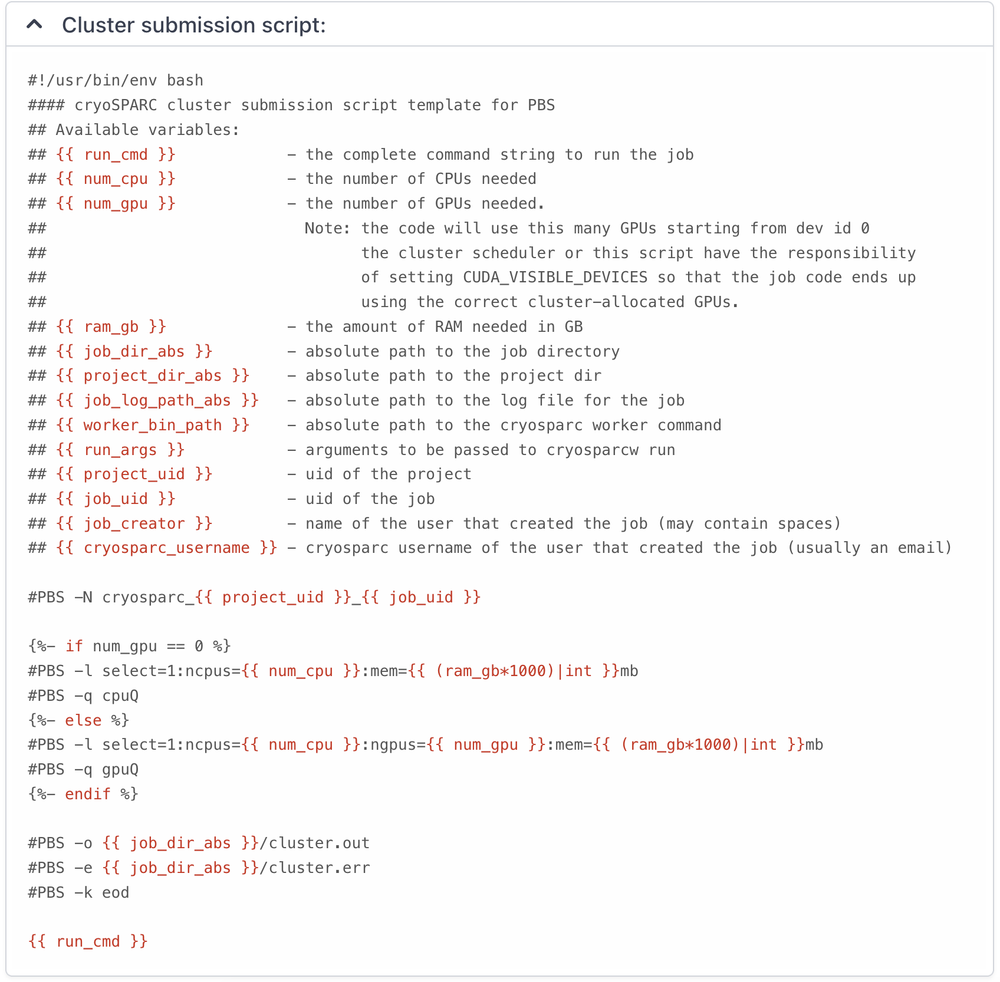

# FAQs

## Accounts/Password/OTP

??? question "(OTP) How to resolve the IPA command error when getting OTP?"

    This error occurs when the credentials issued by your authentication system, which are valid for one day, expire or become invalid. Here are the steps to resolve this problem. 
    
    Open your login terminal and execute the following command to obtain new credentials.
    
    ```bash
    $> kinit
    Password for [UserID]@SDFARM.KR: (Enter your password)
    ```

    Enter your password and press Enter to generate new credentials. Now, re-run the `ipa otptoken-add` command. It should execute without errors, using the newly generated credentials.

??? question "(OTP) How to resolve `Unable to display QR code` error?"

    When connecting to the GSDC login server via a lab workstation/desktop using the GNOME Terminal in a Linux system (e.g., Ubuntu), executing the `ipa otptoken-add` command results in the message {==`ipa: WARNING: Unable to display QR code using the configured output encoding. Please use the token URI to configure your OTP device`==}.

    To resolve this issue, you can force the use of a locale supported by the internal Python QR code package within the ipa tool. Use the following command:
    
    ```bash
    $> LANG=en_US.UTF-8 LC_ALL=en_US.UTF-8 ipa otptoken-add --algo=sha512
    ```

??? question "(LOCK+OTP) How to release screen lock"

    When the screen lock is activated while using OTP, it prompts for a password with a message like :

    ```bash
    Screen used by [UserName] <[UserID]> on [LoginServerName].
    Password:
    ```

    ```bash
    This tty (pts/1) is not a virtual console.

    The pts/1 is now locked by [UserID].
    Password: 
    ```

    What password should I use to unlock it? To unlock the screen in this scenario, you should enter both the `First Factor` (usually your regular password string) and the `Second Factor` (the 6 digits OTP code generated by your OTP token). Combining these two factors (with consequtive password + otp) will allow you to unlock the screen and continue using your session.


## SSH Login/Terminal

## X11 Forwarding

## SSH Tunnelling

## Data Transfer

## CryoSPARC

??? question "How to change CryoSPARC's master host name?"

    CryoSPARC master daemons have been executed on ScientificLinux7.x(EL7)-based login servers (__`tem-ui-el7.sdfarm.kr`__ and __`tem-cs-el7.sdfarm.kr`__) using `cryosparcm start` command for the representative account of each research group. 
    
    During OS upgrades to AlmaLinux 9.x, all these login servers hostname has been changed. 
    Thus, {==CryoSPARC master configuration must be changed in order to ensure normal execution on the new login servers
    (__`tem-ui-al9.sdfarm.kr`__ and __`tem-cs-al9.sdfarm.kr`__)==}. 
    
    === "Old EL7-based login servers (config.sh)"
        ``` yaml
        ...
        export CRYOSPARC_MASTER_HOSTNAME="tem-ui-el7.sdfarm.kr"
        ...
        ```
        or
        ``` yaml
        ...
        export CRYOSPARC_MASTER_HOSTNAME="tem-cs-el7.sdfarm.kr"
        ...
        ```
    === "New AL9-based login servers (config.sh)"
        ``` yaml
        ...
        export CRYOSPARC_MASTER_HOSTNAME="tem-ui-al9.sdfarm.kr"
        ...
        ```
        or
        ``` yaml
        ...
        export CRYOSPARC_MASTER_HOSTNAME="tem-cs-al9.sdfarm.kr"
        ...
        ```

    1. Log-in old login servers (__`tem-ui-el7`__ or __`tem-cs-el7`__) using each group's representative account. Stop all the cryosparc daemons.
        ```bash
        $> cryosparcm stop 
        $> ps aux | grep <AccountName> | grep cryosparc
        $> ps aux | grep <AccountName> | grep -E "cryosparc|node" | awk '{print $2}' | xargs -I{} kill -9 {}
        ```
    2. Locate `/tem/scratch/<GroupDir>/.cryosparc/cryosparc_master`, edit `config.sh` file and save (see above codeblock). 
    3. Log-in new login servers (__`tem-ui-al9`__ or __`tem-cs-al9`__) using the same account. Start cryosparc.
        ```bash
        $> cat /tem/scratch/<GroupDir>/.cryosparc/cryosparc_master/config.sh
        $> cryosparcm start
        ```


??? question "How to migrate CryoSPARC's `TEM-FARM` lane from old EL7 to new AL9-based cluster?"

    `TEM-FARM` lane information (stored in Cryosparc database) needs to be updated mainly due to the difference between Torque and PBSPro batch systems. Lane information is controlled by two files (__`cluster_info.json`__ and __`cluster_script.sh`__).
    
    Those files are located at :
    
    * `/tem/scratch/<GroupDir>/.cryosparc/cluster_info.json` 
    * `/tem/scratch/<GroupDir>/.croysparc/cluster_script.sh`

    !!! note

        Login account and login server (__`tem-ui-al9`__ or __`tem-cs-al9`__) should be each group's representative account and the CryoSPARC's master host, respectively.


    1. Start CryoSPARC (`cryosparcm start`) on the one of new login servers (__`tem-ui-al9`__ or __`tem-cs-al9`__)

    2. Locate `/tem/scratch/<GroupDir>/.cryosparc` directory, edit `cluster_info.json` and `cluster_script.sh` files for AL9 and save them. (see the below codeblocks).

    3. Update the existing cluster lane information using the modified two files.
        ``` bash
        $> cd /tem/scratch/<GroupDir>/.cryosparc
        $> cat cluster_info.json
        $> cat cluster_script.sh
        $> cryosparcm cluster connect
        ...
        Successfully added cluster lane TEM-FARM
        ```

    `cryosparcm cluster connect` command reads `cluster_info.json` and `cluster_script.sh` from the current directory and update the lane configuration.       

    === "EL7 : cluster_info.json"
        ``` yaml
        {
            "name" : "TEM-FARM",
            "worker_bin_path" : "/tem/scratch/<GroupDir>/.cryosparc/cryosparc_worker/bin/cryosparcw",
            "cache_path" : "",
            "send_cmd_tpl" : "{{ command }}",
            "qsub_cmd_tpl" : "qsub {{ script_path_abs }}",
            "qstat_cmd_tpl" : "qstat -as {{ cluster_job_id }}",
            "qdel_cmd_tpl" : "qdel {{ cluster_job_id }}",
            "qinfo_cmd_tpl" : "qstat -q"
        }
        ```
    === "AL9 : cluster_info.json"
        ``` yaml
        {
            "name" : "TEM-FARM",
            "worker_bin_path" : "/tem/scratch/<GroupDir>/.cryosparc/cryosparc_worker/bin/cryosparcw",
            "cache_path" : "",
            "send_cmd_tpl" : "{{ command }}",
            "qsub_cmd_tpl" : "qsub {{ script_path_abs }}",
            "qstat_cmd_tpl" : "qstat -as {{ cluster_job_id }}",
            "qdel_cmd_tpl" : "qdel {{ cluster_job_id }}",
            "qinfo_cmd_tpl" : "qstat -q"
        }
        ```
    <br>

    === "EL7 : cluster_script.sh"
        ```bash
        #!/usr/bin/env bash
        #### cryoSPARC cluster submission script template for PBS
        ## Available variables:
        ## {{ run_cmd }}            - the complete command string to run the job
        ## {{ num_cpu }}            - the number of CPUs needed
        ## {{ num_gpu }}            - the number of GPUs needed.
        ##                            Note: the code will use this many GPUs starting from dev id 0
        ##                                  the cluster scheduler or this script have the responsibility
        ##                                  of setting CUDA_VISIBLE_DEVICES so that the job code ends up
        ##                                  using the correct cluster-allocated GPUs.
        ## {{ ram_gb }}             - the amount of RAM needed in GB
        ## {{ job_dir_abs }}        - absolute path to the job directory
        ## {{ project_dir_abs }}    - absolute path to the project dir
        ## {{ job_log_path_abs }}   - absolute path to the log file for the job
        ## {{ worker_bin_path }}    - absolute path to the cryosparc worker command
        ## {{ run_args }}           - arguments to be passed to cryosparcw run
        ## {{ project_uid }}        - uid of the project
        ## {{ job_uid }}            - uid of the job
        ## {{ job_creator }}        - name of the user that created the job (may contain spaces)
        ## {{ cryosparc_username }} - cryosparc username of the user that created the job (usually an email)
        
        #PBS -N cryosparc_{{ project_uid }}_{{ job_uid }}
        
        #PBS -l nodes=1:ppn={{ num_cpu }}:cpuQ
        #PBS -q cpuQ
        
        #PBS -l nodes=1:ppn={{ num_cpu }}:gpus={{ num_gpu }}:gpuQ
        #PBS -q gpuQ
        
        #PBS -o {{ job_dir_abs }}
        #PBS -e {{ job_dir_abs }}

        ################################
        ## Print Environment Variables #
        ################################
        echo ------------------------------------------------------
        echo -n 'Job is running on node '; cat $PBS_NODEFILE
        echo ------------------------------------------------------
        echo PBS: qsub is running on $PBS_O_HOST
        echo PBS: originating queue is $PBS_O_QUEUE
        echo PBS: executing queue is $PBS_QUEUE
        echo PBS: working directory is $PBS_O_WORKDIR
        echo PBS: execution mode is $PBS_ENVIRONMENT
        echo PBS: job identifier is $PBS_JOBID
        echo PBS: job name is $PBS_JOBNAME
        echo PBS: node file is $PBS_NODEFILE
        echo PBS: current home directory is $PBS_O_HOME
        echo PBS: PATH = $PBS_O_PATH
        echo PBS: PBS_GPUFILE=$PBS_GPUFILE
        echo PBS: CUDA_VISIBLE_DEVICES=$CUDA_VISIBLE_DEVICES
        echo ------------------------------------------------------

        {{ run_cmd }}
        ```
    === "AL9 : cluster_script.sh"
        ```bash
        #!/usr/bin/env bash
        #### cryoSPARC cluster submission script template for PBS
        ## Available variables:
        ## {{ run_cmd }}            - the complete command string to run the job
        ## {{ num_cpu }}            - the number of CPUs needed
        ## {{ num_gpu }}            - the number of GPUs needed.
        ##                            Note: the code will use this many GPUs starting from dev id 0
        ##                                  the cluster scheduler or this script have the responsibility
        ##                                  of setting CUDA_VISIBLE_DEVICES so that the job code ends up
        ##                                  using the correct cluster-allocated GPUs.
        ## {{ ram_gb }}             - the amount of RAM needed in GB
        ## {{ job_dir_abs }}        - absolute path to the job directory
        ## {{ project_dir_abs }}    - absolute path to the project dir
        ## {{ job_log_path_abs }}   - absolute path to the log file for the job
        ## {{ worker_bin_path }}    - absolute path to the cryosparc worker command
        ## {{ run_args }}           - arguments to be passed to cryosparcw run
        ## {{ project_uid }}        - uid of the project
        ## {{ job_uid }}            - uid of the job
        ## {{ job_creator }}        - name of the user that created the job (may contain spaces)
        ## {{ cryosparc_username }} - cryosparc username of the user that created the job (usually an email)
        
        #PBS -N cryosparc_{{ project_uid }}_{{ job_uid }}

        
        #PBS -l select=1:ncpus={{ num_cpu }}:mem={{ (ram_gb*1000)|int }}mb
        #PBS -q cpuQ
        
        #PBS -l select=1:ncpus={{ num_cpu }}:ngpus={{ num_gpu }}:mem={{ (ram_gb*1000)|int }}mb
        #PBS -q gpuQ
        

        #PBS -o {{ job_dir_abs }}/cluster.out
        #PBS -e {{ job_dir_abs }}/cluster.err
        #PBS -k eod

        {{ run_cmd }}
        ```
    You can cross-check the updated lane information (CryoSPARC WebGUI, left menu `More`->`Instance Information`)

    
    /// caption
    Updated TEM-FARM lane information
    ///

    
    /// caption
    Updated TEM-FARM cluster submission script
    ///

??? question "How to resolve the problems on starting and/or restarting CryoSPARC daemons?"

    First, you should check all the cryosparc related processes - supervisord, mongod, command_core, command_vis, command_rtp, webapp, app, liveapp - to be terminated successfully on the CryoSPARC master host. If necessary, you can kill the zombie processes.

    ``` bash
    $> cryosparcm stop
    CryoSPARC is running.
    Stopping cryoSPARC
    app: stopped
    app_api: stopped
    command_core: stopped
    command_rtp: stopped
    command_vis: stopped
    Shut down
    ```

    ``` bash
    $> ps aux | grep <AccountName> | grep cryosparc
    $> ps aux | grep <userid> | grep -E "cryosparc|node" | awk '{print $2}' | xargs -I{} kill -9 {}
    ```

    Second, find your own cryosparc unix socket files on `/tmp` directory, and if exists, delete the files using `rm` command.

    ``` bash
    $> cd /tmp
    $> ls -al | grep <AccountName> | grep sock
    srwx------.  1 userid  userid  0 Jun 24 16:39 cryosparc-supervisor-6276.sock
    srwx------.  1 userid  userid  0 Jun 24 16:39 mongodb-39000.sock
    $> rm cryosparc-supervisor-6276.sock
    $> rm mongodb-39000.sock
    ```

    Then, start your cryosparc instance.

    ``` bash
    $> cryosparcm start
    Starting CryoSPARC System master process...
    CryoSPARC is not already running.
    configuring database...
        configuration complete
    database: started
    database OK
    command_core: started
        command_core connection succeeded
        command_core startup successful
    command_vis: started
    command_rtp: started
        command_rtp connection succeeded
        command_rtp startup successful
    app: started
    app_api: started
    -----------------------------------------------------
    ...
    Startup can take several minutes. Point your browser to the address
    and refresh until you see the CryoSPARC web interface.
    ```