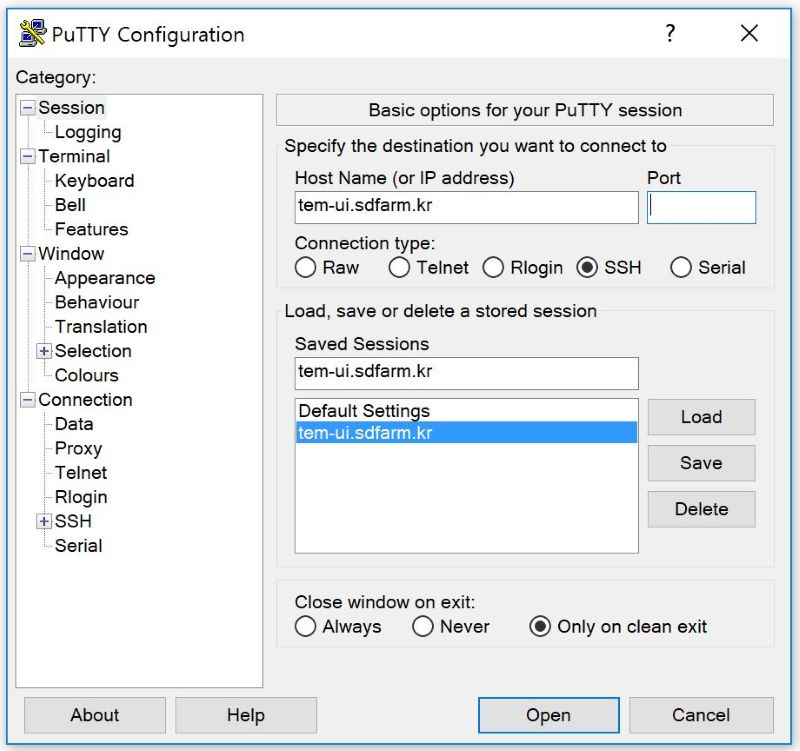

***************
TEM users guide
***************

Accessing TEM service farm
==========================
Before you use GSDC's service farm, you should send an application form to TEM service manager and obtain an user account (please see the contact information for the application form). If you already have valid user accounts, you can log into UI (user interface) nodes to access/use various kind of cluster resources and software environments (including data analysis tools, e.g., relion, cisTEM, eman, etc.).

For Linux/Mac users
-------------------

.. code-block:: bash

  $> ssh -Y -o Port=<port> <userID>@tem-ui.sdfarm.kr
  $> ssh -Y -o Port=<port> <userID>@tem-gpu[01-05].sdfarm.kr

-Y (or -X) options : enable trusted X11 (or untrusted X11) forwarding

For Windows users
-----------------

  * Using MobaXterm (https://mobaxterm.mobatek.net) :
    MobaXterm is an enhanced terminal for Windows with self-contained X11 server, tabbed SSH client, network tools and much more.

.. image:: images/mobaxterm_resized.JPG
    :scale: 70 %
    :align: center

..

  * Using Putty with Xwindows manager (e.g., Xming, Xmanager, etc.) (https://www.putty.org) :
    If you use putty terminal application, you must install a 3rd-party Xwindows manager in advance.

.. image:: images/putty-2_resized.JPG
    :scale: 70 %
    :align: center

Understanding environment modules
=================================
The Environment Modules system is a tool to help users manage their Unix or Linux shell environment, by allowing groups of related environment-variable settings to be made or removed dynamically.

* **Listing available modules**

.. code-block:: bash

  $> module avail
  -------------- /tem/home/tem/Modules/Modules/default/modulefiles --------------------
  apps/gcc/4.4.7/anaconda/5.2           apps/gcc/4.4.7/relion/cuda92/3.0-beta
  apps/gcc/4.4.7/chimera/1.13           apps/gcc/4.4.7/relion/gpu/2.1
  apps/gcc/4.4.7/cistem/1.0.0           apps/gcc/4.4.7/relion/gpu/3.0-beta
  apps/gcc/4.4.7/eman/2.1               cuda/8.0
  apps/gcc/4.4.7/phenix/1.13-2998       cuda/9.2
  apps/gcc/4.4.7/relion/cpu/1.4         dot
  apps/gcc/4.4.7/relion/cpu/2.1         modules
  apps/gcc/4.4.7/relion/cpu/3.0-beta    mpi/gcc/openmpi/1.6.5
  apps/gcc/4.4.7/relion/cuda92/2.1

* **Show module details**

.. code-block:: bash

  $> module show apps/gcc/4.4.7/relion/cpu/3.0-beta
  -------------------------------------------------------------------
  /tem/home/tem/Modules/Modules/default/modulefiles/apps/gcc/4.4.7/relion/cpu/3.0-beta:

  module-whatis    Setups `relion-3.0-beta-cpu' environment variables
  module           load mpi/gcc/openmpi/1.6.5
  setenv           relion_version 3.0-beta-cpu
  prepend-path     PATH /tem/home/tem/relion3/cpu/bin
  prepend-path     LD_LIBRARY_PATH /tem/home/tem/relion3/cpu/lib
  setenv          RELION_QUEUE_NAME tem
  setenv          RELION_MPI_MAX 11
  setenv          RELION_THREAD_MAX 28
  setenv          RELION_QSUB_COMMAND qsub
  setenv          RELION_QSUB_TEMPLATE /tem/home/tem/relion3/cpu/bin/qsub.csh
  setenv          RELION_CTFFIND_EXECUTABLE /tem/home/tem/ctffind-4.1.8/bin/ctffind
  setenv          RELION_RESMAP_EXECUTABLE /tem/home/tem/relion-1.4/ResMap/ResMap-1.1.4-linux64
  setenv          RELION_MOTIONCORR_EXECUTABLE /tem/home/tem/MotionCor2/MotionCor2-01-30-2017
  setenv          RELION_UNBLUR_EXECUTABLE /tem/home/tem/unblur_1.0.2/bin/unblur_openmp_7_17_15.exe
  setenv          RELION_SUMMOVIE_EXECUTABLE /tem/home/tem/summovie_1.0.2/bin/sum_movie_openmp_7_17_15.exe
  conflict        apps/gcc/4.4.7/relion
  -------------------------------------------------------------------

* **Loading modules**

.. code-block:: bash

  $> module load <module_path>
  or
  $> module add <module_path>
  e.g., $> module load apps/gcc/4.4.7/relion/cpu/3.0-beta

* **Listing loaded modules**

.. code-block:: bash

  $> module list
  Currently Loaded Modulefiles:
    1) mpi/gcc/openmpi/1.6.5                2) apps/gcc/4.4.7/relion/cpu/3.0-beta

* **Unloading modules**

.. code-block:: bash

  $> module unload <module_path>
  or
  $> module rm <module_path>
  e.g., $> module unload apps/gcc/4.4.7/relion/cpu/3.0-beta

* **Unloading all the modules**

.. code-block:: bash

  $> module purge

* **Module environment help**

.. code-block:: bash

  $> module --help
    Modules Release 3.2.10 2012-12-21 (Copyright GNU GPL v2 1991):

    Usage: module [ switches ] [ subcommand ] [subcommand-args ]

    Switches:
        -H|--help               this usage info
        -V|--version            modules version & configuration options
        -f|--force              force active dependency resolution
        -t|--terse              terse    format avail and list format
        -l|--long               long     format avail and list format
        -h|--human              readable format avail and list format
        -v|--verbose            enable  verbose messages
        -s|--silent             disable verbose messages
        -c|--create             create caches for avail and apropos
        -i|--icase              case insensitive
        -u|--userlvl <lvl>      set user level to (nov[ice],exp[ert],adv[anced])
    Available SubCommands and Args:
        + add|load              modulefile [modulefile ...]
        + rm|unload             modulefile [modulefile ...]
        + switch|swap           [modulefile1] modulefile2
        + display|show          modulefile [modulefile ...]
        + avail                 [modulefile [modulefile ...]]
        + use [-a|--append]     dir [dir ...]
        + unuse                 dir [dir ...]
        + update
        + refresh
        + purge
        + list
        + clear
        + help                  [modulefile [modulefile ...]]
        + whatis                [modulefile [modulefile ...]]
        + apropos|keyword       string
        + initadd               modulefile [modulefile ...]
        + initprepend           modulefile [modulefile ...]
        + initrm                modulefile [modulefile ...]
        + initswitch            modulefile1 modulefile2
        + initlist
        + initclear

Job manager (Torque)
====================
