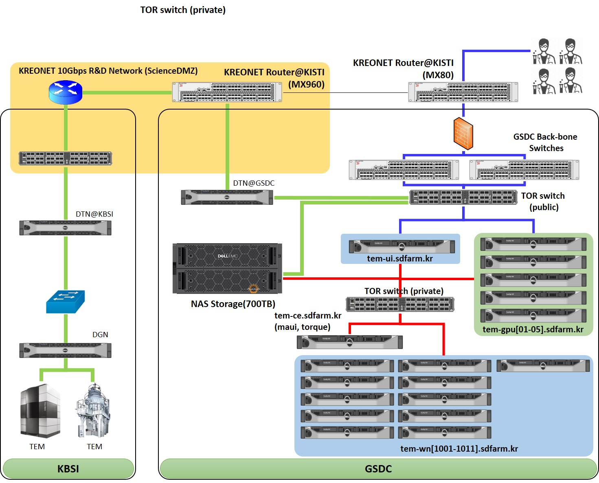

***************************
TEM infrastructure overview
***************************
GSDC (Global Science experimental Data hub Center) supports data processing for Structural Biology with Cryo-EM, Lightsource, and X-ray Laser experiments.
Cryo-EM instrumentations are operated by KBSI. Cryo-EM facilities are directly connected to GSDC Datacenter through KREONet with 10Gbps dedicated/shared optical fiber links. GSDC provides Peta-bytes scale of storages and GPU equipped computational power. Here is an overview of GSDC's TEM infrastructre for Cryo-EM users.

* Overall architecture between KBSI's Cryo-EM facilities and GSDC's TEM service farm

Computing and storage resources
===============================

* Hardware specification of TEM service farm

+--------------+-----------------------------+---------------------------------------------------------------------------+-----------------+
| Category     | Name                        | Specification                                                             | Resources size  |
+--------------+-----------------------------+---------------------------------------------------------------------------+-----------------+
| Login        | tem-ui.sdfarm.kr            | - CPU : Intel(R) Xeon(R) CPU E5-2697v3 @ 2.60GHz 14Core * 2 CPUs          | 28 cores        |
|              |                             | - RAM : DDR4 8GB * 24 (192GB)                                             |                 |
|              |                             | - HDD : 12G SAS HDD 1.2TB * 2EA (RAID-1)                                  |                 |
|              +-----------------------------+---------------------------------------------------------------------------+-----------------+
|              | tem-gpu[01-05].sdfarm.kr    | - CPU : Intel® Xeon® CPU E5-2690v4 @ 2.60GHz 14Core * 2 CPUs              | 140 cores       |
|              |                             | - RAM : DDR4 16GB * 24 (384GB)                                            |                 |
|              |                             | - SSD : 6G SATA SSD 800GB * 2EA (RAID-1)                                  |                 |
|              |                             | - GPU : NVIDIA P100 * 2ea (tem-gpu[01-03])                                |                 |
|              |                             | - GPU : NVIDIA  P40 * 2ea (tem-gpu[04-05])                                |                 |
+--------------+-----------------------------+---------------------------------------------------------------------------+-----------------+
| Computing    | tem-ce.sdfarm.kr            | - CPU : Intel(R) Xeon(R) CPU E5-2697v3 @ 2.60GHz 14Core * 2 CPUs          | 28 cores        |
| (master)     |                             | - RAM : DDR4 8GB * 24 (192GB)                                             |                 |
|              |                             | - HDD : 12G SAS HDD 1.2TB * 2EA (RAID-1)                                  |                 |
|              |                             |                                                                           |                 |
+--------------+-----------------------------+---------------------------------------------------------------------------+-----------------+
| Computing    | tem-wn[1001-1011].sdfarm.kr | - CPU : Intel(R) Xeon(R) CPU E5-2697v3 @ 2.60GHz 14Core * 2 CPUs          | 308 cores       |
| (workers)    |                             | - RAM : DDR4 8GB * 24 (192GB)                                             |                 |
|              |                             | - HDD : 12G SAS HDD 1.2TB * 2EA (RAID-1)                                  |                 |
+--------------+-----------------------------+---------------------------------------------------------------------------+-----------------+
| Storage      | Dell EMC Isilon NAS         | Network attached storage 700 TB                                                             |
+--------------+-----------------------------+---------------------------------------------------------------------------+-----------------+

+--------------+----------+-----------+-----------+
| row 1, col 1 | column 2 | column 3  | column 4  |
+--------------+----------+-----------+-----------+
| row 2        |                                  |
+--------------+----------+-----------+-----------+
| row 3        |          |           |           |
+--------------+----------+-----------+-----------+

Cluster management softwares
============================

+--------------+------------------------+------------------------------------------------------------+--------------------------------+
| Category     | Name                   | Description                                                | Version                        |
|              |                        |                                                            | (module path)                  |
+--------------+------------------------+------------------------------------------------------------+--------------------------------+
| OS           | Scientific Linux       | Operating system                                           | 6.x                            |
+--------------+------------------------+------------------------------------------------------------+--------------------------------+
| System       | Environment module     | - Module environment                                       | v3.2.10                        |
| middleware   |                        | - https://modules.readthedocs.io/en/latest                 |                                |
|              +------------------------+------------------------------------------------------------+--------------------------------+
|              | OpenPBS(torque)        | - Cluster resources management                             | v2.5.7                         |
|              |                        | - http://www.adaptivecomputing.com/products/torque         |                                |
|              +------------------------+------------------------------------------------------------+--------------------------------+
|              | Maui                   | - Job scheduler                                            | v3.3.1                         |
|              |                        | - https://github.com/LabAdvComp/maui                       |                                |
|              +------------------------+------------------------------------------------------------+--------------------------------+
|              | OpenMPI                | - Messaging Pass Interface(MPI)                            | | v1.6.5                       |
|              |                        | - Reference implementation for MPI standard                | | (mpi/gcc/openmpi/1.6.5)      |
|              |                        | - https://www.open-mpi.org                                 |                                |
|              +------------------------+------------------------------------------------------------+--------------------------------+
|              | cuda                   | - Compute Unified Device Architecture(CUDA)                | | v8.0 (cuda/8.0)              |
|              |                        | - NVIDIA CUDA Runtime & Toolkit                            | | v9.2 (cuda/9.2)              |
|              |                        | - https://developer.nvidia.com/cuda-toolkit                |                                |
|              +------------------------+------------------------------------------------------------+--------------------------------+
|              | anaconda               | - Virtual application environement (mainly used for python)| | v5.2                         |
|              |                        | - https://www.anaconda.com                                 | | (apps/gcc/4.4.7/anaconda/5.2)|
|              +------------------------+------------------------------------------------------------+--------------------------------+
|              | python                 | - Python runtime                                           | v2.6.6                         |
+--------------+------------------------+------------------------------------------------------------+--------------------------------+

Data analysis tools
===================

+--------------+---------------------+--------------------------------------------------------------------+----------------------------------------+
| Category     | Name                | Description                                                        | Version                                |
|              |                     |                                                                    | (module path)                          |
+--------------+---------------------+--------------------------------------------------------------------+----------------------------------------+
| Data         | Relion              | | Astand-alone computer program that employs an empirical Bayesian |                                        |
| Analysis     |                     | | approach to refinement of (multiple) 3D reconstructions or 2D    |                                        |
| Tools        |                     | | class averages in electron cryo-microscopy (cryo-EM).            | | v1.4                                 |
|              |                     |                                                                    | | (apps/gcc/4.4.7/relion/cpu/1.4)      |
|              |                     |                                                                    |                                        |
|              |                     |                                                                    | | v2.1                                 |
|              |                     | - https://www3.mrc-lmb.cam.ac.uk/relion/index.php                  | | (apps/gcc/4.4.7/relion/cpu/2.1)      |
|              |                     |                                                                    | | (apps/gcc/4.4.7/relion/gpu/2.1)      |
|              |                     |                                                                    |                                        |
|              |                     |                                                                    | | v3.0-beta                            |
|              |                     |                                                                    | | (apps/gcc/4.4.7/relion/cpu/3.0-beta) |
|              |                     |                                                                    | | (apps/gcc/4.4.7/relion/gpu/3.0-beta) |
|              |                     |                                                                    |                                        |
|              +---------------------+--------------------------------------------------------------------+----------------------------------------+
|              | EMAN                | | Scientific image processing suite with a primary focus on        | | v2.1                                 |
|              |                     | | processing data from transmission electron microscopes.          | | (apps/gcc/4.4.7/eman/2.1)            |
|              |                     |                                                                    |                                        |
|              |                     | - https://blake.bcm.edu/emanwiki/EMAN2                             |                                        |
|              +---------------------+--------------------------------------------------------------------+----------------------------------------+
|              | cisTEM              | | User-friendly software to process cryo-EM images of              | | v1.0.0                               |
|              |                     | | macromolecular complexes and obtain high-resolution 3D           | | (apps/gcc/4.4.7/cistem/1.0.0)        |
|              |                     | | reconstructions.                                                 |                                        |
|              |                     |                                                                    |                                        |
|              |                     | - https://cistem.org                                               |                                        |
|              +---------------------+--------------------------------------------------------------------+----------------------------------------+
|              | Phenix              | | Python-based Hierarchical ENvironment for Integrated Xtallography| | v1.13-2998                           |
|              |                     |                                                                    | | (apps/gcc/4.4.7/phenix/1.13-2998)    |
|              |                     | - https://www.phenix-online.org/documentation/index.html           |                                        |
|              +---------------------+--------------------------------------------------------------------+----------------------------------------+
|              | UCSF Chimera        | | A highly extensible program for interactive visualization and    | | v1.13                                |
|              |                     | | analysis of molecular structures and related data, including     | | (apps/gcc/4.4.7/chimera/1.13)        |
|              |                     | | density maps, supramolecular assemblies, sequence alignments,    |                                        |
|              |                     | | docking results, trajectories, and conformational ensembles.     |                                        |
|              |                     |                                                                    |                                        |
|              |                     | - https://www.cgl.ucsf.edu/chimera                                 |                                        |
+--------------+---------------------+--------------------------------------------------------------------+----------------------------------------+

