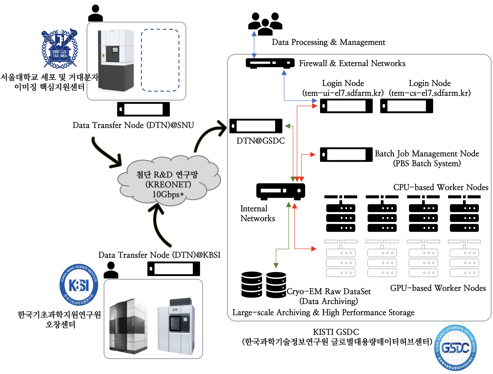

**************************************************
GSDC Computing Cluster for TEM Users and Operators
**************************************************

.. _Service overview:

1. Service overview
===================

GSDC (Global Science experimental Data hub Center) provides data computing services, i.e., large-scale Cryo-EM data transfer, archiving and/or processing to Cryo-EM operators/users.
Cryo-EM facilities which are operated by government-funded research institutes or academies, can be directly connected to GSDC via KREONET with 10+ Gbps dedicated/shared network links. 
GSDC also supports petabyes scale of high performance (and/or archiving) storages and CPU/GPU computing servers to help Cryo-EM users' scientific discoveries. 
Here is GSDC's computing and storage infrastructres for Cryo-EM operators/users.

Overall architecture between KBSI, SNU (Seoul National University), PNU (Pusan National University)'s Cryo-EM facilities and GSDC TEM computing cluster.

.. _Hardware specification of TEM service farm:

2. Computing and storage resources
==================================

.. tabularcolumns:: |\Y{0.1}|\Y{0.2}|\Y{0.6}|\Y{0.1}|

.. table:: My Table
   :widths: auto
   :class: longtable

+--------------+---------------------------------+---------------------------------------------------------------------------+-----------------+
| Category     | Node Name (sdfarm.kr)           | Specification                                                             | Resources size  |
+==============+=================================+===========================================================================+=================+
| Login        | **tem-ui-el7**                  | - CPU : Intel(R) Xeon(R) Gold 6150 CPU @ 2.70GHz 18Core * 2 CPUs          | 72 cores (H/T)  |
| (CryoSPARC)  |                                 | - RAM : DDR4 2,666MHz 16GB * 24EA (384GB)                                 |                 |
|              |                                 | - HDD : 12G SAS HDD 1.2TB * 2EA (RAID-1)                                  |                 |
+--------------+---------------------------------+---------------------------------------------------------------------------+-----------------+
| Login        | **tem-cs-el7**                  | - CPU : Intel(R) Xeon(R) CPU E5-2697v3 @ 2.60GHz 14Core * 2 CPUs          | 56 cores (H/T)  |
| (CryoSPARC)  |                                 | - RAM : DDR4 8GB * 24 (192GB)                                             |                 |
|              |                                 | - HDD : 12G SAS HDD 1.2TB * 2EA (RAID-1)                                  |                 |
+--------------+---------------------------------+---------------------------------------------------------------------------+-----------------+
| Master       | tem-ce-el7                      | - CPU : Intel(R) Xeon(R) CPU E5-2697v3 @ 2.60GHz 14Core * 2 CPUs          | 56 cores (H/T)  |
|              |                                 | - RAM : DDR4 8GB * 24 (192GB)                                             |                 |
|              |                                 | - HDD : 12G SAS HDD 1.2TB * 2EA (RAID-1)                                  |                 |
+--------------+---------------------------------+---------------------------------------------------------------------------+-----------------+
| Workers      | tem-wn[1001-1002]-el7           | - CPU : Intel(R) Xeon(R) Gold 6150 CPU @ 2.70GHz 18Core * 2 CPUs          | 380 cores       |
|              |                                 | - RAM : DDR4 2,666MHz 16GB * 24EA (384GB)                                 |                 |
|              |                                 | - HDD : 12G SAS HDD 1.2TB * 2EA (RAID-1)                                  |                 |
|              +---------------------------------+---------------------------------------------------------------------------+                 |
|              | tem-wn[1003-1013]-el7           | - CPU : Intel(R) Xeon(R) CPU E5-2697v3 @ 2.60GHz 14Core * 2 CPUs          |                 |
|              |                                 | - RAM : DDR4 8GB * 24 (192GB)                                             |                 |
|              |                                 | - HDD : 12G SAS HDD 1.2TB * 2EA (RAID-1)                                  |                 |
|              +---------------------------------+---------------------------------------------------------------------------+-----------------+
|              | tem-gpu[01-03]-el7              | - CPU : Intel® Xeon® CPU E5-2690v4 @ 2.60GHz 14Core * 2 CPUs              | - 300 cores     |
|              |                                 | - RAM : DDR4 16GB * 24 (384GB)                                            | - 26 GPGPUs     |
|              |                                 | - SSD : 6G SATA SSD 800GB * 2EA (RAID-1)                                  |                 |
|              |                                 | - GPU : NVIDIA P100 16GB * 2EA                                            |                 |
|              +---------------------------------+---------------------------------------------------------------------------+                 | 
|              | tem-gpu[04-05]-el7              | - CPU : Intel® Xeon® CPU E5-2690v4 @ 2.60GHz 14Core * 2 CPUs              |                 |
|              |                                 | - RAM : DDR4 16GB * 16 (256GB)                                            |                 |
|              |                                 | - SSD : 6G SATA SSD 800GB * 2EA (RAID-1)                                  |                 |
|              |                                 | - GPU : NVIDIA P40 24GB * 2EA                                             |                 |
|              +---------------------------------+---------------------------------------------------------------------------+                 | 
|              | tem-gpu[06-07]-el7              | - CPU : Intel® Xeon® Gold 6226R CPU @ 2.90GHz 16Core * 2 CPUs             |                 |
|              |                                 | - RAM : DDR4 32GB * 12 (384GB)                                            |                 |
|              |                                 | - HDD : 12G SAS HDD 1.6TB * 2EA (RAID-1)                                  |                 |
|              |                                 | - GPU : NVIDIA A100 40GB * 2EA                                            |                 |
|              +---------------------------------+---------------------------------------------------------------------------+                 | 
|              | tem-gpu[08-10]-el7              | - CPU : Intel® Xeon® Gold 6334R CPU @ 3.60GHz 16Core * 2 CPUs             |                 |
|              |                                 | - RAM : DDR4 32GB * 12 (384GB)                                            |                 |
|              |                                 | - HDD : 12G SAS HDD 1.6TB * 2EA (RAID-1)                                  |                 |
|              |                                 | - GPU : NVIDIA A100 80GB (or V100 32GB) * 4EA                             |                 |
+--------------+---------------------------------+---------------------------------------------------------------------------+-----------------+
| Storage      | User home directory (Home)      | 100GB per each user account (/tem/home)                                                     |
|              +---------------------------------+---------------------------------------------------------------------------+-----------------+
|              | Data analysis (Scratch)         | 80TB per each research group (/tem/scratch)                                                 | 
|              +---------------------------------+---------------------------------------------------------------------------+-----------------+
|              | Archive                         | 500TB per each Cryo-EM site (/tem/archive)                                                  | 
+--------------+---------------------------------+---------------------------------------------------------------------------+-----------------+
| Total                                          | 772 CPU cores (physical), 26 GPGPUs, High Performance Storage                               |
+--------------+---------------------------------+---------------------------------------------------------------------------+-----------------+

.. _Cluster management softwares:

3. Cluster management softwares
===============================

.. tabularcolumns:: |\Y{0.1}|\Y{0.2}|\Y{0.4}|\Y{0.3}|

.. table:: My Table
   :widths: auto
   :class: longtable

+--------------+------------------------+------------------------------------------------------------+--------------------------------+
| Category     | Name                   | Description                                                | Version                        |
|              |                        |                                                            | (modulepath)                   |
+==============+========================+============================================================+================================+
| OS           | Scientific Linux       | Operating system                                           | 7.9                            |
+--------------+------------------------+------------------------------------------------------------+--------------------------------+
| System       | Environment module     | - Module environment                                       | v4.4.1                         |
| M/W          |                        | - https://modules.readthedocs.io/en/latest                 |                                |
|              +------------------------+------------------------------------------------------------+--------------------------------+
|              | OpenPBS(torque)        | - Cluster resources management                             | v6.1.2                         |
|              |                        | - http://www.adaptivecomputing.com/products/torque         |                                |
|              +------------------------+------------------------------------------------------------+--------------------------------+
|              | OpenMPI                | - Messaging Pass Interface(MPI)                            | | v4.0.3                       |
|              |                        | - Reference implementation for MPI standard                | | (mpi/gcc/openmpi/4.0.3)      |
|              |                        | - https://www.open-mpi.org                                 | | (mpi/gcc/8.3.1/openmpi/4.0.3)|
|              +------------------------+------------------------------------------------------------+--------------------------------+
|              | cuda                   | - Compute Unified Device Architecture(CUDA)                | | 9.2 (cuda/9.2)               |
|              |                        | - NVIDIA CUDA Runtime & Toolkit                            | | 11.2 (cuda/11.2)             |
|              |                        | - https://developer.nvidia.com/cuda-toolkit                |                                |
|              +------------------------+------------------------------------------------------------+--------------------------------+
|              | Anaconda               | - Python based virtual environemnt                         | 2020.11 (conda/2020.11)        |
|              |                        | - https://www.anaconda.com/                                |                                |
|              +------------------------+------------------------------------------------------------+--------------------------------+
|              | Python                 | - Python runtime                                           | v2.7.5                         |
+--------------+------------------------+------------------------------------------------------------+--------------------------------+

.. _Data analysis tools:

4. Data analysis tools
======================

.. tabularcolumns:: |\Y{0.15}|\Y{0.15}|\Y{0.4}|\Y{0.3}|

.. table:: My Table
   :widths: auto
   :class: longtable

+----------+-------------+--------------------------------------------------------------------+----------------------------------------+
| Category | Name        | Description                                                        | Version                                |
|          |             |                                                                    | (module path)                          |
+==========+=============+====================================================================+========================================+
| Tools    | **Relion**  | | A stand-alone computer program that employs an empirical Bayesian|                                        |
|          |             | | approach to refinement of (multiple) 3D reconstructions or 2D    | | v3.0.7                               |
|          |             | | class averages in electron cryo-microscopy (cryo-EM).            | | (apps/relion/cpu/3.0.7)              |
|          |             |                                                                    | | (apps/relion/gpu/3.0.7)              |
|          |             |                                                                    |                                        |
|          |             |                                                                    | | v3.1.0                               |
|          |             | - https://www3.mrc-lmb.cam.ac.uk/relion/index.php                  | | (apps/relion/cpu/3.1.0)              |
|          |             |                                                                    | | (apps/relion/gpu/3.1.0)              |
|          |             |                                                                    |                                        |
|          |             |                                                                    | | v4.0.0                               |
|          |             |                                                                    | | (apps/relion/cpu/4.0.0)              |
|          |             |                                                                    | | (apps/relion/gpu/4.0.0)              |
|          |             |                                                                    |                                        |
|          |             |                                                                    | | v4.0.1                               |
|          |             |                                                                    | | (apps/relion/cpu/4.0.1)              |
|          |             |                                                                    | | (apps/relion/gpu/4.0.1)              |
|          |             |                                                                    |                                        |
|          +-------------+--------------------------------------------------------------------+----------------------------------------+
|          | **cisTEM**  | | User-friendly software to process cryo-EM images of              | | v1.0.0                               |
|          |             | | macromolecular complexes and obtain high-resolution 3D           | | (apps/cistem/1.0.0)                  |
|          |             | | reconstructions.                                                 |                                        |
|          |             |                                                                    |                                        |
|          |             | - https://cistem.org                                               |                                        |
|          +-------------+--------------------------------------------------------------------+----------------------------------------+
|          |**CryoSPARC**| | CryoSPARC is the state-of-the-art platform used globally for     | | v3.0.1                               |
|          |             | | obtaining 3D structural information from single particle cryo-EM | | v3.2.0                               |
|          |             | | data.                                                            | | v4.0.0                               |
|          |             |                                                                    | | v4.2.0                               |
|          |             | - https://cryosparc.com                                            | | v4.4.0                               |
|          +-------------+--------------------------------------------------------------------+----------------------------------------+
|          | **Topaz**   | | A pipeline for particle detection in cryoem images using         | | v0.2.4                               |
|          |             | | convolutional neural networks trained from positive and unlabeled| | (topaz/cuda-9.2/0.2.4)               |
|          |             | | data.                                                            | | (topaz/cuda-11.0/0.2.4)              |
|          |             |                                                                    |                                        |
|          |             | - https://github.com/tbepler/topaz                                 |                                        |
|          +-------------+--------------------------------------------------------------------+----------------------------------------+
|          | **PyEM**    | | A collection of Python modules and command-line utilities for    | | v0.5                                 |
|          |             | | electron microscopy of biological samples.                       | | (pyem/0.5)                           |
|          |             | - https://github.com/asarnow/pyem                                  |                                        |
|          +-------------+--------------------------------------------------------------------+----------------------------------------+
|          | **Rosetta** | | Software suite for computational modeling and analysis of protein| | v3.13                                |
|          |             | | structures.                                                      | | (rosetta/openmpi-4.0.3/3.13)         |
|          |             | - https://www.rosettacommons.org/software                          | | (rosetta/mpich-3.4.3/3.13)           |
+----------+-------------+--------------------------------------------------------------------+----------------------------------------+

5. Requesting user accounts and accessing GSDC TEM computing cluster
====================================================================

:ref:`requesting accounts`

Before proceed to next, please read the documents :ref:`module details` and :ref:`batch details` to better understand module environment and batch job manager. 

6. Module paths and job submission templates
============================================

Module paths for data analysis tools
------------------------------------

.. code-block:: bash

  $> module avail
  -------- /tem/el7/Modules/apps ---------
  apps/cistem/1.0.0
  apps/relion/cpu/3.0.7
  apps/relion/cpu/3.1.0
  apps/relion/cpu/4.0.0
  apps/relion/cpu/4.0.1
  apps/relion/gpu/3.0.7
  apps/relion/gpu/3.1.0
  apps/relion/gpu/4.0.0
  apps/relion/gpu/4.0.1

  ---- /tem/el7/Modules/acceleration -----
  cuda/9.2  cuda/11.2

  --------- /tem/el7/Modules/mpi ---------
  mpi/gcc/8.3.1/mpich/3.4.3
  mpi/gcc/8.3.1/openmpi/4.0.3
  mpi/gcc/openmpi/4.0.3

  ----- /tem/el7/Modules/virtualenv ------
  conda/2020.11  
  pyem/0.5       
  topaz/cuda-9.2/0.2.4
  topaz/cuda-11.0/0.2.4

  -------- /tem/el7/Modules/tools --------
  tools/aspera-cli/3.9.6
  tools/ctffind/4.1.14
  tools/gctf/1.18_b2
  tools/motioncor2/1.3.1
  tools/resmap/1.1.4
  tools/summovie/1.0.2
  tools/unblur/1.0.2

  ----- /tem/el7/Modules/experiment ------
  devel/python/3.7
  PyRosetta/4
  rosetta/mpich-3.4.3/3.13
  rosetta/openmpi-4.0.3/3.13

Job submission templates
------------------------

.. code-block:: bash

  ## output, error 로그 파일을 생성하지 않는 cisTEM 작업 템플릿
  /tem/el7/qsub-cisTEM-cpu-noout.sh             
  ## output, error 로그 파일을 생성하는 cisTEM 작업 템플릿
  /tem/el7/qsub-cisTEM-cpu.sh
  ## Relion 3.0.7 CPU MPI 작업 템플릿                   
  /tem/el7/qsub-relion-3.0.7-cpu.bash
  ## Relion 3.0.7 GPU 가속 활용하는 MPI 작업 템플릿           
  /tem/el7/qsub-relion-3.0.7-gpu.bash           

  ## Relion 3.1.0 CPU MPI 작업 템플릿
  /tem/el7/qsub-relion-3.1.0-cpu.bash
  ## Relion 3.1.0 GPU 가속 활용하는 MPI 작업 템플릿           
  /tem/el7/qsub-relion-3.1.0-gpu.bash
  ## Relion 3.1.0 에서 external job 으로 topaz 소프트웨어를 사용하는 작업 템플릿           
  /tem/el7/qsub-relion-3.1.0-topaz.bash         

  ## Relion 4.0.0 CPU MPI 작업 템플릿
  /tem/el7/qsub-relion-4.0.0-cpu.bash
  ## Relion 4.0.0 GPU 가속 활용하는 MPI 작업 템플릿           
  /tem/el7/qsub-relion-4.0.0-gpu.bash
  ## Relion 4.0.0 에서 external job 으로 topaz 소프트웨어를 사용하는 작업 템플릿           
  /tem/el7/qsub-relion-4.0.0-topaz.bash         

  ## Relion 4.0.1 CPU MPI 작업 템플릿
  /tem/el7/qsub-relion-4.0.1-cpu.bash
  ## Relion 4.0.1 GPU 가속 활용하는 MPI 작업 템플릿           
  /tem/el7/qsub-relion-4.0.1-gpu.bash
  ## Relion 4.0.1 에서 external job 으로 topaz 소프트웨어를 사용하는 작업 템플릿           
  /tem/el7/qsub-relion-4.0.1-topaz.bash   

7. Batch queues
===============

.. tabularcolumns:: |\Y{0.1}|\Y{0.1}|\Y{0.5}|\Y{0.3}|
.. table:: My Table
   :widths: auto
   :class: longtable

|

+--------------+-----------------+-------------------------------------------------------------------------------+------------------------------------+
| Category     | Queue Name      | Assigned Computing Resources                                                  | Remarks                            |
+==============+=================+===============================================================================+====================================+
| Shared       | **cpuQ**        | - tem-wn[1001-1002]-el7.sdfarm.kr (36 cores and 384GB memory per node)        | - 380 Physical CPU cores           |
|              |                 | - tem-wn[1003-1013]-el7.sdfarm.kr (28 cores and 192GB memory per node)        |                                    |
|              +-----------------+-------------------------------------------------------------------------------+------------------------------------+
|              | **gpuQ**        | - tem-gpu[01-03]-el7.sdfarm.kr (28 cores, 2 P100 GPUs and 384GB mem.)         | - 300 Physical CPU cores           | 
|              |                 | - tem-gpu[04-05]-el7.sdfarm.kr (28 cores, 2 P40 GPUs and 256GB mem.)          | - 26 GPUs                          |
|              |                 | - tem-gpu[06-07]-el7.sdfarm.kr (32 cores, 2 A100 GPUs and 256GB mem.)         | - P100 16GB device memory          |
|              |                 | - tem-gpu[08-10]-el7.sdfarm.kr (32 cores, 4 A100/V100 GPUs and 384GB mem.)    | - P40 24GB device memory           |
|              |                 |                                                                               | - V100 32GB device memory          | 
|              |                 |                                                                               | - A100 40GB device memory          | 
|              |                 |                                                                               | - A100 80GB device memory          |       
+--------------+-----------------+-------------------------------------------------------------------------------+------------------------------------+

Checking batch queue names and their status
-------------------------------------------

.. code-block:: bash

  $> qstat -Qf
  Queue: cpuQ
    queue_type = Execution
    total_jobs = 0
    state_count = Transit:0 Queued:0 Held:0 Waiting:0 Running:0 Exiting:0 Complete:0
    resources_default.neednodes = cpuQ
    resources_default.nodes = 1
    acl_group_enable = True
    acl_groups = tem_users
    acl_group_sloppy = True
    mtime = 1610553300
    resources_assigned.nodect = 0
    enabled = True
    started = True

  Queue: gpuQ
    queue_type = Execution
    total_jobs = 0
    state_count = Transit:0 Queued:0 Held:0 Waiting:0 Running:0 Exiting:0 Complete:0
    resources_default.neednodes = gpuQ
    resources_default.nodes = 1
    acl_group_enable = True
    acl_groups = tem_users
    acl_group_sloppy = True
    mtime = 1610553300
    resources_assigned.nodect = 0
    enabled = True
    started = True

Checking all worker nodes status
--------------------------------

.. code-block:: bash

  $> pbsnodes -a 
  tem-wn1001-el7.sdfarm.kr
    state = free
    power_state = Running
    np = 36
    properties = cpuQ
    ntype = cluster
    status = opsys=linux,uname=Linux tem-wn1001-el7.sdfarm.kr 3.10.0-1160.6.1.el7.x86_64 #1 SMP Tue Nov 10 08:19:23 CST 2020 x86_64,sessions=2125,nsessions=1,nusers=1,idletime=3189604,totmem=400927652kb,availmem=386021536kb,physmem=394636200kb,ncpus=36,loadave=0.02,gres=,netload=368024574355580,state=free,varattr= ,cpuclock=Fixed,macaddr=34:80:0d:46:cc:88,version=6.1.2,rectime=1610587316,jobs=
    mom_service_port = 15002
    mom_manager_port = 15003

  tem-wn1002-el7.sdfarm.kr
    state = free
    power_state = Running
    np = 36
    properties = cpuQ
    ntype = cluster
    status = opsys=linux,uname=Linux tem-wn1002-el7.sdfarm.kr 3.10.0-1160.2.2.el7.x86_64 #1 SMP Mon Oct 19 10:20:12 CDT 2020 x86_64,sessions=1980,nsessions=1,nusers=1,idletime=3189585,totmem=400927812kb,availmem=386052592kb,physmem=394636360kb,ncpus=36,loadave=0.00,gres=,netload=467274352677137,state=free,varattr= ,cpuclock=Fixed,macaddr=f4:e9:d4:67:a5:0c,version=6.1.2,rectime=1610587321,jobs=
    mom_service_port = 15002
    mom_manager_port = 15003

  tem-wn1003-el7.sdfarm.kr
    state = free
    power_state = Running
    np = 28
    properties = cpuQ
    ntype = cluster
    status = opsys=linux,uname=Linux tem-wn1003-el7.sdfarm.kr 3.10.0-1160.11.1.el7.x86_64 #1 SMP Tue Dec 15 08:51:23 CST 2020 x86_64,sessions=16988 30464,nsessions=2,nusers=2,idletime=77442,totmem=204113112kb,availmem=197470212kb,physmem=197821660kb,ncpus=28,loadave=0.00,gres=,netload=7771760205,state=free,varattr= ,cpuclock=Fixed,macaddr=24:6e:96:01:df:d0,version=6.1.2,rectime=1610587306,jobs=
    mom_service_port = 15002
    mom_manager_port = 15003

  tem-wn1004-el7.sdfarm.kr
    state = free
    power_state = Running
    np = 28
    properties = cpuQ
    ntype = cluster
    status = opsys=linux,uname=Linux tem-wn1004-el7.sdfarm.kr 3.10.0-1160.11.1.el7.x86_64 #1 SMP Tue Dec 15 08:51:23 CST 2020 x86_64,sessions=21911,nsessions=1,nusers=1,idletime=84377,totmem=204113112kb,availmem=197460724kb,physmem=197821660kb,ncpus=28,loadave=0.19,gres=,netload=9209594231,state=free,varattr= ,cpuclock=Fixed,macaddr=24:6e:96:01:df:c0,version=6.1.2,rectime=1610587297,jobs=
    mom_service_port = 15002
    mom_manager_port = 15003

  tem-wn1005-el7.sdfarm.kr
    state = free
    power_state = Running
    np = 28
    properties = cpuQ
    ntype = cluster
    status = opsys=linux,uname=Linux tem-wn1005-el7.sdfarm.kr 3.10.0-1160.11.1.el7.x86_64 #1 SMP Tue Dec 15 08:51:23 CST 2020 x86_64,sessions=2032,nsessions=1,nusers=1,idletime=84135,totmem=204113112kb,availmem=197566008kb,physmem=197821660kb,ncpus=28,loadave=0.00,gres=,netload=9652090409,state=free,varattr= ,cpuclock=Fixed,macaddr=24:6e:96:02:de:b0,version=6.1.2,rectime=1610587295,jobs=
    mom_service_port = 15002
    mom_manager_port = 15003

  tem-wn1006-el7.sdfarm.kr
    state = free
    power_state = Running
    np = 28
    properties = cpuQ
    ntype = cluster
    status = opsys=linux,uname=Linux tem-wn1006-el7.sdfarm.kr 3.10.0-1160.11.1.el7.x86_64 #1 SMP Tue Dec 15 08:51:23 CST 2020 x86_64,sessions=22262,nsessions=1,nusers=1,idletime=84367,totmem=204113112kb,availmem=197470252kb,physmem=197821660kb,ncpus=28,loadave=0.00,gres=,netload=9653528113,state=free,varattr= ,cpuclock=Fixed,macaddr=24:6e:96:01:e1:70,version=6.1.2,rectime=1610587303,jobs=
    mom_service_port = 15002
    mom_manager_port = 15003

  tem-wn1007-el7.sdfarm.kr
    state = free
    power_state = Running
    np = 28
    properties = cpuQ
    ntype = cluster
    status = opsys=linux,uname=Linux tem-wn1007-el7.sdfarm.kr 3.10.0-1160.11.1.el7.x86_64 #1 SMP Tue Dec 15 08:51:23 CST 2020 x86_64,sessions=15172,nsessions=1,nusers=1,idletime=84349,totmem=204113112kb,availmem=197490356kb,physmem=197821660kb,ncpus=28,loadave=0.08,gres=,netload=7246363991,state=free,varattr= ,cpuclock=Fixed,macaddr=24:6e:96:02:e3:80,version=6.1.2,rectime=1610587301,jobs=
    mom_service_port = 15002
    mom_manager_port = 15003

  tem-wn1008-el7.sdfarm.kr
    state = free
    power_state = Running
    np = 28
    properties = cpuQ
    ntype = cluster
    status = opsys=linux,uname=Linux tem-wn1008-el7.sdfarm.kr 3.10.0-1160.11.1.el7.x86_64 #1 SMP Tue Dec 15 08:51:23 CST 2020 x86_64,sessions=22147,nsessions=1,nusers=1,idletime=84323,totmem=204113112kb,availmem=197470664kb,physmem=197821660kb,ncpus=28,loadave=0.00,gres=,netload=6170249241,state=free,varattr= ,cpuclock=Fixed,macaddr=24:6e:96:02:df:50,version=6.1.2,rectime=1610587299,jobs=
    mom_service_port = 15002
    mom_manager_port = 15003

  tem-wn1009-el7.sdfarm.kr
     state = job-exclusive
     power_state = Running
     np = 28
     properties = cpuQ
     ntype = cluster
     jobs = 0-13/307.tem-ce-el7.sdfarm.kr,14-27/308.tem-ce-el7.sdfarm.kr
     status = opsys=linux,uname=Linux tem-wn1009-el7.sdfarm.kr 3.10.0-1160.11.1.el7.x86_64 #1 SMP Tue Dec 15 08:51:23 CST 2020 x86_64,sessions=1637 21403 21462,nsessions=3,nusers=2,idletime=124523,totmem=204113112kb,availmem=82190600kb,physmem=197821660kb,ncpus=28,loadave=28.02,gres=,netload=5715573075825,state=free,varattr= ,cpuclock=Fixed,macaddr=ec:f4:bb:e9:cd:28,version=6.1.2,rectime=1611712971,jobs=307.tem-ce-el7.sdfarm.kr 308.tem-ce-el7.sdfarm.kr
     mom_service_port = 15002
     mom_manager_port = 15003

  tem-wn1010-el7.sdfarm.kr
     state = job-exclusive
     power_state = Running
     np = 28
     properties = cpuQ
     ntype = cluster
     jobs = 0-13/307.tem-ce-el7.sdfarm.kr,14-27/308.tem-ce-el7.sdfarm.kr
     status = opsys=linux,uname=Linux tem-wn1010-el7.sdfarm.kr 3.10.0-1160.11.1.el7.x86_64 #1 SMP Tue Dec 15 08:51:23 CST 2020 x86_64,sessions=10683 10742 21656,nsessions=3,nusers=2,idletime=125228,totmem=204113112kb,availmem=82076700kb,physmem=197821660kb,ncpus=28,loadave=28.41,gres=,netload=10000812494662,state=free,varattr= ,cpuclock=Fixed,macaddr=ec:f4:bb:e9:c8:e0,version=6.1.2,rectime=1611712972,jobs=307.tem-ce-el7.sdfarm.kr 308.tem-ce-el7.sdfarm.kr
     mom_service_port = 15002
     mom_manager_port = 15003

  tem-wn1011-el7.sdfarm.kr
     state = job-exclusive
     power_state = Running
     np = 28
     properties = cpuQ
     ntype = cluster
     jobs = 0-13/307.tem-ce-el7.sdfarm.kr,14-27/308.tem-ce-el7.sdfarm.kr
     status = opsys=linux,uname=Linux tem-wn1011-el7.sdfarm.kr 3.10.0-1160.11.1.el7.x86_64 #1 SMP Tue Dec 15 08:51:23 CST 2020 x86_64,sessions=10368 10428 21655,nsessions=3,nusers=2,idletime=128086,totmem=204113112kb,availmem=81587604kb,physmem=197821660kb,ncpus=28,loadave=28.16,gres=,netload=5807235665327,state=free,varattr= ,cpuclock=Fixed,macaddr=ec:f4:bb:e9:bf:28,version=6.1.2,rectime=1611712972,jobs=307.tem-ce-el7.sdfarm.kr 308.tem-ce-el7.sdfarm.kr
     mom_service_port = 15002
     mom_manager_port = 15003

  tem-wn1012-el7.sdfarm.kr
     state = job-exclusive
     power_state = Running
     np = 28
     properties = cpuQ
     ntype = cluster
     jobs = 0-13/307.tem-ce-el7.sdfarm.kr,14-27/308.tem-ce-el7.sdfarm.kr
     status = opsys=linux,uname=Linux tem-wn1012-el7.sdfarm.kr 3.10.0-1160.11.1.el7.x86_64 #1 SMP Tue Dec 15 08:51:23 CST 2020 x86_64,sessions=10379 10475 21655,nsessions=3,nusers=2,idletime=127792,totmem=204113112kb,availmem=84717576kb,physmem=197821660kb,ncpus=28,loadave=28.27,gres=,netload=10075699597211,state=free,varattr= ,cpuclock=Fixed,macaddr=24:6e:96:02:de:d0,version=6.1.2,rectime=1611712971,jobs=307.tem-ce-el7.sdfarm.kr 308.tem-ce-el7.sdfarm.kr
     mom_service_port = 15002
     mom_manager_port = 15003

  tem-gpu01-el7.sdfarm.kr
    state = free
    power_state = Running
    np = 28
    properties = gpuQ
    ntype = cluster
    status = opsys=linux,uname=Linux tem-gpu01-el7.sdfarm.kr 3.10.0-1160.11.1.el7.x86_64 #1 SMP Tue Dec 15 08:51:23 CST 2020 x86_64,sessions=1823 4268,nsessions=2,nusers=2,idletime=36086,totmem=402281596kb,availmem=390304804kb,physmem=395990144kb,ncpus=28,loadave=0.05,gres=,netload=2091843090,state=free,varattr= ,cpuclock=Fixed,macaddr=24:6e:96:77:a0:80,version=6.1.2,rectime=1610587294,jobs=
    mom_service_port = 15002
    mom_manager_port = 15003
    gpus = 2
    gpu_status = gpu[1]=gpu_id=00000000:82:00.0;gpu_pci_device_id=368578782;gpu_pci_location_id=00000000:82:00.0;gpu_product_name=Tesla P100-PCIE-16GB;gpu_memory_total=16280 MB;gpu_memory_used=0 MB;gpu_mode=Default;gpu_state=Unallocated;gpu_utilization=0%;gpu_memory_utilization=0%;gpu_ecc_mode=Enabled;gpu_single_bit_ecc_errors=0;gpu_double_bit_ecc_errors=0;gpu_temperature=28 C,gpu[0]=gpu_id=00000000:03:00.0;gpu_pci_device_id=368578782;gpu_pci_location_id=00000000:03:00.0;gpu_product_name=Tesla P100-PCIE-16GB;gpu_memory_total=16280 MB;gpu_memory_used=0 MB;gpu_mode=Default;gpu_state=Unallocated;gpu_utilization=0%;gpu_memory_utilization=0%;gpu_ecc_mode=Enabled;gpu_single_bit_ecc_errors=0;gpu_double_bit_ecc_errors=0;gpu_temperature=29 C;gpu_display=Enabled,gpu_display=Enabled,driver_ver=460.27.04,timestamp=Thu Jan 14 10:21:33 2021

  tem-gpu02-el7.sdfarm.kr
    state = free
    power_state = Running
    np = 28
    properties = gpuQ
    ntype = cluster
    status = opsys=linux,uname=Linux tem-gpu02-el7.sdfarm.kr 3.10.0-1160.11.1.el7.x86_64 #1 SMP Tue Dec 15 08:51:23 CST 2020 x86_64,sessions=2142,nsessions=1,nusers=1,idletime=35378,totmem=402277340kb,availmem=390086436kb,physmem=395985888kb,ncpus=56,loadave=0.09,gres=,netload=2464164051,state=free,varattr= ,cpuclock=Fixed,macaddr=24:6e:96:77:9b:30,version=6.1.2,rectime=1610587314,jobs=
    mom_service_port = 15002
    mom_manager_port = 15003
    gpus = 2
    gpu_status = gpu[1]=gpu_id=00000000:82:00.0;gpu_pci_device_id=368578782;gpu_pci_location_id=00000000:82:00.0;gpu_product_name=Tesla P100-PCIE-16GB;gpu_memory_total=16280 MB;gpu_memory_used=0 MB;gpu_mode=Default;gpu_state=Unallocated;gpu_utilization=0%;gpu_memory_utilization=0%;gpu_ecc_mode=Enabled;gpu_single_bit_ecc_errors=0;gpu_double_bit_ecc_errors=0;gpu_temperature=27 C,gpu[0]=gpu_id=00000000:03:00.0;gpu_pci_device_id=368578782;gpu_pci_location_id=00000000:03:00.0;gpu_product_name=Tesla P100-PCIE-16GB;gpu_memory_total=16280 MB;gpu_memory_used=0 MB;gpu_mode=Default;gpu_state=Unallocated;gpu_utilization=0%;gpu_memory_utilization=0%;gpu_ecc_mode=Enabled;gpu_single_bit_ecc_errors=0;gpu_double_bit_ecc_errors=0;gpu_temperature=33 C;gpu_display=Enabled,gpu_display=Enabled,driver_ver=460.27.04,timestamp=Thu Jan 14 10:21:52 2021

  tem-gpu03-el7.sdfarm.kr
    state = free
    power_state = Running
    np = 28
    properties = gpuQ
    ntype = cluster
    status = opsys=linux,uname=Linux tem-gpu03-el7.sdfarm.kr 3.10.0-1160.11.1.el7.x86_64 #1 SMP Tue Dec 15 08:51:23 CST 2020 x86_64,sessions=1816,nsessions=1,nusers=1,idletime=34739,totmem=402281596kb,availmem=390290980kb,physmem=395990144kb,ncpus=28,loadave=0.10,gres=,netload=1338950655,state=free,varattr= ,cpuclock=Fixed,macaddr=24:6e:96:77:9b:10,version=6.1.2,rectime=1610587315,jobs=
    mom_service_port = 15002
    mom_manager_port = 15003
    gpus = 2
    gpu_status = gpu[1]=gpu_id=00000000:82:00.0;gpu_pci_device_id=368578782;gpu_pci_location_id=00000000:82:00.0;gpu_product_name=Tesla P100-PCIE-16GB;gpu_memory_total=16280 MB;gpu_memory_used=0 MB;gpu_mode=Default;gpu_state=Unallocated;gpu_utilization=0%;gpu_memory_utilization=0%;gpu_ecc_mode=Enabled;gpu_single_bit_ecc_errors=0;gpu_double_bit_ecc_errors=0;gpu_temperature=29 C,gpu[0]=gpu_id=00000000:03:00.0;gpu_pci_device_id=368578782;gpu_pci_location_id=00000000:03:00.0;gpu_product_name=Tesla P100-PCIE-16GB;gpu_memory_total=16280 MB;gpu_memory_used=0 MB;gpu_mode=Default;gpu_state=Unallocated;gpu_utilization=0%;gpu_memory_utilization=0%;gpu_ecc_mode=Enabled;gpu_single_bit_ecc_errors=0;gpu_double_bit_ecc_errors=0;gpu_temperature=28 C;gpu_display=Enabled,gpu_display=Enabled,driver_ver=460.27.04,timestamp=Thu Jan 14 10:21:53 2021
  
  tem-gpu04-el7.sdfarm.kr
     state = free
     power_state = Running
     np = 28
     properties = gpuQ
     ntype = cluster
     status = opsys=linux,uname=Linux tem-gpu04-el7.sdfarm.kr 3.10.0-1160.11.1.el7.x86_64 #1 SMP Tue Dec 15 08:51:23 CST 2020 x86_64,sessions=2041,nsessions=1,nusers=1,idletime=63469,totmem=137732192kb,availmem=132548340kb,physmem=131440740kb,ncpus=48,loadave=0.10,gres=,netload=790032261080,state=free,varattr= ,cpuclock=Fixed,macaddr=e4:43:4b:07:8c:f0,version=6.1.2,rectime=1611712958,jobs=
     mom_service_port = 15002
     mom_manager_port = 15003
     gpus = 2
     gpu_status = gpu[1]=gpu_id=00000000:AF:00.0;gpu_pci_device_id=456659166;gpu_pci_location_id=00000000:AF:00.0;gpu_product_name=Tesla P40;gpu_memory_total=22919 MB;gpu_memory_used=0 MB;gpu_mode=Default;gpu_state=Unallocated;gpu_utilization=0%;gpu_memory_utilization=0%;gpu_ecc_mode=Enabled;gpu_single_bit_ecc_errors=0;gpu_double_bit_ecc_errors=0;gpu_temperature=28 C,gpu[0]=gpu_id=00000000:3B:00.0;gpu_pci_device_id=456659166;gpu_pci_location_id=00000000:3B:00.0;gpu_product_name=Tesla P40;gpu_memory_total=22919 MB;gpu_memory_used=0 MB;gpu_mode=Default;gpu_state=Unallocated;gpu_utilization=0%;gpu_memory_utilization=0%;gpu_ecc_mode=Enabled;gpu_single_bit_ecc_errors=0;gpu_double_bit_ecc_errors=0;gpu_temperature=25 C;gpu_display=Enabled,gpu_display=Enabled,driver_ver=460.32.03,timestamp=Wed Jan 27 11:02:37 2021

  tem-gpu05-el7.sdfarm.kr
     state = free
     power_state = Running
     np = 28
     properties = gpuQ
     ntype = cluster
     status = opsys=linux,uname=Linux tem-gpu05-el7.sdfarm.kr 3.10.0-1160.11.1.el7.x86_64 #1 SMP Tue Dec 15 08:51:23 CST 2020 x86_64,sessions=2352,nsessions=1,nusers=1,idletime=63492,totmem=269906392kb,availmem=261305348kb,physmem=263614940kb,ncpus=72,loadave=0.13,gres=,netload=808539072,state=free,varattr= ,cpuclock=Fixed,macaddr=e4:43:4b:03:78:38,version=6.1.2,rectime=1611712989,jobs=
     mom_service_port = 15002
     mom_manager_port = 15003
     gpus = 2
     gpu_status = gpu[1]=gpu_id=00000000:AF:00.0;gpu_pci_device_id=456659166;gpu_pci_location_id=00000000:AF:00.0;gpu_product_name=Tesla P40;gpu_memory_total=22919 MB;gpu_memory_used=0 MB;gpu_mode=Default;gpu_state=Unallocated;gpu_utilization=0%;gpu_memory_utilization=0%;gpu_ecc_mode=Enabled;gpu_single_bit_ecc_errors=0;gpu_double_bit_ecc_errors=0;gpu_temperature=30 C,gpu[0]=gpu_id=00000000:3B:00.0;gpu_pci_device_id=456659166;gpu_pci_location_id=00000000:3B:00.0;gpu_product_name=Tesla P40;gpu_memory_total=22919 MB;gpu_memory_used=0 MB;gpu_mode=Default;gpu_state=Unallocated;gpu_utilization=0%;gpu_memory_utilization=0%;gpu_ecc_mode=Enabled;gpu_single_bit_ecc_errors=0;gpu_double_bit_ecc_errors=0;gpu_temperature=27 C;gpu_display=Enabled,gpu_display=Enabled,driver_ver=460.32.03,timestamp=Wed Jan 27 11:03:08 2021

  tem-gpu06-el7.sdfarm.kr
     state = free
     power_state = Running
     np = 32
     properties = gpuQ,gpuQA100
     ntype = cluster
     status = opsys=linux,uname=Linux tem-gpu06-el7.sdfarm.kr 3.10.0-1160.49.1.el7.x86_64 #1 SMP Tue Nov 23 21:51:54 CST 2021 x86_64,sessions=1853,nsessions=1,nusers=1,idletime=78369,totmem=402049028kb,availmem=396843552kb,physmem=395757576kb,ncpus=32,loadave=0.34,gres=,netload=2752372686,state=free,varattr= ,cpuclock=Fixed,macaddr=f4:03:43:e5:19:40,version=6.1.2,rectime=1639028497,jobs=
     mom_service_port = 15002
     mom_manager_port = 15003
     gpus = 2
     gpu_status = gpu[1]=gpu_id=00000000:D8:00.0;gpu_pci_device_id=552669406;gpu_pci_location_id=00000000:D8:00.0;gpu_product_name=NVIDIA A100-PCIE-40GB;gpu_memory_total=40536 MB;gpu_memory_used=0 MB;gpu_mode=Default;gpu_state=Unallocated;gpu_utilization=30%;gpu_memory_utilization=0%;gpu_ecc_mode=Enabled;gpu_single_bit_ecc_errors=0;gpu_double_bit_ecc_errors=0;gpu_temperature=72 C,gpu[0]=gpu_id=00000000:86:00.0;gpu_pci_device_id=552669406;gpu_pci_location_id=00000000:86:00.0;gpu_product_name=NVIDIA A100-PCIE-40GB;gpu_memory_total=40536 MB;gpu_memory_used=0 MB;gpu_mode=Default;gpu_state=Unallocated;gpu_utilization=0%;gpu_memory_utilization=0%;gpu_ecc_mode=Enabled;gpu_single_bit_ecc_errors=0;gpu_double_bit_ecc_errors=0;gpu_temperature=73 C;gpu_display=Enabled,gpu_display=Enabled,driver_ver=495.29.05,timestamp=Thu Dec  9 14:41:35 2021

  tem-gpu07-el7.sdfarm.kr
     state = free
     power_state = Running
     np = 32
     properties = gpuQ,gpuQA100
     ntype = cluster
     status = opsys=linux,uname=Linux tem-gpu07-el7.sdfarm.kr 3.10.0-1160.49.1.el7.x86_64 #1 SMP Tue Nov 23 21:51:54 CST 2021 x86_64,sessions=1855 2925,nsessions=2,nusers=2,idletime=77023,totmem=402049028kb,availmem=396857460kb,physmem=395757576kb,ncpus=32,loadave=0.05,gres=,netload=2832872237,state=free,varattr= ,cpuclock=Fixed,macaddr=f4:03:43:e5:19:20,version=6.1.2,rectime=1639028495,jobs=
     mom_service_port = 15002
     mom_manager_port = 15003
     gpus = 2
     gpu_status = gpu[1]=gpu_id=00000000:D8:00.0;gpu_pci_device_id=552669406;gpu_pci_location_id=00000000:D8:00.0;gpu_product_name=NVIDIA A100-PCIE-40GB;gpu_memory_total=40536 MB;gpu_memory_used=0 MB;gpu_mode=Default;gpu_state=Unallocated;gpu_utilization=31%;gpu_memory_utilization=0%;gpu_ecc_mode=Enabled;gpu_single_bit_ecc_errors=0;gpu_double_bit_ecc_errors=0;gpu_temperature=74 C,gpu[0]=gpu_id=00000000:86:00.0;gpu_pci_device_id=552669406;gpu_pci_location_id=00000000:86:00.0;gpu_product_name=NVIDIA A100-PCIE-40GB;gpu_memory_total=40536 MB;gpu_memory_used=0 MB;gpu_mode=Default;gpu_state=Unallocated;gpu_utilization=0%;gpu_memory_utilization=0%;gpu_ecc_mode=Enabled;gpu_single_bit_ecc_errors=0;gpu_double_bit_ecc_errors=0;gpu_temperature=73 C;gpu_display=Enabled,gpu_display=Enabled,driver_ver=495.29.05,timestamp=Thu Dec  9 14:41:33 2021

  tem-gpu08-el7.sdfarm.kr
     state = free
     power_state = Running
     np = 32
     properties = gpuQ
     ntype = cluster
     jobs = 0-7/26246.tem-ce-el7.sdfarm.kr,8-15/26247.tem-ce-el7.sdfarm.kr
     status = opsys=linux,uname=Linux tem-gpu08-el7.sdfarm.kr 3.10.0-1160.el7.x86_64 #1 SMP Wed Sep 30 08:53:05 CDT 2020 x86_64,sessions=1980 3970 4058,nsessions=3,nusers=2,idletime=1749163,totmem=401565384kb,availmem=207428728kb,physmem=395273932kb,ncpus=32,loadave=2.96,gres=,netload=72578106956,state=free,varattr= ,cpuclock=Fixed,macaddr=84:16:0c:56:c6:80,version=6.1.2,rectime=1704885635,jobs=26246.tem-ce-el7.sdfarm.kr 26247.tem-ce-el7.sdfarm.kr
     mom_service_port = 15002
     mom_manager_port = 15003
     gpus = 4
     gpu_status = gpu[3]=gpu_id=00000000:E3:00.0;gpu_pci_device_id=548737246;gpu_pci_location_id=00000000:E3:00.0;gpu_product_name=NVIDIA A100 80GB PCIe;gpu_memory_total=81920 MB;gpu_memory_used=875 MB;gpu_mode=Default;gpu_state=Unallocated;gpu_utilization=2%;gpu_memory_utilization=0%;gpu_ecc_mode=Enabled;gpu_single_bit_ecc_errors=0;gpu_double_bit_ecc_errors=0;gpu_temperature=33 C,gpu[2]=gpu_id=00000000:CA:00.0;gpu_pci_device_id=548737246;gpu_pci_location_id=00000000:CA:00.0;gpu_product_name=NVIDIA A100 80GB PCIe;gpu_memory_total=81920 MB;gpu_memory_used=875 MB;gpu_mode=Default;gpu_state=Unallocated;gpu_utilization=0%;gpu_memory_utilization=0%;gpu_ecc_mode=Enabled;gpu_single_bit_ecc_errors=0;gpu_double_bit_ecc_errors=0;gpu_temperature=33 C;gpu_display=Enabled,gpu[1]=gpu_id=00000000:65:00.0;gpu_pci_device_id=548737246;gpu_pci_location_id=00000000:65:00.0;gpu_product_name=NVIDIA A100 80GB PCIe;gpu_memory_total=81920 MB;gpu_memory_used=5539 MB;gpu_mode=Default;gpu_state=Shared;gpu_utilization=42%;gpu_memory_utilization=4%;gpu_ecc_mode=Enabled;gpu_single_bit_ecc_errors=0;gpu_double_bit_ecc_errors=0;gpu_temperature=37 C;gpu_display=Enabled,gpu[0]=gpu_id=00000000:17:00.0;gpu_pci_device_id=548737246;gpu_pci_location_id=00000000:17:00.0;gpu_product_name=NVIDIA A100 80GB PCIe;gpu_memory_total=81920 MB;gpu_memory_used=5539 MB;gpu_mode=Default;gpu_state=Shared;gpu_utilization=0%;gpu_memory_utilization=0%;gpu_ecc_mode=Enabled;gpu_single_bit_ecc_errors=0;gpu_double_bit_ecc_errors=0;gpu_temperature=51 C;gpu_display=Enabled,gpu_display=Enabled,driver_ver=545.23.08,timestamp=Wed Jan 10 20:20:31 2024

  tem-gpu09-el7.sdfarm.kr
     state = free
     power_state = Running
     np = 32
     properties = gpuQ
     ntype = cluster
     status = opsys=linux,uname=Linux tem-gpu09-el7.sdfarm.kr 3.10.0-1160.el7.x86_64 #1 SMP Wed Sep 30 08:53:05 CDT 2020 x86_64,sessions=1974 3604,nsessions=2,nusers=2,idletime=1749082,totmem=401565384kb,availmem=389220984kb,physmem=395273932kb,ncpus=32,loadave=0.18,gres=,netload=20373698063,state=free,varattr= ,cpuclock=Fixed,macaddr=84:16:0c:57:43:10,version=6.1.2,rectime=1704885650,jobs=
     mom_service_port = 15002
     mom_manager_port = 15003
     gpus = 4
     gpu_status = gpu[3]=gpu_id=00000000:E3:00.0;gpu_pci_device_id=548737246;gpu_pci_location_id=00000000:E3:00.0;gpu_product_name=NVIDIA A100 80GB PCIe;gpu_memory_total=81920 MB;gpu_memory_used=875 MB;gpu_mode=Default;gpu_state=Unallocated;gpu_utilization=2%;gpu_memory_utilization=0%;gpu_ecc_mode=Enabled;gpu_single_bit_ecc_errors=0;gpu_double_bit_ecc_errors=0;gpu_temperature=39 C,gpu[2]=gpu_id=00000000:CA:00.0;gpu_pci_device_id=548737246;gpu_pci_location_id=00000000:CA:00.0;gpu_product_name=NVIDIA A100 80GB PCIe;gpu_memory_total=81920 MB;gpu_memory_used=875 MB;gpu_mode=Default;gpu_state=Unallocated;gpu_utilization=0%;gpu_memory_utilization=0%;gpu_ecc_mode=Enabled;gpu_single_bit_ecc_errors=0;gpu_double_bit_ecc_errors=0;gpu_temperature=37 C;gpu_display=Enabled,gpu[1]=gpu_id=00000000:65:00.0;gpu_pci_device_id=548737246;gpu_pci_location_id=00000000:65:00.0;gpu_product_name=NVIDIA A100 80GB PCIe;gpu_memory_total=81920 MB;gpu_memory_used=875 MB;gpu_mode=Default;gpu_state=Unallocated;gpu_utilization=0%;gpu_memory_utilization=0%;gpu_ecc_mode=Enabled;gpu_single_bit_ecc_errors=0;gpu_double_bit_ecc_errors=0;gpu_temperature=39 C;gpu_display=Enabled,gpu[0]=gpu_id=00000000:17:00.0;gpu_pci_device_id=548737246;gpu_pci_location_id=00000000:17:00.0;gpu_product_name=NVIDIA A100 80GB PCIe;gpu_memory_total=81920 MB;gpu_memory_used=875 MB;gpu_mode=Default;gpu_state=Unallocated;gpu_utilization=0%;gpu_memory_utilization=0%;gpu_ecc_mode=Enabled;gpu_single_bit_ecc_errors=0;gpu_double_bit_ecc_errors=0;gpu_temperature=39 C;gpu_display=Enabled,gpu_display=Enabled,driver_ver=545.23.08,timestamp=Wed Jan 10 20:20:43 2024

  tem-gpu10-el7.sdfarm.kr
     state = free
     power_state = Running
     np = 32
     properties = gpuQ
     ntype = cluster
     jobs = 12-14/26099.tem-ce-el7.sdfarm.kr,0-2/26116.tem-ce-el7.sdfarm.kr
     status = opsys=linux,uname=Linux tem-gpu10-el7.sdfarm.kr 3.10.0-1160.el7.x86_64 #1 SMP Wed Sep 30 08:53:05 CDT 2020 x86_64,sessions=1969 6199 9395 26230,nsessions=4,nusers=3,idletime=688131,totmem=401565384kb,availmem=386644792kb,physmem=395273932kb,ncpus=32,loadave=6.19,gres=,netload=254155932749361,state=free,varattr= ,cpuclock=Fixed,macaddr=84:16:0c:56:d0:e0,version=6.1.2,rectime=1704885651,jobs=26099.tem-ce-el7.sdfarm.kr 26116.tem-ce-el7.sdfarm.kr
     mom_service_port = 15002
     mom_manager_port = 15003
     gpus = 4
     gpu_status = gpu[3]=gpu_id=00000000:E3:00.0;gpu_pci_device_id=498471134;gpu_pci_location_id=00000000:E3:00.0;gpu_product_name=Tesla V100-PCIE-32GB;gpu_memory_total=32768 MB;gpu_memory_used=267 MB;gpu_mode=Default;gpu_state=Shared;gpu_utilization=1%;gpu_memory_utilization=0%;gpu_ecc_mode=Enabled;gpu_single_bit_ecc_errors=0;gpu_double_bit_ecc_errors=0;gpu_temperature=26 C,gpu[2]=gpu_id=00000000:CA:00.0;gpu_pci_device_id=498471134;gpu_pci_location_id=00000000:CA:00.0;gpu_product_name=Tesla V100-PCIE-32GB;gpu_memory_total=32768 MB;gpu_memory_used=267 MB;gpu_mode=Default;gpu_state=Shared;gpu_utilization=0%;gpu_memory_utilization=0%;gpu_ecc_mode=Enabled;gpu_single_bit_ecc_errors=0;gpu_double_bit_ecc_errors=0;gpu_temperature=26 C;gpu_display=Enabled,gpu[1]=gpu_id=00000000:65:00.0;gpu_pci_device_id=498471134;gpu_pci_location_id=00000000:65:00.0;gpu_product_name=Tesla V100-PCIE-32GB;gpu_memory_total=32768 MB;gpu_memory_used=267 MB;gpu_mode=Default;gpu_state=Shared;gpu_utilization=0%;gpu_memory_utilization=0%;gpu_ecc_mode=Enabled;gpu_single_bit_ecc_errors=0;gpu_double_bit_ecc_errors=0;gpu_temperature=32 C;gpu_display=Enabled,gpu[0]=gpu_id=00000000:17:00.0;gpu_pci_device_id=498471134;gpu_pci_location_id=00000000:17:00.0;gpu_product_name=Tesla V100-PCIE-32GB;gpu_memory_total=32768 MB;gpu_memory_used=267 MB;gpu_mode=Default;gpu_state=Shared;gpu_utilization=0%;gpu_memory_utilization=0%;gpu_ecc_mode=Enabled;gpu_single_bit_ecc_errors=0;gpu_double_bit_ecc_errors=0;gpu_temperature=28 C;gpu_display=Enabled,gpu_display=Enabled,driver_ver=545.23.08,timestamp=Wed Jan 10 20:20:48 2024

8. fstat.bin : Monitoring the usage of all the worker nodes
===========================================================

.. code-block:: bash
  
  ## fstat.bin tool is available on tem-ui-el7.sdfarm.kr and tem-cs-el7.sdfarm.kr login nodes
  $> which fstat.bin
  /usr/bin/fstat.bin

  $> fstat.bin
  ------------------------------------------------------------------------------------------------------------------------
  NODE                          QUEUE   STATUS(F/S/E)    [GPU] T/U/F    [CPU] T/U/F  USAGE RATIO
  ------------------------------------------------------------------------------------------------------------------------
  tem-gpu01-el7.sdfarm.kr        gpuQ          Shared     2/2/0 [##]        28/6/22  [######......................]
  tem-gpu02-el7.sdfarm.kr        gpuQ          Shared     2/2/0 [##]        28/3/25  [###.........................]
  tem-gpu03-el7.sdfarm.kr        gpuQ          Shared     2/2/0 [##]        28/8/20  [########....................]
  tem-gpu04-el7.sdfarm.kr        gpuQ          Shared     2/1/1 [#.]        28/2/26  [##..........................]
  tem-gpu05-el7.sdfarm.kr        gpuQ            Free     2/0/2 [..]        28/0/28  [............................]
  tem-gpu06-el7.sdfarm.kr        gpuQ          Shared     2/2/0 [##]       32/16/16  [################................]
  tem-gpu07-el7.sdfarm.kr        gpuQ          Shared     2/2/0 [##]        32/3/29  [###.............................]
  tem-gpu08-el7.sdfarm.kr        gpuQ          Shared   4/2/2 [##..]       32/16/16  [################................]
  tem-gpu09-el7.sdfarm.kr        gpuQ            Free   4/0/4 [....]        32/0/32  [................................]
  tem-gpu10-el7.sdfarm.kr        gpuQ          Shared   4/4/0 [####]        32/6/26  [######..........................]
  tem-wn1001-el7.sdfarm.kr       cpuQ          Shared            n/a        36/8/28  [########............................]
  tem-wn1002-el7.sdfarm.kr       cpuQ            Free            n/a        36/0/36  [....................................]
  tem-wn1003-el7.sdfarm.kr       cpuQ            Free            n/a        28/0/28  [............................]
  tem-wn1004-el7.sdfarm.kr       cpuQ            Free            n/a        28/0/28  [............................]
  tem-wn1005-el7.sdfarm.kr       cpuQ            Free            n/a        28/0/28  [............................]
  tem-wn1006-el7.sdfarm.kr       cpuQ            Free            n/a        28/0/28  [............................]
  tem-wn1007-el7.sdfarm.kr       cpuQ            Free            n/a        28/0/28  [............................]
  tem-wn1008-el7.sdfarm.kr       cpuQ            Free            n/a        28/0/28  [............................]
  tem-wn1009-el7.sdfarm.kr       cpuQ            Free            n/a        28/0/28  [............................]
  tem-wn1010-el7.sdfarm.kr       cpuQ            Free            n/a        28/0/28  [............................]
  tem-wn1011-el7.sdfarm.kr       cpuQ            Free            n/a        28/0/28  [............................]
  tem-wn1012-el7.sdfarm.kr       cpuQ            Free            n/a        28/0/28  [............................]
  tem-wn1013-el7.sdfarm.kr       cpuQ            Free            n/a        28/0/28  [............................]
  ------------------------------------------------------------------------------------------------------------------------
          12 running jobs
          0 queued(waiting) jobs
          Total 680 cores / Used 68 cores (utilization 10.00 percent)
  ------------------------------------------------------------------------------------------------------------------------
  (f) Enter f to display farm (nodes) status.
  (j) Enter j to display jobs.
  (g) Enter g to display GPUs status.
  (q) Quit.

  Select? (f/j/g/q) __

  * NODE  : CPU 또는 GPU 장치를 가진 계산서버 이름 
  * QUEUE : 각 서버가 속한 큐 이름
  * STATUS(F/S/E/D/O)
    - F (Free) : 계산서버에 어떤 데이터 분석 작업도 할당되어 있지 않음
    - S (Shared) : 계산서버에 CPU 또는 GPU 작업이 할당되어 실행중이나, 해당 서버의 모든 자원을 할당받은 상태는 아님
    - E (Exclusive) : 계산서버에 작업들이 할당되어 실행중이고, 작업들이 모든 자원을 할당받아 busy 한 상태
    - D (Drained) : 작업들이 할당되어 실행중이나, 새로운 작업들은 할당되지 않을 예정인 상태 (예, 장애, 재부팅 등 관리모드 전환)
    - O (Down) : 장애발생으로 계산서버가 가용하지 못한 상태
  * [GPU] T/U/F : GPU 계산서버에 설치된 GPU 카드 총 개수, 사용중인 개수(#), 유휴 카드 개수(.)
  * [CPU] T/U/F : CPU 계산서버의 총 코어 개수, 사용중인 개수(#), 유휴 코어 개수(.)

9. dynmotd : Checking storage quota limit and usage ratio
==========================================================================

.. code-block:: bash

  ## dynmotd tool is available on tem-ui-el7.sdfarm.kr, tem-cs-el7.sdfarm.kr and tem-dtn-el7.sdfarm.kr nodes

  $> which dynmotd
  /usr/local/bin/dynmotd

  $> dynmotd
    ____ ____  ____   ____   _____ _____ __  __   _____                    
  / ___/ ___||  _ \ / ___| |_   _| ____|  \/  | |  ___|_ _ _ __ _ __ ___  
  | |  _\___ \| | | | |       | | |  _| | |\/| | | |_ / _` | '__| '_ ` _ \ 
  | |_| |___) | |_| | |___    | | | |___| |  | | |  _| (_| | |  | | | | | |
  \____|____/|____/ \____|   |_| |_____|_|  |_| |_|  \__,_|_|  |_| |_| |_|
                                                                          
  * Official GSDC TEM users guide : https://tem-docs.readthedocs.io
  ==========================================================================
  * Hostname..............: tem-ui-el7.sdfarm.kr
  * OS Release............: Scientific Linux release 7.9 (Nitrogen)
  * System uptime.........: 5 days 2 hours 2 minutes 39 seconds
  * Users.................: Currently 5 user(s) logged on
  * Processes.............: 920 running
  * CPU usage.............: 0.07, 0.85, 1.30 (1, 5, 15 min)
  * Memory (used/total)...: 13445 MB / 386699 MB
  * Swap in use...........: 0 MB
  --------------------------------------------------------------------------
  * TEM Storage (used/total).......: 383 TB / 5,836.8 TB (7%)
  * Current User...................: <UserID>
  * User Home Directory............: /tem/home/<UserID>
    ** Disk Quota Limit............: 0k
    ** Disk Usage..................: 250.8 TB
    ** Number of Files.............: 21,785,501
  * Group Scratch Directory........: /tem/scratch/<GroupDir>
    ** Disk Quota Limit............: 40 TB
    ** Disk Usage..................: 13.01 GB
    ** Number of Files.............: 269,991

  ==========================================================================

