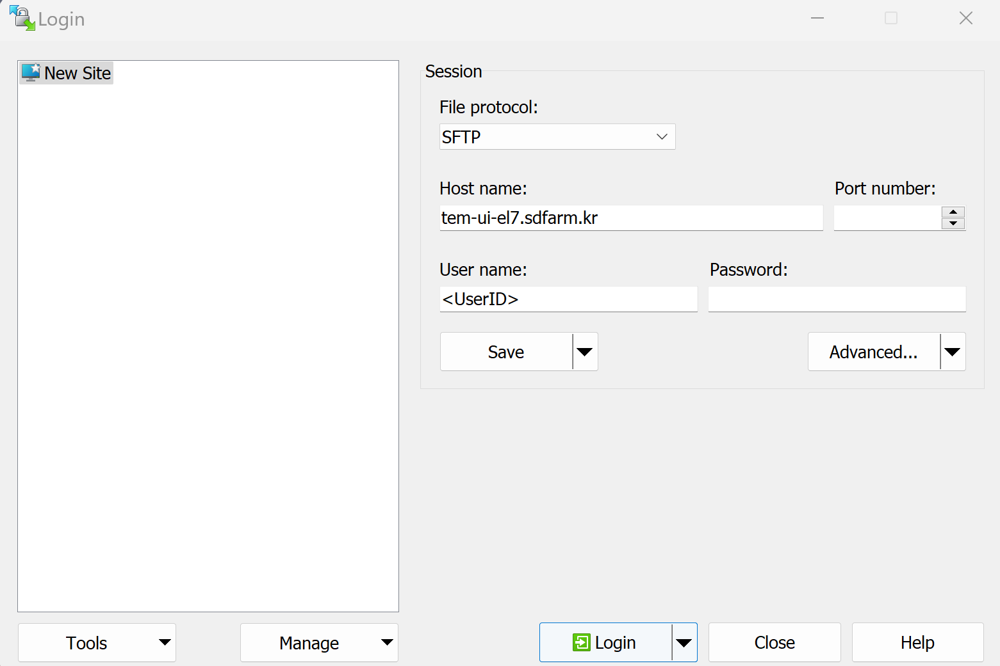
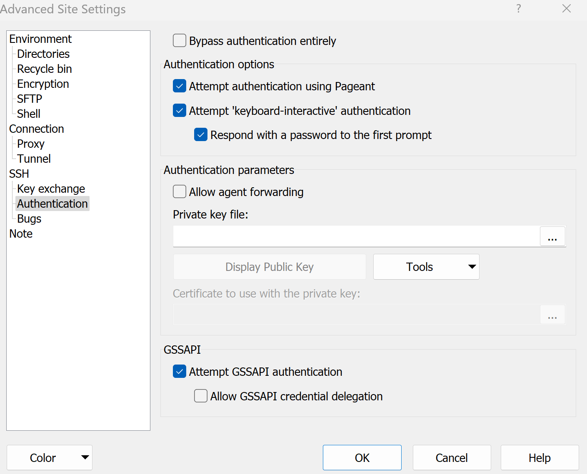
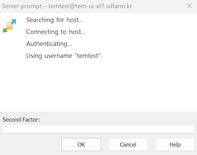

.. |newi| image:: images/new-24.png

********************************************************************
Two-factor Authentication (2FA) with One-Time-Password (OTP) |newi|
********************************************************************

2FA with One-Time-Passowrd (OTP) Guide
======================================

We have introduced a Two-Factor Authentication (2FA) using One-Time-Password (OTP) to enhance the security environment. Please follow the GSDC OTP guide (written in both Korean and English) through the link below 
to enable it on your TEM account. Note that you must follow the guide when you are already logged in. 

* `GSDC OTP Guide <https://gsdc-farm.gitbook.io/gsdc-otp/>`_

You are strongly recommended to do so as soon as possible because once all TEM user accounts are OTP enabled, then we plan to suspend the policy requiring source IPs. 

We hope your cooperation and please do not hesitate to contact us if you have any questions.

2FA Tips and Tricks
===================

How can I resolve the IPA command error?
----------------------------------------

This error occurs when the credentials issued by your authentication system, which are valid for one day, expire or become invalid. Here are the steps to resolve this issue:

Open your terminal and execute the following command to obtain new credentials.

.. code-block:: bash

    $> kinit
    Password for XXXXXX@SDFARM.KR: (Enter your password)

Enter your password and press Enter to generate new credentials. Now, re-run the "ipa otptoken-add" command. It should execute without errors, using the newly generated credentials.

Releasing screen lock
---------------------

When the screen lock is activated while using OTP, it prompts for a password with a message like :

.. code-block:: bash

    Screen used by [UserName] <[UserID]> on [loginNodeName].
    Password:
    
What password should I use to unlock it? To unlock the screen in this scenario, you should enter both the First Factor (usually your regular password) and the Second Factor (the OTP generated by your OTP token). 
Combining these two factors (with consequtive password + otp) will allow you to unlock the screen and continue using your session.

How can I use SSH/SFTP programs with 2FA?
-----------------------------------------

Your client (e.g., Terminal-based ssh/scp/rsync commands on Linux/Mac etc.) programs may natively support interactive or multi-factor authentication methods. 

    * GUI terminal programs (for Linux or Mac) : `SSH/SCP/RSYNC via terminal-based commands <https://tem-docs.readthedocs.io/en/latest/guide.html#for-linux-mac-users>`_  

However, many GUI programs do not have this functionality built in.

Known GUI applications for SSH that support 2FA natively:

    * MobaXterm (for Windows only) : `SSH via MobaXterm <https://gsdc-farm.gitbook.io/gsdc-otp/login-with-otp#mobaxterm-connecting-via-mobaxterm-on-windows>`_
    * XShell (for Windows only) : `SSH using Xshell <https://gsdc-farm.gitbook.io/gsdc-otp/login-with-otp#xshell-connecting-using-xshell>`_
    * Putty

Known GUI applications for SFTP that support 2FA natively:

    * FileZilla (for Windows or Linux/Mac) : see :ref:`filezilla_with_2fa`
    * WinSCP (for Windows only) : see :ref:`winscp_with_2fa`

.. _filezilla_with_2fa:
How can I use FileZilla with 2FA?
---------------------------------

With the FileZilla global settings ("Edit" -> "Setttings"),  

    * In "Connection" menu, make sure to set "Timeout in seconds" value to 0, it will not close and recreate idle sessions.

.. image:: images/filezilla-0.png
    :scale: 50 %
    :align: center
    :class: with-border   
   
|

When editing and connecting a new site for SFTP ("File" -> "Site Manager" -> "New site"),
 
    * In "General" tab, choose the Logon Type "interactive", and with this setting, it will ask you for your password and OTP.
    * In "Transfer Settings" tab, also make sure to check "Limit number of simultaneous connections" and leave the default value of 1.

.. image:: images/filezilla-1.png
    :scale: 50 %
    :align: center
    :class: with-border

|

.. image:: images/filezilla-2.png
    :scale: 50 %
    :align: center
    :class: with-border

|

.. _winscp_with_2fa:
How can I use WinSCP with 2FA?
------------------------------

1. Download and install the WinSCP from https://winscp.net/eng/downloads.php. Check out the WinSCP installation guide for more detailed info: https://winscp.net/eng/docs/guide_install.

2. Run the WinSCP.exe which you installed in step 1

3. Click "Tab" -> "Sites" -> "Site Manager"

4. Click on "Advanced..." button on the login window

|

5. Go to the SSH -> Authentication, check all the options in "Authentication options"

|

6. Back in the login window, enter the hostname (tem-ui-el7.sdfarm.kr or tem-cs-el7.sdfarm.kr), port number and <UserID>. 
Note to leave the blank in "Password". Click "Save" button and choose a name for this session configuration in the "Site name" field, and click OK.

|

7. Back in the login window, choose this site and click on the "Login" buttion. You will be connected to the login server. If this is the first time you are connecting to the server, the server's host key 
information will be shown. Click "Yes" to proceed.

8. You will be asked for your password and 2FA (OTP) code for connecting to the login server.

.. image:: images/winscp-4.png
    :scale: 50 %
    :align: center
    :class: with-border

|

|

9. Finally, in the main window you will see the files on the TEM cluster in the right panel, and the files on your computer in the left one. 
You can drag and drop files to copy them from the cluster to your computer and vice versa.

.. image:: images/winscp-6.png
    :scale: 50 %
    :align: center
    :class: with-border

|