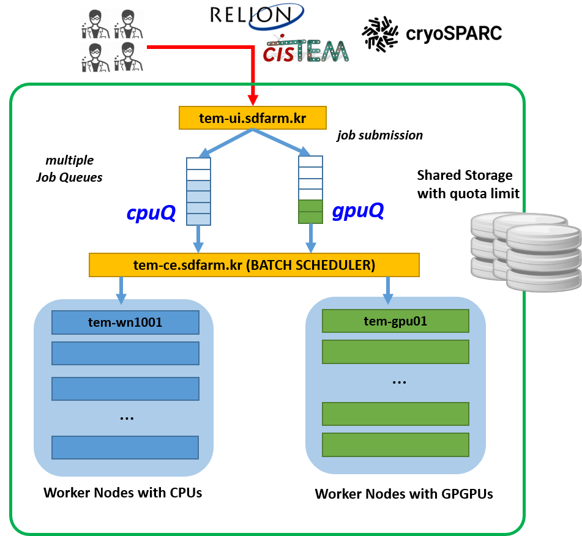

************
Batch Queues
************

Batch queue list
================

TEM farm provides multiple batch queues with different characteristics to users who submit jobs to analyze large-scale Cryo-EM data. 
A batch queue means a logical set of CPU and GPU computing resources.
Users interact with a specific queue to manange their own jobs. 
Within each queue, submitted jobs are executed in order (First-in-first-out).
Note that multiple jobs requiring CPU and/or GPU resources can be executed concurrently if there are enough available resources in the queue.

+--------------+-----------------+-----------------------------------------------------------------------+------------------------------------+
| Category     | Queue Name      | Assigned Computing Resources                                          | Remarks                            |
+--------------+-----------------+-----------------------------------------------------------------------+------------------------------------+
| Shared       | **cpuQ**        | - tem-wn[1001-1011].sdfarm.kr (28 cores and 192GB memory per node)    | - 308 Physical CPU cores           |
|              |                 |                                                                       |                                    |
|              +--------------------+--------------------------------------------------------------------+------------------------------------|
|              | **gpuQ**        | - tem-gpu[01-03].sdfarm.kr (28 cores, 2 P100 GPGPUs and 384GB memory) | - 155 Physical CPU cores           | 
|              |                 | - tem-gpu04.sdfarm.kr (24 cores, 2 P40 GPGPUs and 128GB memory)       | - 10 GPGPUs                        |
|              |                 | - tem-gpu05.sdfarm.kr (36 cores, 2 P40 GPGPUs and 256GB memory)       |                                    |
+--------------+-----------------+-----------------------------------------------------------------------+------------------------------------+
