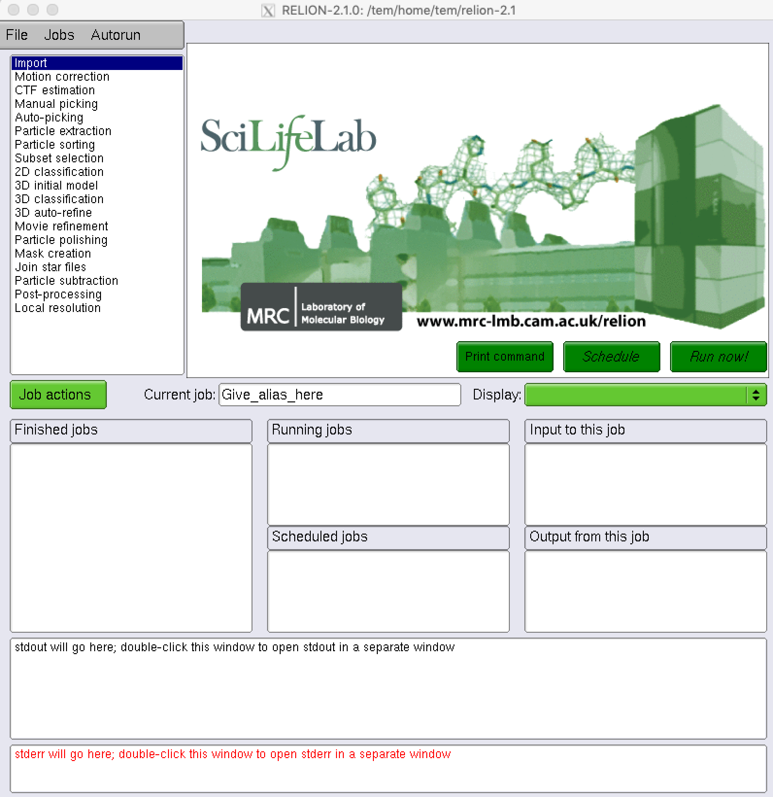
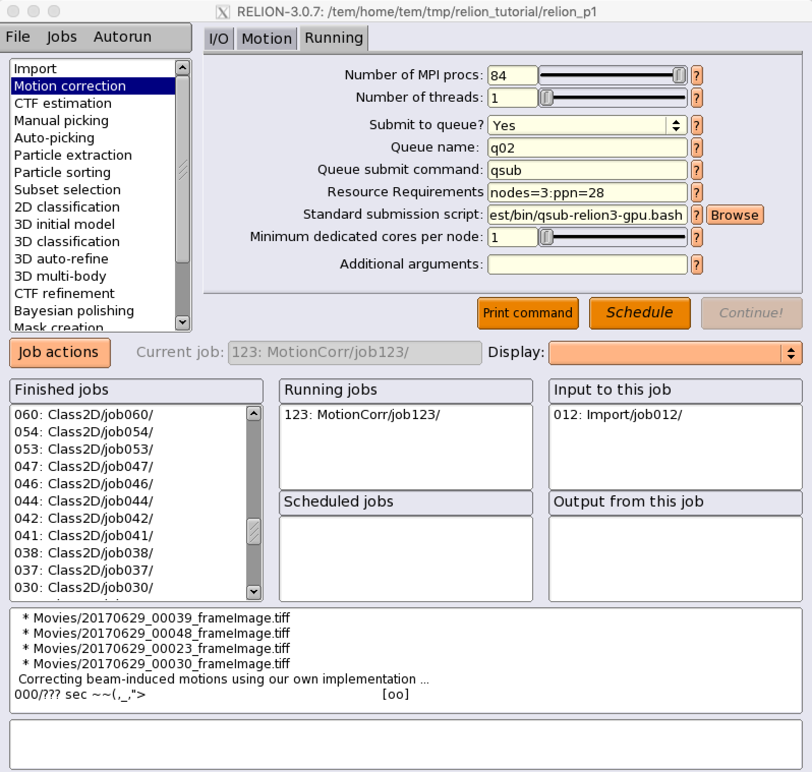
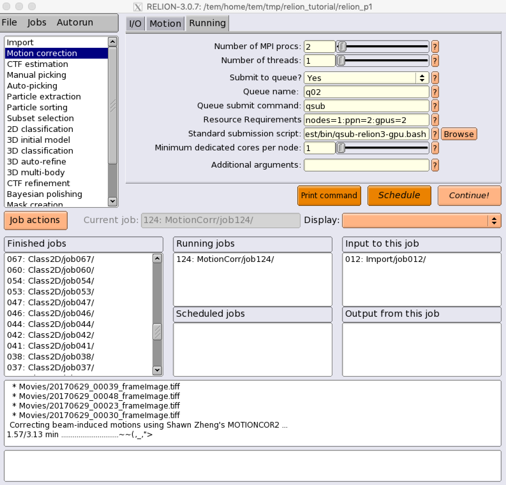
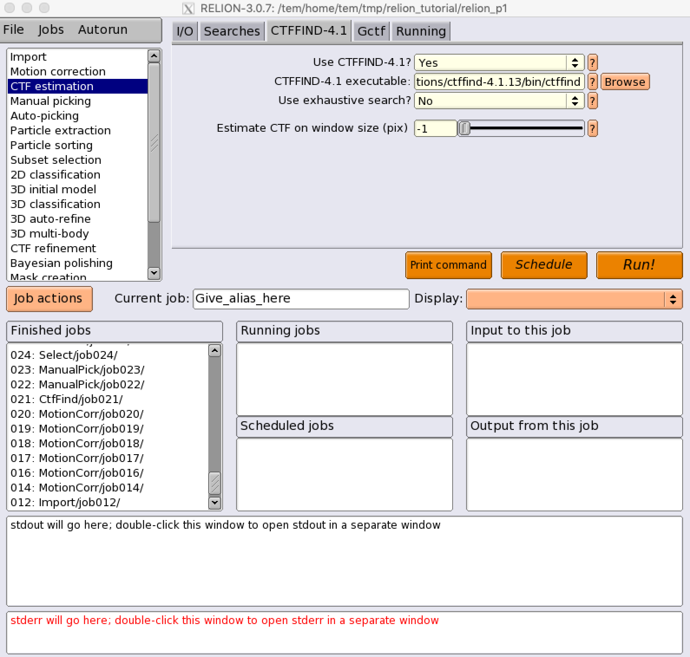
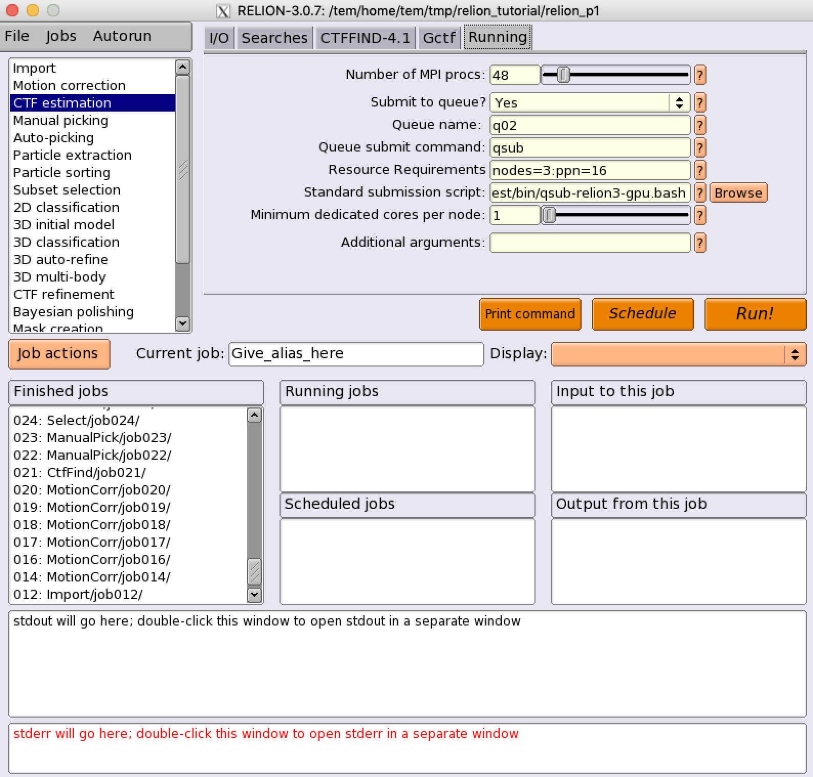
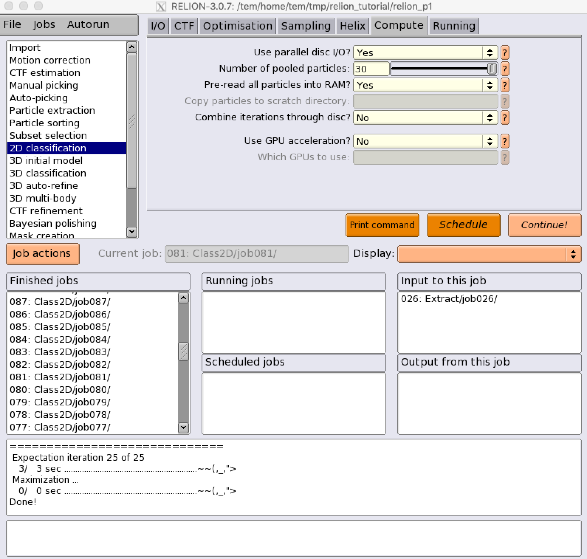
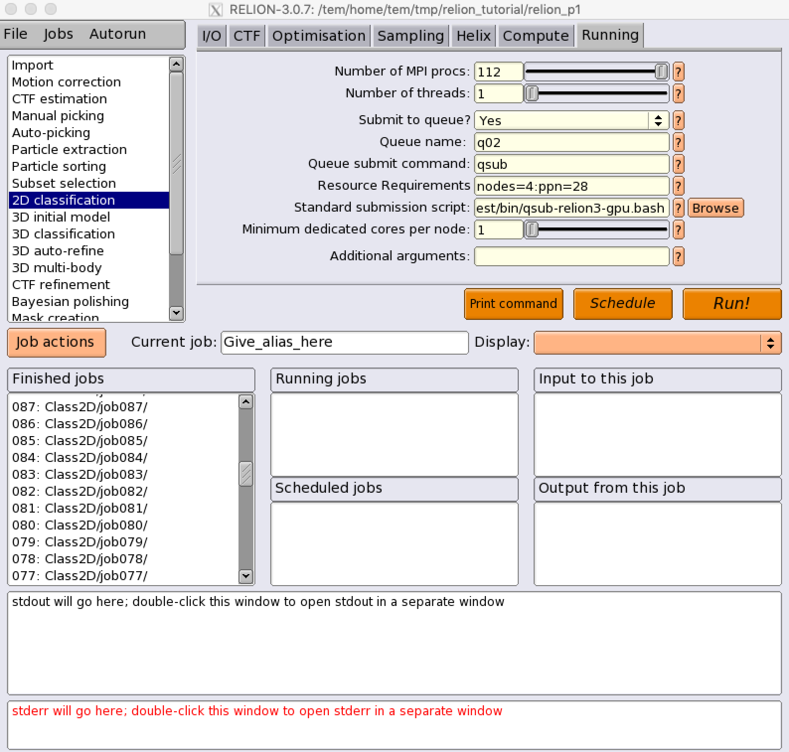

******
Relion
******
RELION (for REgularised LIkelihood OptimisatioN, pronounce rely-on) is a stand-alone computer program that employs an empirical Bayesian approach to refinement of (multiple) 3D reconstructions or 2D class averages in electron cryo-microscopy (cryo-EM). (from Relion official site https://www3.mrc-lmb.cam.ac.uk/relion/index.php?title=Main_Page)

Executing Relion GUI tools
==========================

How to start Relion data analysis tool
--------------------------------------

1. You can find out relion applications' environment module path by listing all the module available on TEM service farm

.. code-block:: bash

  $> module avail

  ----------------- /tem/home/tem/Modules/Modules/versions -----------------
  3.2.10

  ----------- /tem/home/tem/Modules/Modules/default/modulefiles ------------
  apps/gcc/4.4.7/cistem/1.0.0     cuda/9.1
  apps/gcc/4.4.7/relion/cpu/3.0.7 modules
  apps/gcc/4.4.7/relion/gpu/3.0.7 mpi/gcc/openmpi/1.8.8

2. Check the module details for the specific relion version (e.g., Relion v3.0.7 with GPGPU support or Relion v3.0.7 with CPU cores support only)

.. code-block:: bash

  $> module show apps/gcc/4.4.7/relion/gpu/3.0.7

  -------------------------------------------------------------------
  /tem/home/tem/Modules/Modules/default/modulefiles/apps/gcc/4.4.7/relion/gpu/3.0.7:

  module-whatis    Setups `relion-3.0.7' environment variables 
  module           load mpi/gcc/openmpi/1.8.8 
  module           load cuda/9.1 
  setenv           relion_version 3.0.7 
  prepend-path     PATH /tem/home/tem/_Applications/relion-3.0.7/gpu/bin 
  prepend-path     LD_LIBRARY_PATH /tem/home/tem/_Applications/relion-3.0.7/gpu/lib 
  setenv           LANG en_US.UTF-8 
  setenv           RELION_QUEUE_NAME tem 
  setenv           RELION_QSUB_COMMAND qsub 
  setenv           RELION_QSUB_TEMPLATE /tem/home/tem/_Applications/relion-3.0.7/gpu/bin/qsub-relion3-gpu.bash 
  setenv           RELION_QSUB_EXTRA_COUNT 3 
  setenv           RELION_QSUB_EXTRA1 Number of Nodes 
  setenv           RELION_QSUB_EXTRA2 Number of processes per each node 
  setenv           RELION_QSUB_EXTRA3 Number of GPUs per node 
  setenv           RELION_QSUB_EXTRA1_DEFAULT 1 
  setenv           RELION_QSUB_EXTRA2_DEFAULT 3 
  setenv           RELION_QSUB_EXTRA3_DEFAULT 2 
  setenv           RELION_CTFFIND_EXECUTABLE /tem/home/tem/_Applications/ctffind-4.1.13/bin/ctffind 
  setenv           RELION_GCTF_EXECUTABLE /tem/home/tem/_Applications/Gctf_v1.18_b2/bin/Gctf_v1.18_b2_sm60_cu9.1
  setenv           RELION_RESMAP_EXECUTABLE /tem/home/tem/_Applications/ResMap-1.1.4/ResMap-1.1.4-linux64 
  setenv           RELION_MOTIONCOR2_EXECUTABLE /tem/home/tem/_Applications/MotionCor2/MotionCor2_Cuda9.1_v1.0.5
  setenv           RELION_UNBLUR_EXECUTABLE /tem/home/tem/_Applications/unblur_1.0.2/bin/unblur_openmp_7_17_15.exe 
  setenv           RELION_SUMMOVIE_EXECUTABLE /tem/home/tem/_Applications/summovie_1.0.2/bin/sum_movie_openmp_7_17_15.exe 
  conflict         apps/gcc/4.4.7/relion 
  -------------------------------------------------------------------

  or

  $> module show apps/gcc/4.4.7/relion/cpu/3.0.7

  -------------------------------------------------------------------
  /tem/home/tem/Modules/Modules/default/modulefiles/apps/gcc/4.4.7/relion/cpu/3.0.7:

  module-whatis    Setups `relion-3.0.7' environment variables 
  module           load mpi/gcc/openmpi/1.8.8 
  setenv           relion_version 3.0.7 
  prepend-path     PATH /tem/home/tem/_Applications/relion-3.0.7/cpu/bin 
  prepend-path     LD_LIBRARY_PATH /tem/home/tem/_Applications/relion-3.0.7/cpu/lib 
  setenv           LANG en_US.UTF-8 
  setenv           RELION_QUEUE_USE yes 
  setenv           RELION_QUEUE_NAME own_queue_name 
  setenv           RELION_QSUB_COMMAND qsub 
  setenv           RELION_QSUB_TEMPLATE /tem/home/tem/_Applications/relion-3.0.7/cpu/bin/qsub-relion3-cpu.bash 
  setenv           RELION_QSUB_EXTRA_COUNT 2 
  setenv           RELION_QSUB_EXTRA1 Number of Nodes 
  setenv           RELION_QSUB_EXTRA2 Number of processes per each node 
  setenv           RELION_QSUB_EXTRA1_DEFAULT 2 
  setenv           RELION_QSUB_EXTRA2_DEFAULT 16 
  setenv           RELION_CTFFIND_EXECUTABLE /tem/home/tem/_Applications/ctffind-4.1.13/bin/ctffind 
  setenv           RELION_GCTF_EXECUTABLE /tem/home/tem/_Applications/Gctf_v1.18_b2/bin/Gctf_v1.18_b2_sm60_cu9.1 
  setenv           RELION_RESMAP_EXECUTABLE /tem/home/tem/_Applications/ResMap-1.1.4/ResMap-1.1.4-linux64 
  setenv           RELION_MOTIONCOR2_EXECUTABLE /tem/home/tem/_Applications/MotionCor2/MotionCor2_Cuda9.1_v1.0.5 
  setenv           RELION_UNBLUR_EXECUTABLE /tem/home/tem/_Applications/unblur_1.0.2/bin/unblur_openmp_7_17_15.exe 
  setenv           RELION_SUMMOVIE_EXECUTABLE /tem/home/tem/_Applications/summovie_1.0.2/bin/sum_movie_openmp_7_17_15.exe 
  conflict         apps/gcc/4.4.7/relion 
  -------------------------------------------------------------------

3. Load the environment module for the version of relion application which you want to execute. As the module specified is loaded, all the modules with dependency are also loaded (you can check these modules with "module list" command)

.. code-block:: bash

  $> module load apps/gcc/4.4.7/relion/gpu/3.0.7
  $> module list
  Currently Loaded Modulefiles:
    1) mpi/gcc/openmpi/1.8.8             2) cuda/9.1                          3) apps/gcc/4.4.7/relion/gpu/3.0.7

4. Check the relion application binary path

.. code-block:: bash

  $> which relion
  /tem/home/tem/_Applications/relion-3.0.7/gpu/bin/relion

5. Execute the relion application (we assume that X11 forwarding is enabled)

.. code-block:: bash

  $> relion

PBS Strings used in Relion
==========================

.. table:: torque_strings_of_relion

  +----------------------+------------------------+------------------------------------------------------------+
  | String               | Variable type          | Description                                                |
  +----------------------+------------------------+------------------------------------------------------------+
  | **XXXcommandXXX**    | string                 | relion command + arguments                                 |
  +----------------------+------------------------+------------------------------------------------------------+
  | **XXXqueueXXX**      | string                 | Name of the queue to submit job to                         |
  +----------------------+------------------------+------------------------------------------------------------+
  | **XXXmpinodesXXX**   | integer                | The number of MPI processes to use                         |
  +----------------------+------------------------+------------------------------------------------------------+
  | **XXXthreadsXXX**    | integer                | The number of threads to use on each MPI process           |
  +----------------------+------------------------+------------------------------------------------------------+
  | **XXXcoresXXX**      | integer                | The number of MPI processes times the number of threads    |
  +----------------------+------------------------+------------------------------------------------------------+
  | **XXXdedicatedXXX**  | integer                | The minimum number of cores on each node                   |
  |                      |                        | (use this to fill entire nodes)                            |
  +----------------------+------------------------+------------------------------------------------------------+
  | **XXXnodesXXX**      | integer                | The total number of nodes to be requested                  |
  +----------------------+------------------------+------------------------------------------------------------+
  | **XXXextra1XXX**     | string                 | Installation-specific                                      |
  +----------------------+------------------------+------------------------------------------------------------+
  | **XXXextra2XXX**     | string                 | Installation-specific                                      |
  +----------------------+------------------------+------------------------------------------------------------+

Relion, by default, does not use the XXXextra1XXX, XXXextra2XXX, ... variables. 
They provide additional flexibility for queueing systems (like Torque) that require additional variables. 
They may be activated by first setting RELION_QSUB_EXTRA_COUNT to the number of fields you need (e.g. 3) and then setting the RELION_QSUB_EXTRA1, RELION_QSUB_EXTRA2, RELION_QSUB_EXTRA3 ... environment variables, respectively.
This will result in extra input fields in the GUI, with the label text being equal to the value of the environment variable. Likewise, their default values (upon starting the GUI) can be set through environment variables RELION_QSUB_EXTRA1_DEFAULT, RELION_QSUB_EXTRA2_DEFAULT, etc and their help messages can be set through environmental variables RELION_QSUB_EXTRA1_HELP, RELION_QSUB_EXTRA2_HELP and so on.

Running data analysis jobs using CPU cores (apps/gcc/4.4.7/relion/cpu/3.0.7)
============================================================================

Module path
-----------

Users should load an environment module, whose path is  **apps/gcc/4.4.7/relion/cpu/3.0.7** (i.e., moulde load apps/gcc/4.4.7/relion/cpu/3.0.7) to execute data analysis jobs using CPU cores in relion GUI.

* apps/gcc/4.4.7/relion/cpu/3.0.7

Environment variables
---------------------
Relion defines a lot of environment variables that can be used to execute different types of subtasks in the analysis workflows. Among these, "RELION_QSUB_TEMPLATE" describes the location of a proper batch job script template (usually called standard job submission script) to submit jobs to the farm.

.. code-block:: bash

  (for relion 3.0.7 standard job submission script) RELION_QSUB_TEMPLATE /tem/home/tem/_Applications/relion-3.0.7/cpu/bin/qsub-relion3-cpu.bash

For the use of CPU cluster nodes, we have set the RELION_QSUB_EXTRA_COUNT to 2. Two extra options describe "Number of Nodes" and "Number of processes per each node", respectively. These values can be referred by XXXextra1, XXXextra2XXX in the following batch job script template.

.. code-block:: bash

  setenv RELION_QSUB_EXTRA_COUNT 2
  setenv RELION_QSUB_EXTRA1 "Number of Nodes"
  setenv RELION_QSUB_EXTRA2 "Number of processes per each node"
  setenv RELION_QSUB_EXTRA1_DEFAULT 2
  setenv RELION_QSUB_EXTRA2_DEFAULT 16

.. image:: images/relion-cpu.jpg
    :scale: 70 %
    :align: center

As shown in above figure, you can browse and select **"standard submission script"** as the location of RELION_QSUB_TEMPLATE for relion 3.0.7 (i.e., /tem/home/tem/_Applications/relion-3.0.7/cpu/bin/qsub-relion3-cpu.bash or its own your copy), and give **"Number of Nodes"** and **"Number of processes per each node"** values instead of default ones to submit a job to Torque based TEM farm.

.. note::
  For CPU jobs, note that you **MUST** use **cpuQ** for the "Queue name" field and render correct "number of MPI procs" which is generally total number of processes (# of nodes * # of processes per each node) 

Standard job submission script (for CPU use)
--------------------------------------------

.. code-block:: bash

  #!/bin/bash

  ### Inherit all current environment variables
  #PBS -V

  ### Job name
  #PBS -N XXXnameXXX

  ### Queue name
  #PBS -q XXXqueueXXX

  ### CPU cluster use : Specify the number of nodes (XXXextra1XXX) and the number of processes per each node (XXXextra2XXX)
  #PBS -l nodes=XXXextra1XXX:ppn=XXXextra2XXX:XXXqueueXXX

  #PBS -o ${PBS_JOBNAME}/run.out
  #PBS -e ${PBS_JOBNAME}/run.err

  ###########################################################
  ### Print Environment Variables
  ###########################################################
  echo ------------------------------------------------------
  echo -n 'Job is running on node '; cat $PBS_NODEFILE
  echo ------------------------------------------------------
  echo PBS: qsub is running on $PBS_O_HOST
  echo PBS: originating queue is $PBS_O_QUEUE
  echo PBS: executing queue is $PBS_QUEUE
  echo PBS: working directory is $PBS_O_WORKDIR
  echo PBS: execution mode is $PBS_ENVIRONMENT
  echo PBS: job identifier is $PBS_JOBID
  echo PBS: job name is $PBS_JOBNAME
  echo PBS: node file is $PBS_NODEFILE
  echo PBS: current home directory is $PBS_O_HOME
  echo PBS: PATH = $PBS_O_PATH
  echo ------------------------------------------------------

  ###########################################################
  # Switch to the working directory;
  cd ${PBS_O_WORKDIR}/${PBS_JOBNAME}
  touch run.out
  touch run.err
  cd $PBS_O_WORKDIR
  ###########################################################

  ### Run:
  module load apps/gcc/4.4.7/relion/cpu/3.0.7
  mpirun --prefix /tem/home/tem/_SystemLibs/openmpi-1.8.8 -machinefile $PBS_NODEFILE XXXcommandXXX

  echo "Done!"

Running data analysis jobs using GPGPUs (apps/gcc/4.4.7/relion/gpu/3.0.7)
=========================================================================

Environment variables
---------------------
Relion defines a lot of environment variables that can be used to execute different types of subtasks in the analysis workflows. Among these, "RELION_QSUB_TEMPLATE" describes the location of a proper batch job script to submit jobs to the farm.

.. code-block:: bash

  (for relion 3.0.7 w/ GPU support standard job submission script) RELION_QSUB_TEMPLATE /tem/home/tem/_Applications/relion-3.0.7/gpu/bin/qsub-relion3-gpu.bash

Unlike CPU cluster use case, we have set the RELION_QSUB_EXTRA_COUNT to 3 for the use of GPGPU cluster, 
where each extra option describes "Number of Nodes", "Number of processes per each node", and "Number of GPUs per node", respectively. All these values can be accessed by XXXextra1, XXXextra2XXX, XXXextra3XXX in the batch job script template.

.. code-block:: bash

  setenv RELION_QSUB_EXTRA_COUNT 3
  setenv RELION_QSUB_EXTRA1 "Number of Nodes"
  setenv RELION_QSUB_EXTRA2 "Number of processes per each node"
  setenv RELION_QSUB_EXTRA3 "Number of GPUs per node"
  setenv RELION_QSUB_EXTRA1_DEFAULT 1
  setenv RELION_QSUB_EXTRA2_DEFAULT 3
  setenv RELION_QSUB_EXTRA3_DEFAULT 2

.. image:: images/relion-script-description.png
    :scale: 70 %
    :align: center

.. note::
  For GPU jobs, note that you **MUST** use **gpuQ** for the "Queue name" field and render correct "number of MPI procs" which is generally total number of processes (# of nodes * # of processes per each node) 

Standard job submission script (for GPGPU use)
----------------------------------------------

.. code-block:: bash

  #!/bin/bash

  ### Inherit all current environment variables
  #PBS -V

  ### Job name
  #PBS -N XXXnameXXX

  ### Queue name
  #PBS -q XXXqueueXXX

  ### GPU use : Specify the number of nodes (XXXextra1XXX), the number of processes per each node (XXXextra2XXX), and the number of GPGPUs per node (XXXextra3XXX)
  #PBS -l nodes=XXXextra1XXX:ppn=XXXextra2XXX:gpus=XXXextra3XXX:XXXqueueXXX

  #PBS -o ${PBS_JOBNAME}/run.out
  #PBS -e ${PBS_JOBNAME}/run.err

  ###########################################################
  ### Print Environment Variables
  ###########################################################
  echo ------------------------------------------------------
  echo -n 'Job is running on node '; cat $PBS_NODEFILE
  echo ------------------------------------------------------
  echo PBS: qsub is running on $PBS_O_HOST
  echo PBS: originating queue is $PBS_O_QUEUE
  echo PBS: executing queue is $PBS_QUEUE
  echo PBS: working directory is $PBS_O_WORKDIR
  echo PBS: execution mode is $PBS_ENVIRONMENT
  echo PBS: job identifier is $PBS_JOBID
  echo PBS: job name is $PBS_JOBNAME
  echo PBS: node file is $PBS_NODEFILE
  echo PBS: current home directory is $PBS_O_HOME
  echo PBS: PATH = $PBS_O_PATH
  echo PBS: PBS_GPUFILE=$PBS_GPUFILE
  echo PBS: CUDA_VISIBLE_DEVICES=$CUDA_VISIBLE_DEVICES
  echo ------------------------------------------------------

  ###########################################################
  # Switch to the working directory;
  cd ${PBS_O_WORKDIR}/${PBS_JOBNAME}
  touch run.out
  touch run.err
  cd $PBS_O_WORKDIR
  ###########################################################

  ### Run:
  module load apps/gcc/4.4.7/relion/gpu/3.0.7
  mpirun --prefix /tem/home/tem/openmpi-1.8.8 -machinefile $PBS_NODEFILE XXXcommandXXX

  echo "Done!"

Specifying which GPGPUs to use
------------------------------

.. image:: images/relion-gpu-node-allocation.png
    :scale: 70 %
    :align: center

Here, we describe more advanced syntax for restricting RELION processes to certain GPUs on multi-GPU setups. You can use an argument to the --gpu option to provide a list of device-indices. The syntax is then to delimit ranks with colons [:], and threads by commas [,]. Any GPU indices provided is taken to be a list which is repeated if shorter than the total number of GPUs. By extension, the following rules applies

If a GPU id is specified more than once for a single mpi-rank, that GPU will be assigned proprotionally more of the threads of that rank.
If no colons are used (i.e. GPUs are only specified for a single rank), then the GPUs specified, apply to all ranks.
If GPUs are specified for more than one rank but not for all ranks, the unrestricted ranks are assigned the same GPUs as the restricted ranks, by a modulo rule.
For example, if you would only want to use two of the four GPUs for all mpi-ranks, because you want to leave another two free for a different user/job, then (by the above rule 2) you can specify

.. code-block:: bash

  mpirun -n 3 ‘which relion_refine_mpi‘ --gpu 2:3
  slave 1 is told to use GPU2. slave 2 is told to use GPU3.

If you want an even spread over ALL GPUs, then you should not specify selection indices, as RELION will handle this itself. On your hypothetical 4-GPU machine, you would simply say

.. code-block:: bash

  mpirun -n 3 ‘which relion_refine_mpi‘ --gpu
  ## slave 1 will use GPU0 and GPU1 for its threads. slave 2 will use GPU2 and GPU3 for its threads

One can also schedule individual threads from MPI processes on the GPUs. This would be most useful when available RAM would be a limitation. Then one could for example run 3 MPI processes, each of which spawn a number of threads on two of the cards each, as follows:

.. code-block:: bash

  mpirun -n 3 ‘which relion_refine_mpi‘ --j 4 --gpu 0,1,1,2:3
  ## slave 1 is told to put thread 1 on GPU0, threads 2 and 3 on GPU1, and thread 4 on GPU2.  slave 2 is told to put all 4 threads on GPU3.

Finally, for completeness, the following is a more complex example to illustrate the full functionality of the GPU-device specification options.

.. code-block:: bash

  mpirun -n 4 ... -j 3 --gpu 2:2:1,3
  ## slave 1 w/ 3 threads on GPU2, slave 2 w/ 3 threads on GPU2, slave 3 distributes 3 threads as evenly as possible across GPU1 and GPU3.

For more information, please refer to Relion Benchmarks and computer hardware (https://www3.mrc-lmb.cam.ac.uk/relion/index.php/Benchmarks_%26_computer_hardware)

Executing CPU/GPU jobs in unified Relion environment
====================================================

Basically, with GPU-enabled Relion GUI, users can execute GPU-accelerated built-in subprograms, for examples :

* **refine, refine_mpi** (only the slaves, not the master)
* **autopick, autopick_mpi** (master and slaves)

and 3rd-party GPU-accelerated programs, for examples :

* **Gctf** (/tem/home/tem/_Applications/Gctf_v1.18_b2/bin/Gctf_v1.18_b2_sm60_cu9.1)
* **MotionCor2** (/tem/home/tem/_Applications/MotionCor2/MotionCor2_Cuda9.1_v1.0.5)

However, the GPU-enabled Relion also includes other built-in or 3rd-party CPU-only subprograms which follows :

* **MotionCor2-like alignment algorithm** (by Takanori Nakane)
* **CTFFind 4.1** (/tem/home/tem/_Applications/ctffind-4.1.13/bin/ctffind)
* **autopick** (built-in)
* **particle extraction** (built-in)
* **particle sorting** (built-in)
* **subset selection** (built-in)
* **2D classification** (built-in)
* **3D classification** (built-in)
* **3D refinement, 3D multi-body** (built-in)
* **CTF refinement** (built-in)
* **Particle substraction, etc.** (built-in)

So, for users convenience, we have deployed another Relion application with more generic computational resources requirements (GPU and/or CPU).

Module path
-----------

* apps/gcc/4.4.7/relion/gpu/3.0.7p

.. code-block:: bash

  $> module avail

  --------------------------- /tem/home/tem/Modules/Modules/versions ---------------------------
  3.2.10

  --------------------- /tem/home/tem/Modules/Modules/default/modulefiles ----------------------
  apps/gcc/4.4.7/cistem/1.0.0      cuda/9.1
  apps/gcc/4.4.7/relion/cpu/3.0.7  modules
  apps/gcc/4.4.7/relion/gpu/3.0.7  mpi/gcc/openmpi/1.8.8
  apps/gcc/4.4.7/relion/gpu/3.0.7p

  $> module show apps/gcc/4.4.7/relion/gpu/3.0.7p

  -------------------------------------------------------------------
  /tem/home/tem/Modules/Modules/default/modulefiles/apps/gcc/4.4.7/relion/gpu/3.0.7p:

  module-whatis    Setups `relion-3.0.7' environment variables 
  module           load mpi/gcc/openmpi/1.8.8 
  module           load cuda/9.1 
  setenv           relion_version 3.0.7 
  prepend-path     PATH /tem/home/tem/_Applications/relion-3.0.7/test/bin 
  prepend-path     LD_LIBRARY_PATH /tem/home/tem/_Applications/relion-3.0.7/test/lib 
  setenv           LANG en_US.UTF-8 
  setenv           RELION_QUEUE_USE yes 
  setenv           RELION_QUEUE_NAME own_queue_name 
  setenv           RELION_QSUB_COMMAND qsub 
  setenv           RELION_QSUB_TEMPLATE /tem/home/tem/_Applications/relion-3.0.7/test/bin/qsub-relion3-gpu.bash
  setenv           RELION_QSUB_EXTRA_COUNT 1 
  setenv           RELION_QSUB_EXTRA1 Resource Requirements 
  setenv           RELION_QSUB_EXTRA1_DEFAULT nodes=1:ppn=3:gpus=2 
  setenv           RELION_QSUB_EXTRA1_HELP For the use of GPUs, nodes=<#of nodes>:ppn=<# of processes per n# of GPUs per node>. For the use of CPU cores, nodes=<#of nodes>:ppn=<# of processes per node> 
  setenv           RELION_CTFFIND_EXECUTABLE /tem/home/tem/_Applications/ctffind-4.1.13/bin/ctffind 
  setenv           RELION_GCTF_EXECUTABLE /tem/home/tem/_Applications/Gctf_v1.18_b2/bin/Gctf_v1.18_b2_sm60_cu9.1 
  setenv           RELION_RESMAP_EXECUTABLE /tem/home/tem/_Applications/ResMap-1.1.4/ResMap-1.1.4-linux64 
  setenv           RELION_MOTIONCOR2_EXECUTABLE /tem/home/tem/_Applications/MotionCor2/MotionCor2_Cuda9.1_v1.0.5 
  setenv           RELION_UNBLUR_EXECUTABLE /tem/home/tem/_Applications/unblur_1.0.2/bin/unblur_openmp_7_17_15.exe 
  setenv           RELION_SUMMOVIE_EXECUTABLE /tem/home/tem/_Applications/summovie_1.0.2/bin/sum_movie_openmp_7_17_15.exe 
  conflict         apps/gcc/4.4.7/relion 
  -------------------------------------------------------------------

  $> module load apps/gcc/4.4.7/relion/gpu/3.0.7p
  $> module list
  Currently Loaded Modulefiles:
    1) mpi/gcc/openmpi/1.8.8              2) cuda/9.1                           3) apps/gcc/4.4.7/relion/gpu/3.0.7p

Here, we have set the RELION_QSUB_EXTRA_COUNT to 1 for the statement of more generic resource requirements (nodes, ppn, gpus) which denote "Number of Nodes", "Number of processes per each node" and "Number of GPUs per node", respectively.

* **nodes** : number of nodes required (default:1)
* **ppn** : number of processes(cores) per node (default:3)
* **gpus** : number of GPU devices per node (default:2)

.. warning::
  If you set "gpus" in the resource requirement field (e.g., nodes=1:ppn=3:gpus=2), you **MUST** use **gpuQ** for the "Queue name" field so that the job is assigned to the computing servers with **GPU** devices.
  Otherwise, if you give other queue name, cpuQ for example, the job you submitted will not start running. 

Standard job submission script
------------------------------

* RELION_QSUB_TEMPLATE : /tem/home/tem/_Applications/relion-3.0.7/test/bin/qsub-relion3-gpu.bash

.. code-block:: bash

  #!/bin/bash

  ### Inherit all current environment variables
  #PBS -V

  ### Job name
  #PBS -N XXXnameXXX

  ### Queue name
  #PBS -q XXXqueueXXX

  ### Resource requirements : XXXextra1XXX
  #PBS -l XXXextra1XXX:XXXqueueXXX

  #PBS -o ${PBS_JOBNAME}/run.out
  #PBS -e ${PBS_JOBNAME}/run.err

  ###########################################################
  ### Print Environment Variables
  ###########################################################
  echo ------------------------------------------------------
  echo -n 'Job is running on node '; cat $PBS_NODEFILE
  echo ------------------------------------------------------
  echo PBS: qsub is running on $PBS_O_HOST
  echo PBS: originating queue is $PBS_O_QUEUE
  echo PBS: executing queue is $PBS_QUEUE
  echo PBS: working directory is $PBS_O_WORKDIR
  echo PBS: execution mode is $PBS_ENVIRONMENT
  echo PBS: job identifier is $PBS_JOBID
  echo PBS: job name is $PBS_JOBNAME
  echo PBS: node file is $PBS_NODEFILE
  echo PBS: current home directory is $PBS_O_HOME
  echo PBS: PATH = $PBS_O_PATH
  echo PBS: PBS_GPUFILE=$PBS_GPUFILE
  echo PBS: CUDA_VISIBLE_DEVICES=$CUDA_VISIBLE_DEVICES
  echo ------------------------------------------------------

  ###########################################################
  # Switch to the working directory;
  cd ${PBS_O_WORKDIR}/${PBS_JOBNAME}
  touch run.out
  touch run.err
  cd $PBS_O_WORKDIR
  ###########################################################

  ### Run:
  module load apps/gcc/4.4.7/relion/gpu/3.0.7p
  mpirun --prefix /tem/home/tem/openmpi-1.8.8 -machinefile $PBS_NODEFILE XXXcommandXXX

  echo "Done!"

Examples
--------

Motion Correction
~~~~~~~~~~~~~~~~~

* **MotionCor2-like alignment algorithm** (CPU-only job, relion-own implementation)

  * (Motion) Use RELION's own implementation? : Yes
  * (Running) Number of MPI Procs : 84
  * (Running) Number of threads : 1
  * (Running) Queue name : **cpuQ**
  * (Running) Resource Requirements : nodes=3:ppn=28  (e.g., we assume that the job is allocated to the 3 nodes which have all 28 cores available for each node) 
  * (Running) Standard submission script : /tem/home/tem/_Applications/relion-3.0.7/test/bin/qsub-relion3-gpu.bash 

.. image:: images/relion-motioncor1.png
    :scale: 50 %
    :align: center

* **MotionCor2** (GPU-accelerated job)
  
  * (Motion) Use RELION's own implementation? : No
  * (Motion) MOTIONCOR2 executable : /tem/home/tem/_Applications/MotionCor2/MotionCor2_Cuda9.1_v1.0.5
  * (Running) Number of MPI Procs : 2 
  * (Running) Number of threads : 1
  * (Running) Queue name : **gpuQ**
  * (Running) Resource Requirements : nodes=1:ppn=3:gpus=2  (e.g., we assume that the job is allocated to 1 node which has 3 cpu cores and 2 GPU devices available)
  * (Running) Standard submission script : /tem/home/tem/_Applications/relion-3.0.7/test/bin/qsub-relion3-gpu.bash 

.. image:: images/motioncor2-1.png
    :scale: 50 %
    :align: center

CTF Estimation
~~~~~~~~~~~~~~

* **CTFFIND-4.1** (CPU-only job)

  * (CTFFIND-4.1) Use CTFFIND-4.1? : Yes
  * (CTFFIND-4.1) CTFFIND-4.1 executable? : /tem/home/tem/_Applications/ctffind-4.1.13/bin/ctffind
  * (Gctf) Use Gctf instead? : No
  * (Running) Number of MPI procs: 48
  * (Running) Submit to queue? : Yes
  * (Running) Queue name : **cpuQ**
  * (Running) Resource Requirements : nodes=3:ppn=16  (e.g., we assume the use of 3 nodes, 16 cpu cores per each node)
  * (Running) Standard submission script : /tem/home/tem/_Applications/relion-3.0.7/test/bin/qsub-relion3-gpu.bash

* **Gctf** (GPU-accelerated job)

  * (CTFFIND-4.1) Use CTFFIND-4.1? : No
  * (Gctf) Use Gctf instead? : Yes
  * (Gctf) Gctf executable: /tem/home/tem/_Applications/Gctf_v1.18_b2/bin/Gctf_v1.18_b2_sm60_cu9.1
  * (Gctf) Which GPUs to use: <empty> (i.e., relion automatically assigned available GPU devices to the MPI processes)
  * (Running) Number of MPI procs: 5 (1 master and 4 slave processes) 
  * (Running) Submit to queue? : Yes
  * (Running) Queue name : **gpuQ**
  * (Running) Resource Requirements : nodes=1:ppn=5:gpus=2
  * (Running) Standard submission script : /tem/home/tem/_Applications/relion-3.0.7/test/bin/qsub-relion3-gpu.bash

.. image:: images/gctf-1.png
    :scale: 50 %
    :align: center

.. image:: images/gctf-2.png
    :scale: 50 %
    :align: center

2D Classification
~~~~~~~~~~~~~~~~~

* **relion_refine_mpi** (CPU-only job)

  * (Compute) Use GPU acceleration? : No
  * (Running) Number of MPI procs: 112 
  * (Running) Number of threads: 1
  * (Running) Submit to queue? : Yes
  * (Running) Queue name : **cpuQ** 
  * (Running) Resource Requirements : nodes=4:ppn=28  (e.g., we assume the use of 4 nodes, 28 cpu cores per each node)
  * (Running) Standard submission script : /tem/home/tem/_Applications/relion-3.0.7/test/bin/qsub-relion3-gpu.bash

* **relion_refine_mpi** (GPU-accelerated job)

  * (Compute) Use GPU acceleration? : Yes
  * (Compute) Which GPUs to use? : 0:1 (i.e., we will assign each slave process to GPU device index 0 and 1, respectively)
  * (Running) Number of MPI procs: 3 (1 master and 2 slave processes)
  * (Running) Number of threads: 1
  * (Running) Submit to queue? : Yes
  * (Running) Queue name : **gpuQ** 
  * (Running) Resource Requirements : nodes=1:ppn=3:gpus=2
  * (Running) Standard submission script : /tem/home/tem/_Applications/relion-3.0.7/test/bin/qsub-relion3-gpu.bash

.. image:: images/2dclassgpu-1.png
    :scale: 50 %
    :align: center

.. image:: images/2dclassgpu-2.png
    :scale: 50 %
    :align: center
