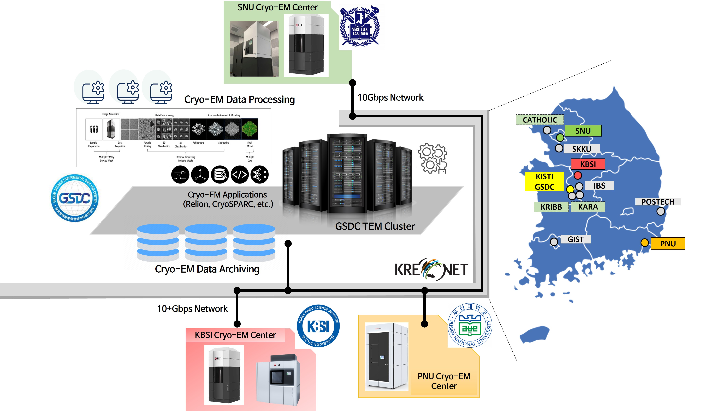

# Services

## Overview

GSDC (Global Science experimental Data hub Center) provides data computing services—transferring and archiving large volumes of Cryo-EM data and processing it for Cryo-EM operators and end users. Cryo-EM facilities operated by government-funded research institutes or academies can connect directly to GSDC via KREONET, over 10+Gbps dedicated or shared network links. GSDC also provides CPU/GPU computing servers and petabyte-scale high-performance storage to accelerate Cryo-EM users' R&D activities. GSDC's computing and storage infrastructure for Cryo-EM operators and users is outlined below.

## Collaboration between Cryo-EM sites and GSDC

A high-level view of the collaboration between Cryo-EM facilities (operated by KBSI, SNU, PNU, and others) and GSDC.

/// caption
Collaboration between Cryo-EM sites and GSDC
///
