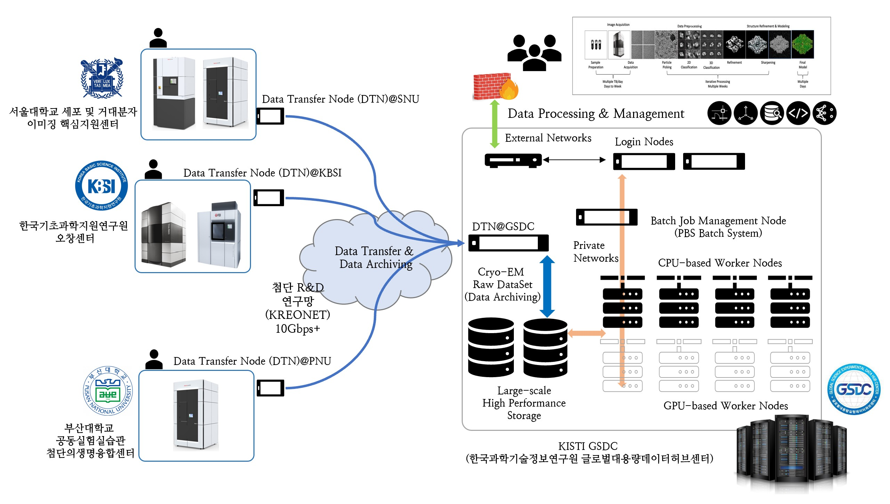

# Comptuing and Storage Resources in GSDC TEM

/// caption
Overall architecture of GSDC TEM Comptuing and Storage Resources (including Data Transfer Nodes)
///

## Login Servers

| Server Name            | Specification                                                           | Remarks               |
| ---------------------- | ----------------------------------------------------------------------- | --------------------- |
| __tem-ui-al9.sdfarm.kr__ | Intel Xeon 3.1GHz 18Core * 2CPUs, 384GB Memory                        | 72 Cores (w/ HT)      |
| __tem-cs-al9.sdfarm.kr__ | Intel Xeon 2.7GHz 18Core * 2CPUs, 384GB Memory                        | 72 Cores (w/ HT)      |

## Data Transfer(Mover) Servers

| Server Name            | Specification                                                           | Remarks               |
| ---------------------- | ----------------------------------------------------------------------- | --------------------- |
| __tem-dm-al9.sdfarm.kr__   | Intel Xeon 3.1GHz 18Core * 2CPUs, 384GB Memory                      | SFTP, GridFTP         |
| __tem-dtn-al9.sdfarm.kr__  | Intel Xeon 2.7GHz 18Core * 2CPUs, 384GB Memory                      | Rclone, GridFTP       |

## Batch System Server

| Server Name            | Specification                                                           | Remarks               |
| ---------------------- | ----------------------------------------------------------------------- | --------------------- |
| tem-ce-al9.sdfarm.kr   | Intel Xeon 2.7GHz 18Core * 2CPUs, 384GB Memory                          | PBSPro batch scheduler|

## Computing Resources

| Server Name                           | Specification                                                 | Remarks          |
| ------------------------------------- | ------------------------------------------------------------- | ---------------- |
| tem-cpu[01-13]-al9.sdfarm.kr          | Intel Xeon 2.6GHz 14Core * 2CPUs, 192GB Memory                | 364 Cores total  |
| tem-gpu[01-10]-al9.sdfarm.kr          | :material-check: 256~384GB Memory   :material-check: Nvidia P40, P100, V100, A100 GPUs          | 300 Cores total 26 GPUs total  |

## Storage Resources

| Category               | Specification                                   | Remarks                    |
| ---------------------- | ----------------------------------------------- | -------------------------- |
| Users Home Directory   | :material-check: 100GB / each account(ID)       | /tem/home/<userID>         |
| Scratch Directory      | :material-check: 80TB / each research group     | /tem/scratch/<groupDir>    |
| Archiving Directory    | :material-check: 500TB / each Cryo-EM site      | /tem/archive/<siteDir>     |
