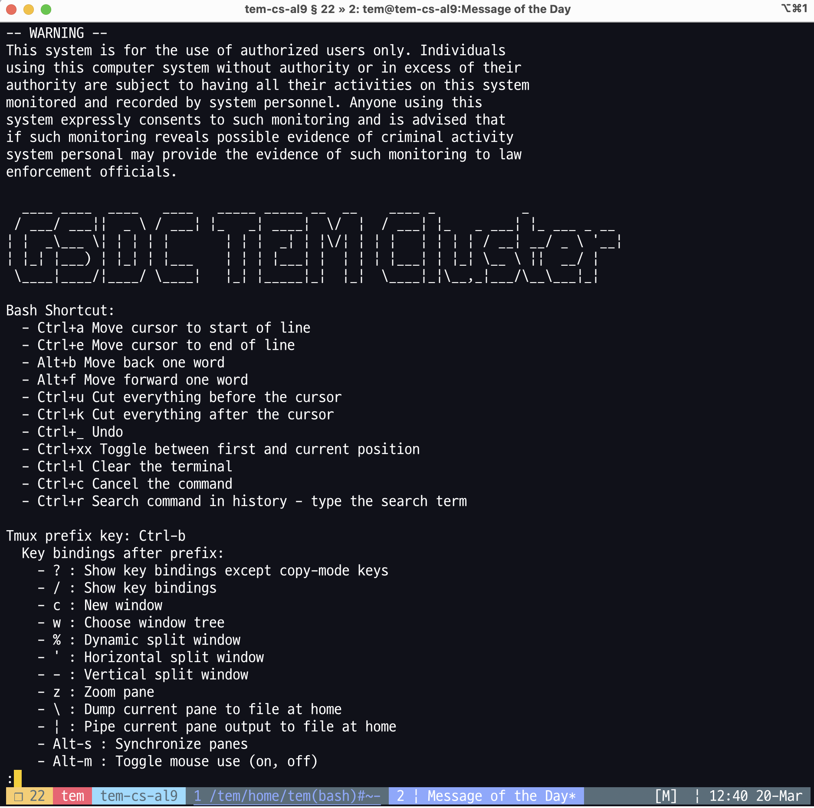

# Utilities for GSDC TEM Cluster

## **cluster.mydata**

Users can perform the following command (`cluster.mydata`) to check storage quota limit, usage ratio and so on. `cluster.mydata` tool is available on all the login nodes.

```bash
$> which cluster.mydata
/usr/local/bin/cluster.mydata
```

```bash
$> cluster.mydata
____ ____  ____   ____   _____ _____ __  __    ____ _           _
/ ___/ ___||  _ \ / ___| |_   _| ____|  \/  |  / ___| |_   _ ___| |_ ___ _ __
| |  _\___ \| | | | |       | | |  _| | |\/| | | |   | | | | / __| __/ _ \ '__|
| |_| |___) | |_| | |___    | | | |___| |  | | | |___| | |_| \__ \ ||  __/ |
\____|____/|____/ \____|   |_| |_____|_|  |_|  \____|_|\__,_|___/\__\___|_|

+ Official GSDC TEM Users Guide  : https://tem-docs.readthedocs.io/en/al9

+ Scratch/Home Quota Information : $> cluster.mydata
+ TEM Cluster Status Information : $> cluster.status
+------------------------------------------------------------------------+
+ Hostname............: tem-ui-al9.sdfarm.kr
+ OS Release..........: AlmaLinux release 9.5 (Teal Serval)
+ System Uptime.......: 20 days 0 hours 18 minutes 12 seconds
+ Users...............: Currently 2 user(s) logged on
+ Processes...........: 1123 running
+ CPU usage...........: 0.07, 0.13, 0.19 (1, 5, 15 min)
+ Memory (used/total).: 7699 MB / 384883 MB
+ Swap in use.........: 0 MB
+------------------------------------------------------------------------+
+ TEM Storage (used/total).......: 2.4 PBytes / 7.2 PBytes (34%)
+ Current User...................: <UserID>
* User Home Directory............: /tem/home/<UserID>
  ** Disk Quota Limit............: 0k
  ** Disk Usage..................: 19.87G
  ** Number of Files.............: 267373
* Group Scratch Directory........: /tem/scratch/<GroupDir>
  ** Disk Quota Limit............: 80T
  ** Disk Usage..................: 71.75T
  ** Number of Files.............: 5330260
+------------------------------------------------------------------------+
```

## **cluster.status**

Users can monitor the status and the usage ratio of all worker nodes with the following command (`cluster.status`).
`cluster.status` tool is available on all the login nodes.


```bash
$> which cluster.status
/usr/local/bin/cluster.status
```

```bash
$> cluster.status

        Refreshed every 10 seconds automatically. (To exit, press Ctrl+C)
------------------------------------------------------------------------------------------------------------------------------
NODE                      QUEUE     STATE     [GPU]T/U/F  [CPU]T/U/F  UTILIZATION                          [MEM]T/U/F(GB)
------------------------------------------------------------------------------------------------------------------------------
tem-cpu00-al9.sdfarm.kr    cpuQ      free            n/a     28/1/27  [#---------------------------]       187.3/  7.8/179.5
tem-gpu01-al9.sdfarm.kr    gpuQ      free     2/2/0 [##]     32/8/24  [########------------------------]   376.1/ 39.1/337.0
------------------------------------------------------------------------------------------------------------------------------
        [CPU] Total  60 / Used   9 cores ( 15.00 % )
        [GPU] Total   2 / Used   2    ea ( 100.00 % )
------------------------------------------------------------------------------------------------------------------------------
Current DateTime : 2025-05-15 11:25:02.752113
List of Jobs:

tem-ce-al9.sdfarm.kr:
                                                            Req'd  Req'd   Elap
Job ID          Username Queue    Jobname    SessID NDS TSK Memory Time  S Time
--------------- -------- -------- ---------- ------ --- --- ------ ----- - -----
4822.tem-ce-al* tem      cpuQ     cryosparc* 426316   1   1  8000m   --  R 02:11
4842.tem-ce-al* tem      gpuQ     cryosparc* 19237*   1   4   16gb   --  R 01:12
4845.tem-ce-al* tem      gpuQ     cryosparc* 19325*   1   4   24gb   --  R 00:34
4846.tem-ce-al* tem      gpuQ     cryosparc*    --    1   4   24gb   --  Q   --


* NODE  : CPU 또는 GPU 장치를 가진 계산서버 이름
* QUEUE : 각 서버가 속한 큐 이름
* STATE
    - F (free) : 계산서버에 어떤 데이터 분석 작업도 할당되어 있지 않음
    - S (shared) : 계산서버에 CPU 또는 GPU 작업이 할당되어 실행중이나, 해당 서버의 모든 자원을 할당받은 상태는 아님
    - E (exclusive) : 계산서버에 작업들이 할당되어 실행중이고, 작업들이 모든 자원을 할당받아 busy 한 상태
    - D (drained) : 작업들이 할당되어 실행중이나, 새로운 작업들은 할당되지 않을 예정인 상태 (예, 장애, 재부팅 등 관리모드 전환)
    - O (down) : 장애발생으로 계산서버가 가용하지 못한 상태
* [GPU] T/U/F : 각 GPU 계산서버에 설치된 GPU 카드 총 개수, 사용중인 개수(#), 유휴 카드 개수(-)
* [CPU] T/U/F : 각 CPU 계산서버의 총 코어 개수, 사용중인 개수(#), 유휴 코어 개수(-)
* [MEM] T/U/F : 각 계산서버의 총 메모리 양, 사용중인 양, 유휴 양 (GB단위)
```

## **TMUX**

Tmux is a terminal multiplexer. It allows you to create several "pseudo terminals (sessions)" from a single terminal. 
This is very useful for running multiple programs with a single connection, such as when you're remotely connecting to a machine using Secure Shell (SSH).

Tmux also decouples your programs from the main terminal, protecting them from accidentally disconnecting. You can detach tmux from the current terminal, 
and all your programs will continue to run safely in the background. Later, you can reattach tmux to the same or a different terminal.

### **Get started with tmux**

When you login-in the login server, a tmux session will be created by default for your convenience.
If the default session is not activated, type `tmux` in order to start using tmux. This command launches a tmux server, creates a session with a single window, and attaches to it.   


/// caption
Default tmux session (session number is 22 in this example)
///

### **Listing all the tmux sessions**

To list all the tmux sessions created by an user, type **`tmux ls`**.

```bash
$> tmux ls
2: 9 windows (created Tue Mar 11 12:35:06 2025) (attached)
21: 1 windows (created Thu Mar 20 09:21:30 2025)
22: 1 windows (created Thu Mar 20 13:02:43 2025) (attached)
```

### **Switching between tmux sessions or windows**

Tmux operates using a series of keybindings (keyboard shortcuts) triggered by pressing the **prefix** combination.

By default, the prefix is **`Ctrl+b`**. After that, for instance, press **`c`** to create a new window in the current session.

To traverse between tmux sessions (or windows), press **`Ctrl+b`** and **`w`**.

```bash
(0)   - 2: 9 windows (attached)
(1)   ├─> 1: USERID@tem-cs-al9:/tem/home/USERID(bash)~: "tem-cs-al9.sdfarm.kr"
(2)   ├─> 2: USERID@tem-cs-al9:/tem/home/USERID(bash)~: "tem-cs-al9.sdfarm.kr"
(3)   ├─> 3: USERID@tem-cs-al9:/tem/home/USERID(bash)~: "tem-cs-al9.sdfarm.kr"
(4)   ├─> 4: USERID@tem-cs-al9:/tem/home/USERID(bash)~*: "tem-cs-al9.sdfarm.kr"
(5)   ├─> 5: USERID@tem-ce-al9:/tem/el9/applications(bash)~: "tem-cs-al9.sdfarm.kr"
(6)   ├─> 6: USERID@tem-cs-al9:/tem/home/USERID(bash)~: "tem-cs-al9.sdfarm.kr"
(7)   ├─> 7: USERID@tem-cs-al9:/tem/home/USERID(bash)~: "tem-cs-al9.sdfarm.kr"
(8)   ├─> 8: USERID@tem-cs-al9:/tem/home/USERID(python ./pbspro_client.py)#~: "tem-cs-al9.sdfarm.kr"
(9)   └─> 9: USERID@tem-cs-al9:/tem/home/USERID(bash)~-: "tem-cs-al9.sdfarm.kr"
(M-a) - 21: 1 windows
(M-b) └─> 1: USERID@tem-cs-al9:/tmp(bash)~*: "tem-cs-al9.sdfarm.kr"
(M-c) - 22: 1 windows (attached)
(M-d) └─> 1: USERID@tem-cs-al9:/tem/home/USERID(bash)*: "tem-cs-al9.sdfarm.kr"
```


### **Useful keybindings**

Tmux provides several keybindings to execute commands quickly in a tmux session. Here are some of the most useful ones.

```bash
Tmux prefix key: Ctrl-b
Key bindings after prefix:
    - ? : Show key bindings except copy-mode keys
    - / : Show key bindings
    - c : New window
    - w : Choose window tree
    - % : Dynamic split window
    - ' : Horizontal split window
    - - : Vertical split window
    - z : Zoom pane
    - \ : Dump current pane to file at home
    - | : Pipe current pane output to file at home
    - Alt-s : Synchronize panes
    - Alt-m : Toggle mouse use (on, off)
    - Alt-x : Kill current pane
    - Alt-Shift-X : Kill current window
    - Alt-Ctrl-x : Kill current session
    - ` : Switch to app launcher
    - ? : Show man
    - m : Show MOTD
```