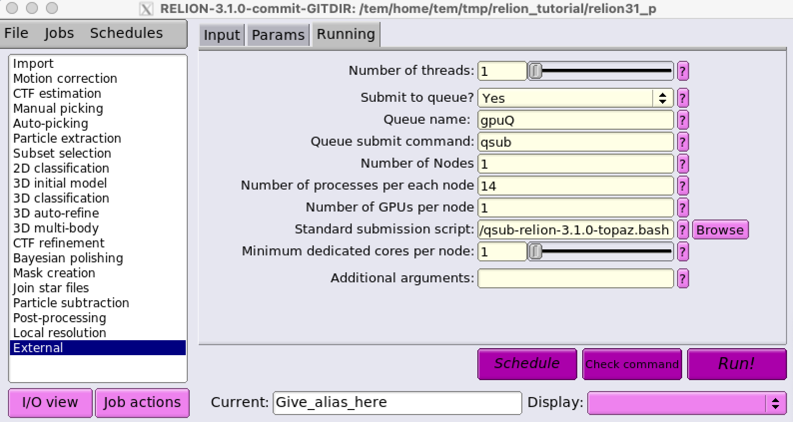

.. _topaz:

*****
Topaz
*****

A pipeline for particle detection in cryo-electron microscopy images using convolutional neural networks trained from positive and unlabeled examples. 
Topaz also includes methods for micrograph and tomogram denoising using deep denoising models.

* Official **Topaz** site : http://cb.csail.mit.edu/cb/topaz/

Topaz Executables
=================

Basically, topaz uses NVIDIA GPUs with CUDA support for GPU acceleration in order to provide the features like automatic particle picking, denoising, etc. 
Here, we have installed Topaz into seperate conda environments, where each is built upon CUDA 9.x and CUDA 11.x. 
You can find out each version of topaz executables with the following commands:

.. code-block:: bash

  $> module avail

  ------------------------------------------- /tem/el7/Modules/apps -------------------------------------------
  apps/cistem/1.0.0      apps/relion/cpu/3.1.0  apps/relion/gpu/3.1.0
  apps/relion/cpu/3.0.7  apps/relion/gpu/3.0.7

  --------------------------------------- /tem/el7/Modules/acceleration ---------------------------------------
  cuda/9.2
  cuda/11.2

  ------------------------------------------- /tem/el7/Modules/mpi --------------------------------------------
  mpi/gcc/openmpi/4.0.3

  ---------------------------------------- /tem/el7/Modules/virtualenv ----------------------------------------
  conda/2020.11
  pyem/0.5  
  topaz/cuda-9.2/0.2.4
  topaz/cuda-11.0/0.2.4  

  ------------------------------------------ /tem/el7/Modules/tools -------------------------------------------
  tools/ctffind/4.1.14  tools/motioncor2/1.3.1  tools/summovie/1.0.2
  tools/gctf/1.18_b2    tools/resmap/1.1.4      tools/unblur/1.0.2

Topaz binary executable with CUDA 9.2
-------------------------------------

.. code-block:: bash

  $> module load topaz/cuda-9.2/0.2.4
  Loading topaz/cuda-9.2/0.2.4
    Loading requirement: conda/2020.11

  (topaz-v0.2.4-cuda9.2) $>

 
.. code-block:: bash

  (topaz-v0.2.4-cuda9.2) $> which topaz
  /tem/el7/conda3-2020.11/envs/topaz-v0.2.4-cuda9.2/bin/topaz

With above command, you can find that the path of topaz executable with CUDA 9.x support is **/tem/el7/conda3-2020.11/envs/topaz-v0.2.4-cuda9.2/bin/topaz**.

Topaz binary executable with CUDA 11.2
--------------------------------------

.. code-block:: bash

  $> module load topaz/cuda-11.0/0.2.4
  Loading topaz/cuda-11.0/0.2.4
    Loading requirement: conda/2020.11

  (topaz-v0.2.4-cuda11.0) $>

 
.. code-block:: bash

  (topaz-v0.2.4-cuda11.0) $> which topaz
  /tem/el7/conda3-2020.11/envs/topaz-v0.2.4-cuda11.0/bin/topaz

With above command, you can find that the path of topaz executable with CUDA 11.x support is **/tem/el7/conda3-2020.11/envs/topaz-v0.2.4-cuda11.0/bin/topaz**.

Using Topaz in CryoSPARC
========================

If your CryoSPARC instance's version is v3.0.1, you should use the topaz executable **/tem/el7/conda3-2020.11/envs/topaz-v0.2.4-cuda9.2/bin/topaz** because the CryoSPARC is built upon CUDA 9.2 support.
Otherwise if you use CryoSPARC v3.2.0+, the topaz executable is **/tem/el7/conda3-2020.11/envs/topaz-v0.2.4-cuda11.0/bin/topaz**.

Please refer to https://guide.cryosparc.com/processing-data/all-job-types-in-cryosparc/deep-picking/topaz for executing topaz jobs in CryoSPARC.

Using Topaz in Relion (v3.1+)
=============================

To run topaz jobs within relion data analysis tool, you **SHOULD USE Relion v3.1+ and Topaz v0.2.4+**. For your conveneince, we have cloned all the **relion_run_topaz** packages to GSDC TEM farm.

Here is the location of **relion_run_topaz** packages: 

* **/tem/el7/topaz/relion_run_topaz/run_topaz_denoise.py**
* **/tem/el7/topaz/relion_run_topaz/run_topaz_pick.py**
* **/tem/el7/topaz/relion_run_topaz/run_topaz_train.py**
* **/tem/el7/topaz/relion_run_topaz/run_topaz_train_denoise.py**

.. code-block:: bash

  $> pwd
  /tem/el7/topaz/relion_run_topaz
  [tem@tem-cs-el7 relion_run_topaz]$ tree .
  .
  ├── LICENSE
  ├── README.md
  ├── run_topaz_denoise.py
  ├── run_topaz_pick.py
  ├── run_topaz_train.py
  └── run_topaz_train_denoise.py
  
  0 directories, 6 files

Since Relion v3.1+ has built using CUDA 9.2 support, we have modified **topaz_path** with this executable **/tem/el7/conda3-2020.11/envs/topaz-v0.2.4-cuda9.2/bin/topaz** in all the above python scripts.

For an external job type in relion GUI, after providing python executable path, inputs and optional arguments, you can use the following job submission template.

* **/tem/el7/qsub-relion-3.1.0-topaz.bash**

.. image:: images/relion-topaz2.png
    :scale: 70 %
    :align: center

Note that both number of nodes and number of GPUs are set to 1 due to the lack of parallelism across multiple servers and GPUs in Topaz application. 
For more details on running topaz jobs in relion (using external job type), please refer to https://github.com/tbepler/topaz/tree/master/relion_run_topaz.