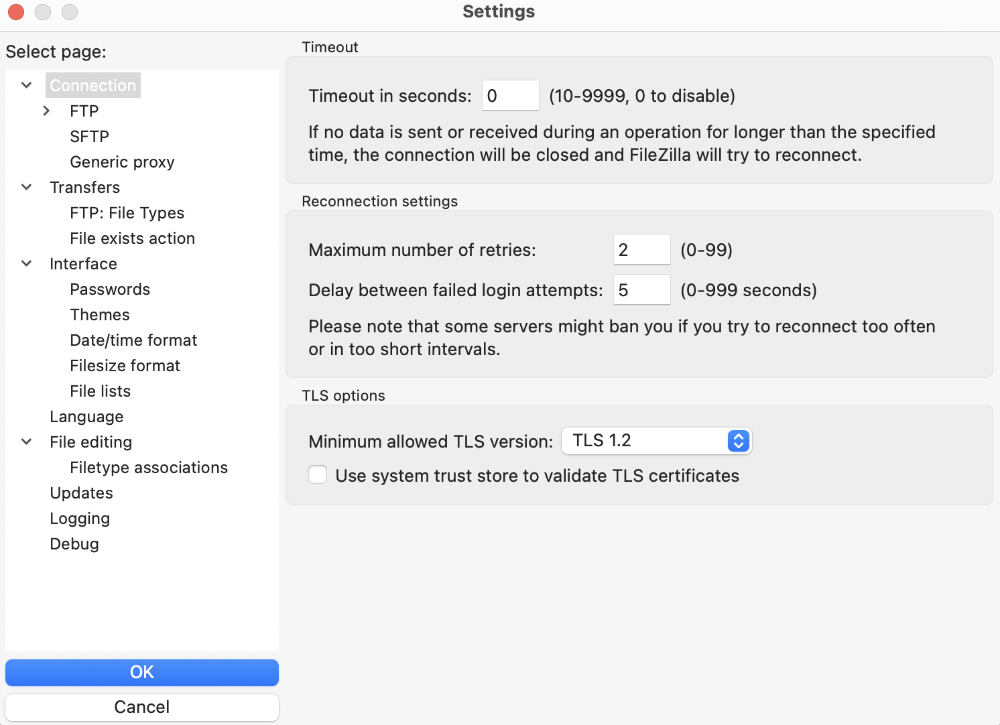
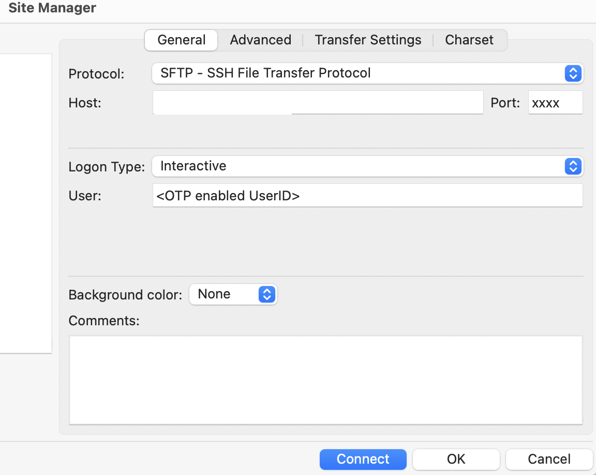
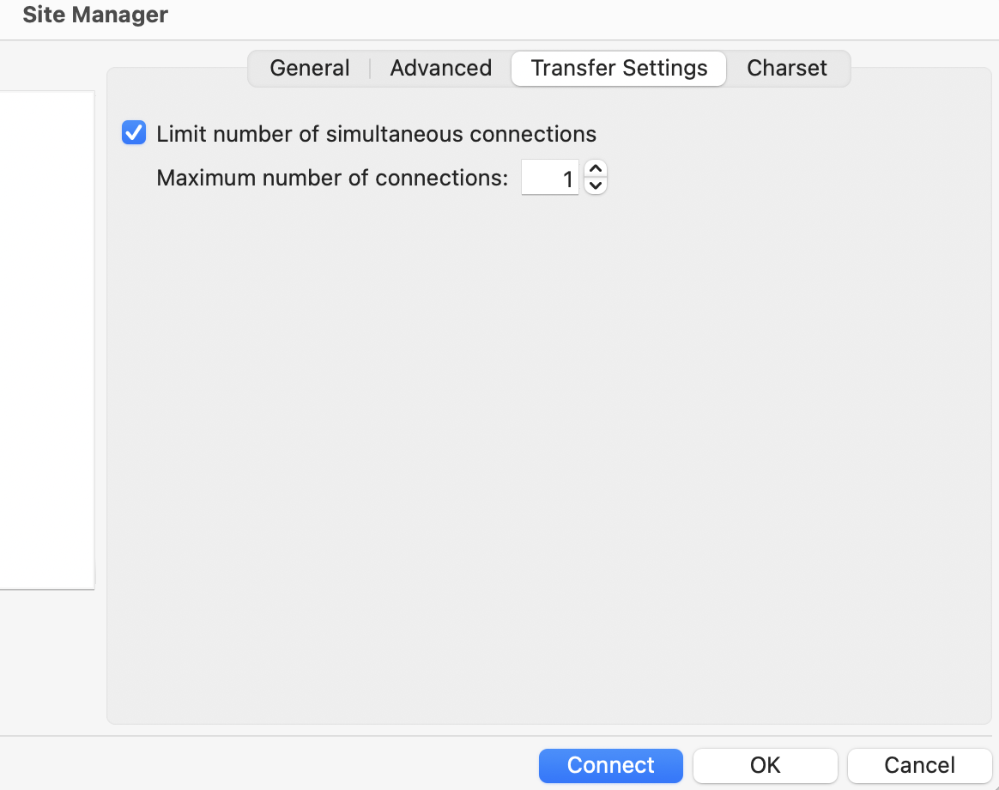

# FileZilla

## Data Transfer using FileZilla with 2FA

In FileZilla's global settings (`Edit` -> `Settings`):

* In the `Connection` menu, set `Timeout in seconds` to `0` so idle sessions aren't closed and recreated.

Then, when setting up a new SFTP site (`File` -> `Site Manager` -> `New site`):

* In the `General` tab, select SFTP as the protocol and enter __`tem-dm-al9.sdfarm.kr`__ as the data transfer server's host and port number. 
* In the `General` tab, set Logon Type to `interactive`; this prompts you for your password and OTP.
* In the `Transfer Settings` tab, check `Limit number of simultaneous connections` and leave the default value of 1.

/// caption
`New site` -> `General`
///

/// caption
`New site` -> `Transfer Settings`
///

