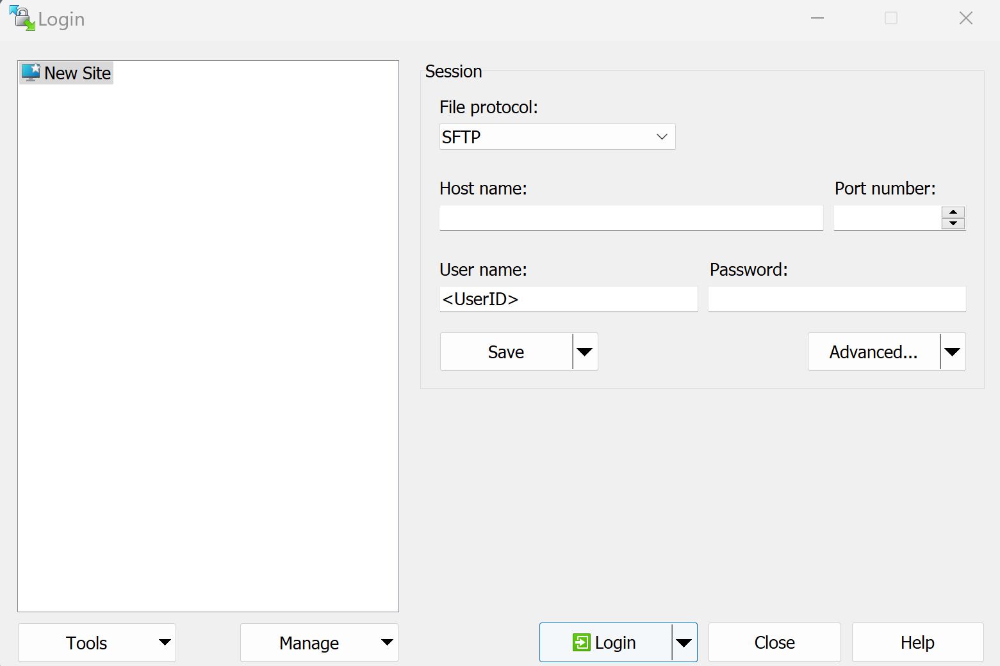
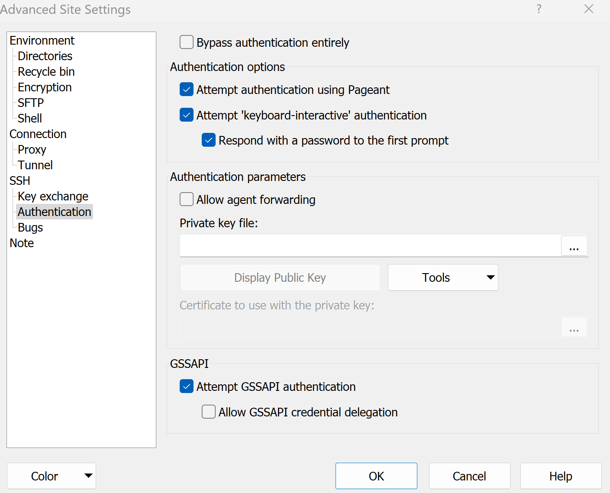
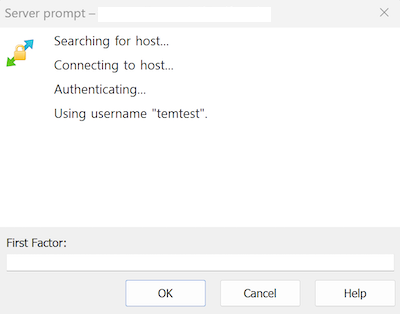
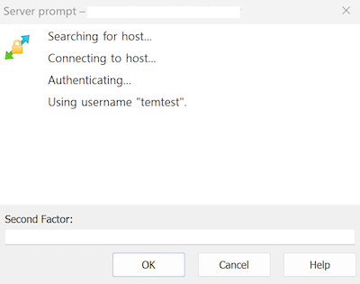
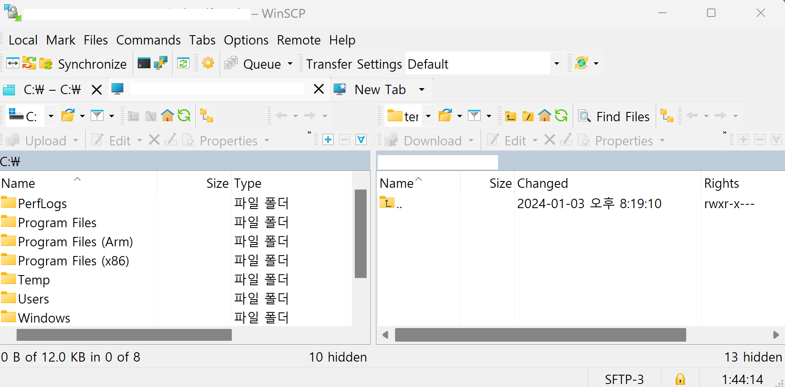

# WinSCP

## Data Transfer using WinSCP with 2FA

Download and install WinSCP from the [WinSCP download site](https://winscp.net/eng/downloads.php). See the WinSCP installation guide for [more details](https://winscp.net/eng/docs/guide_install).

Run the WinSCP.exe you installed in the previous step.

Click `Tabs` -> `Sites` -> `Site Manager`

   * Select SFTP as `File protocol:`.
   * Enter __`tem-dm-al9.sdfarm.kr`__ as `Host name:`.
   * Enter a designated port number as `Port number:`
   * Enter `User name:`

Click on `Advanced...` button on the login window

In the advanced dialog, go to `SSH` -> `Authentication` and check all the options under `Authentication options`.

Back in the login window, confirm the hostname (__`tem-dm-al9.sdfarm.kr`__), port number, and username. Leave `Password:` blank. Click `Save`, choose a name for this session in the `Site name` field, and click OK.

Back in the login window, select this site and click `Login`. You'll be connected to the login server. If this is your first connection, the server's host key information will appear. Click `Yes` to proceed.

WinSCP will ask for your password and OTP code to connect to the login server.

In the main window, you'll see files on the GSDC TEM cluster in the right panel and files on your computer in the left panel. Drag and drop files between the two to copy them in either direction.

