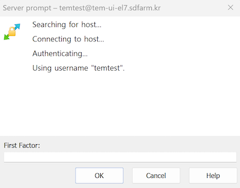

# WinSCP

## Data Transfer using WinSCP with 2FA

Download and install the WinSCP from [WinSCP download site](https://winscp.net/eng/downloads.php). Check out the WinSCP installation guide for [more detailed information](https://winscp.net/eng/docs/guide_install).

Run the WinSCP.exe which you installed in above step.

Click `Tabs` -> `Sites` -> `Site Manager`

   * Select SFTP as `File protocol:`.
   * Enter __`tem-ui-al9.sdfarm.kr`__ or __`tem-cs-al9.sdfarm.kr`__ as `Host name:`.
   * Enter a designated port number as `Port number:`
   * Enter `User name:`

Click on `Advanced...` button on the login window

In advanced dialog, go to the `SSH` -> `Authentication`, check all the options in `Authentication options`

Back in the login window, confirm the hostname (__`tem-ui-al9.sdfarm.kr`__ or __`tem-cs-al9.sdfarm.kr`__), port number and user name. Note to leave the blank in `Password:`. Click `Save` button and choose a name for this session configuration in the `Site name` field, and click OK.

Back in the login window, choose this site and click on the `Login` buttion. You will be connected to the login server. If this is the first time you are connecting to the server, the server's host key information will be shown. Click `Yes` to proceed.

WinSCP asks your password and OTP code for connecting to the login server.

 { width="400" }

 { width="400" }

Finally, in the main window you will see the files on the GSDC TEM cluster in the right panel, and the files on your computer in the left one. You can drag and drop files to copy them from the cluster to your computer and vice versa.

